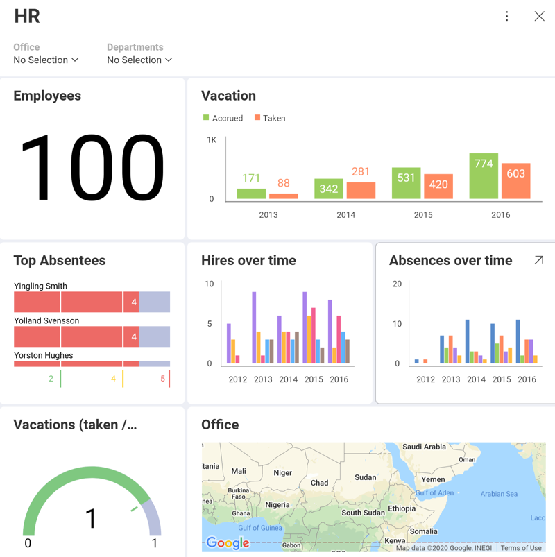

## Filters

Dashboard filters allow you to slice the contents of visualizations in a
dashboard all at once. When you add datasets to the dashboard filters
collection, they will remain in context for all dashboard visualization
to be bound to. Dynamic filtering applies to all connected
visualizations, as the filter selection changes.

For instance, a dataset with the list of locations around the world can
be added to enable binding all visualizations of a dashboard. In this
scenario, the contents of each visualization can be filtered by location
by the user browsing the information in that dashboard.

Reveal also supports activating a Date Range as a Dashboard Filter,
which enables the filtering of all visualizations by a specific period
of time.

The following sections will cover:

  - [Dashboard Filters](dashboard-filters.md) in both the *Dashboard* and
    the *Visualizations editor*

  - [Dashboard Filter configurable properties](dashboard-filters-properties.md), including:

      - [Displayed Field](dashboard-filters-properties.html#displayed-field)

      - [Multiple Selection](dashboard-filters-properties.html#multiple-selections)

      - [Required Selection](dashboard-filters-properties.html#required-selection)

      - [Data Filters](dashboard-filters-properties.html#data-filters)

  - [Dashboard Filters and their connections to visualizations](connecting-dashboard-filters-visualization.md), also
    referred to as visualization binding

  - [Visualization Quick Filters](visualization-filters.md)
