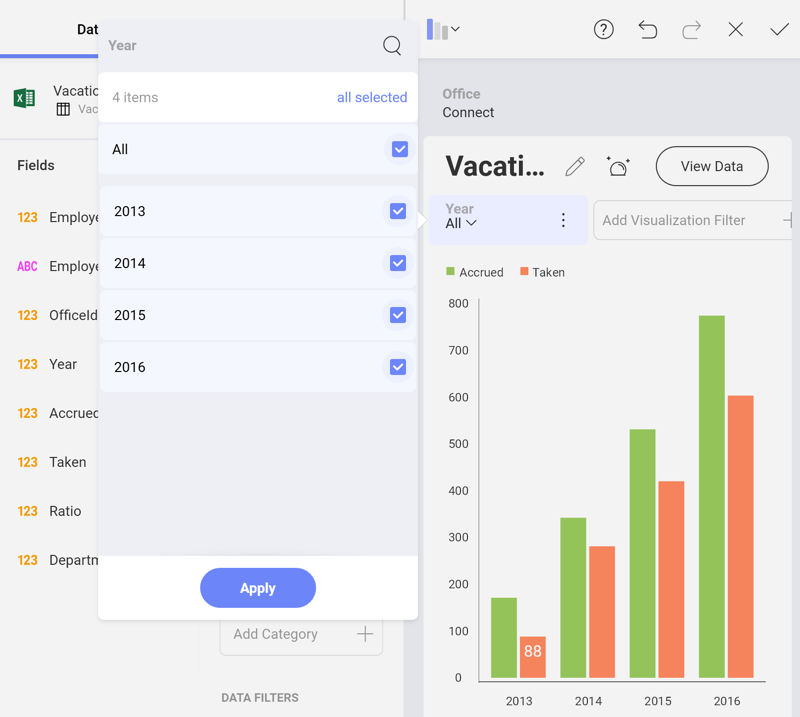
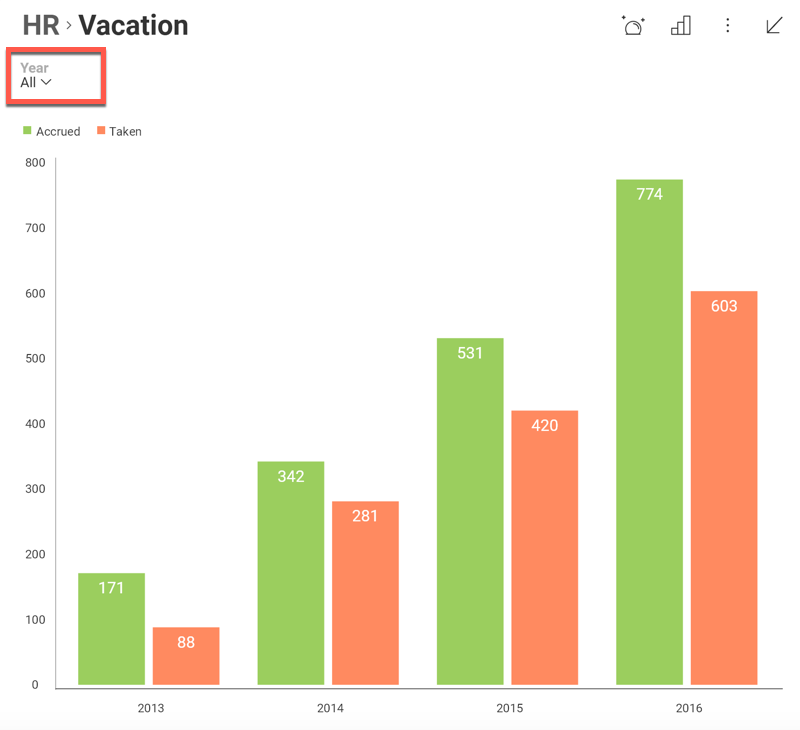
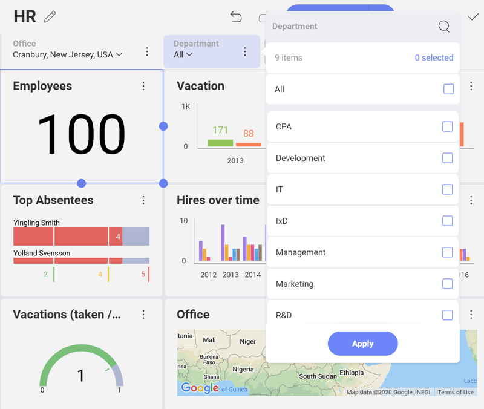
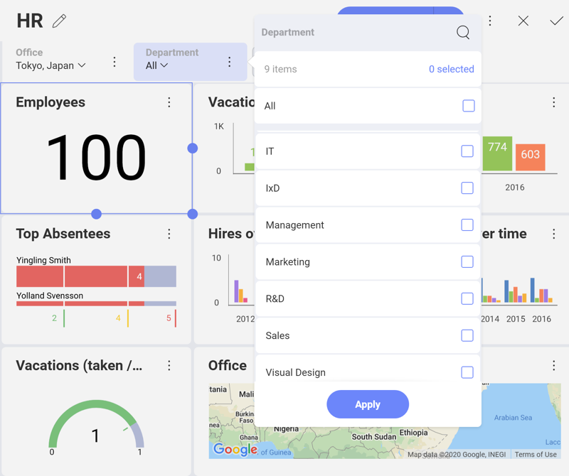

## Visualization Quick Filters

At a visualization level, you can also apply "quick" filters, which
allow you to dynamically filter the visualization contents as the quick
filter selection changes. These become part of the dashboard definition,
and can't be modified by consumers of the dashboard.

In order to define a quick filter, select the **Add a Visualization Filter** button on top of your visualization in the Visualizations
Editor:

The filter options displayed in the Visualization Filters area depend on
the data type of the field. There are three different filter dialogs:
text, numeric, and date fields. Once created, the quick filter will be
displayed on top of your visualization in the Visualizations Editor.

When the visualization is maximized in Dashboard View mode, you will see
it under the visualization's title.

As with [Dashboard Filters](dashboard-filters.md), this enables a dynamic
filtering of the visualization contents as the quick filter selection
changes.

### Cascading Filters

The list of possible values displayed to select from in Quick Filters
will be filtered based on previous Quick Filter selections. Fields on
the left take precedence and determine the list of possible values on
filters to the right.

For instance, in the example below, the *Office* filter was created
first, and the *Departments* filter created after that one. After
selecting **Cranbury, New Jersey, USA** as an *Office*, the Departments
list was the following:

However, if you select **Tokyo, Japan** instead, the list of
*Departments* will be a different one.

### Data Filters

You can also apply filters to the fields in the dataset displayed in the
Visualization Filter. This allows you, for example, to filter rows in
the dataset that have null or empty values on a specific column by
enabling the filter empty values configuration setting in a specific
column. You can also select specific values, or add rules to your field
in order to change the options depending on the field type. For more
information, visit the [field filters and rules](field-filters-rules.md)
section.

In the **Visualization Filter** section, select **Edit** in the overflow
button next to the Visualization Filter. This will allow you to select
the type of filter you want to apply to your field.

