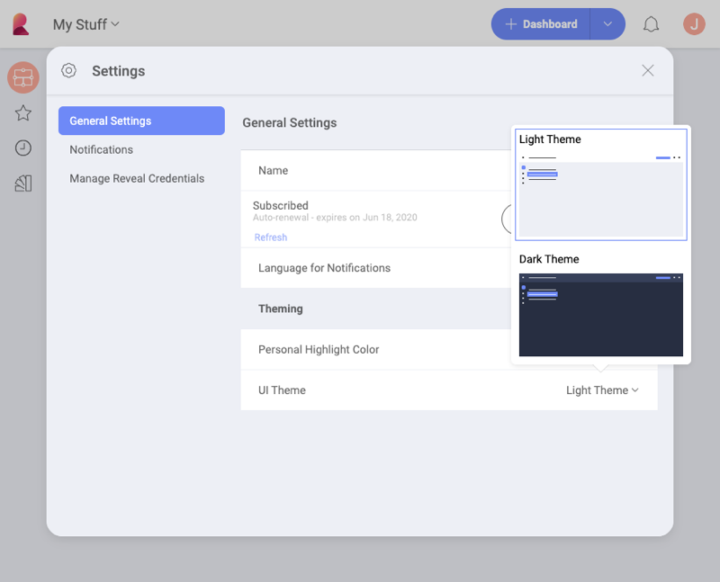
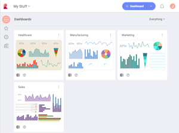
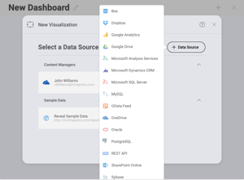
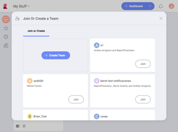

## Application Themes

The general User Experience (UX) can be customized applying application themes, changing localization and regional settings, or even including further customization with the Reveal SDK.

Color themes allow you to modify the colors in the Reveal interface to
suit your preferences. In order to change your current theme, click/tap
the icon with your initial (photo) in the right top corner of the
initial screen. Then navigate to *Settings* ⇒ *General Settings* ⇒ *UI
Theme*.

You can choose between a Light (Default) and Dark Theme. These colors
will change some of the application's UI, including the dashboard name
background color, the data source dialog, and others. The following are
just some examples of screens with each theme.

| **Screen Name**     | **Light**                                                                                   | **Dark**                                                                                  |
| ------------------- | ------------------------------------------------------------------------------------------- | ----------------------------------------------------------------------------------------- |
| Dashboard Selector  |            |            |
| Data Source Creator |  |  |
| Teams Creator       |                        |                        |

If you switch the *Match OS* function on, your theme in Reveal will automatically change every time your operating system's theme changes. 
