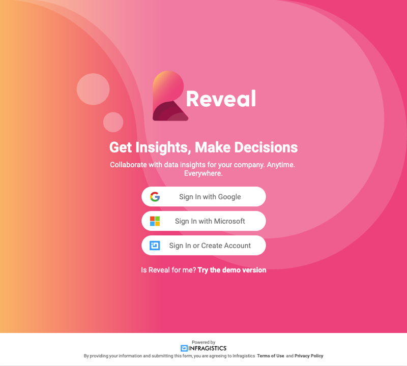
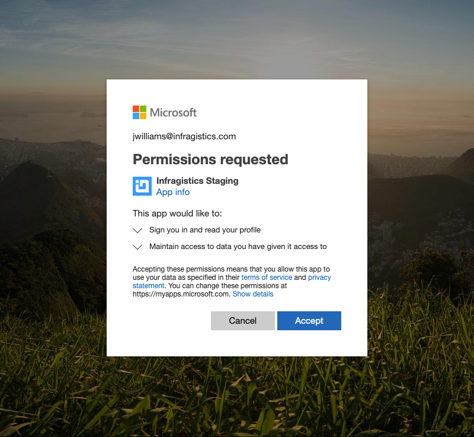
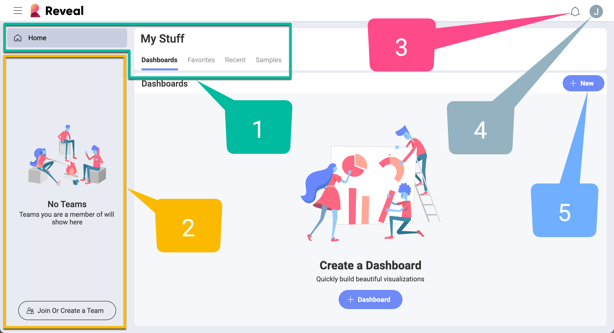

## Logging into Reveal

Welcome to Reveal!  
When opening the app you'll be met with different login options:

Before jumping in, take into account that in Reveal you can join an **Organization**. If you are a member of an organization, you have to log in with your organization’s email. Choose Google (G Suite) or Microsoft (O365) as needed and you'll be associated with the organization team. Alternatively, you can log in using your iCloud (*Apple*) account credentials.

> [!NOTE]
> The organization team is named after your organization (e.g. your company's name).  

Depending on which account you used to sign in Reveal, you will have your OneDrive or Google Drive automatically added to your list of [data sources](~/en/datasources/overview.md). You will be additionally asked for **limited permissions** only the first time you use your [OneDrive](~/en/datasources/OneDrive.md) and [Google Drive](~/en/datasources/Google-Drive.md).

### Your First Screen

Once you get in, you are greeted with your first screen:

You always start in your personal space, **My Stuff**.

Below you can find a quick reference for this initial screen:

 1.  **My Stuff/Teams** - In this popover menu, you can access your personal space and any team you are a member of. You can also create new teams or join existing ones.

 1.  **Dashboards** - This is the central hub for all dashboards. Start from here when you want to create, revise, share, or just open a dashboard you need that was created by other team members.

 3.  **Favorites** - Keep your most important dashboards at hand in *Favorites*.

 4.  **Recent** - In *Recent*, you will find the dashboards you have viewed or edited, sorted by the most recently used.

 5.  **Dashboard samples** - In *Samples*, you will find dashboards composed by the Reveal's team. Their rich variety of visualizations will inspire your creativity and help you create your own beautiful dashboards.

 6.  **+ Dashboard split button** - By selecting the *+ Dashboard* split button, you can create folders or go directly to dashboard creation. In addition, here you can also upload a .rdash file (Reveal dashboard).

 7.  **Filter** - choose from the dropdown menu which dashboards to see in the dashboard module: all, only created by you
 or shared with you.

 8.  **Notifications center** - Select the the bell icon to access team and dashboard updates.

 9.  **Profile settings** - Select the icon with your initial (photo) to access Reveal's *general settings*, *learning tips*, *Help center* and *give feedback* or ask any questions related to the application.

### What About Roles & Permissions?

In Reveal, people can join an organization and one or more teams. Roles and permissions apply to both organizations and teams.  
Roles represent a set of permissions assigned to a Reveal user in relation to a team or an organization. This means every user is assigned a role when joining organizations or teams. There are three different roles (owner, member, viewer) with a clear set of permissions each.
