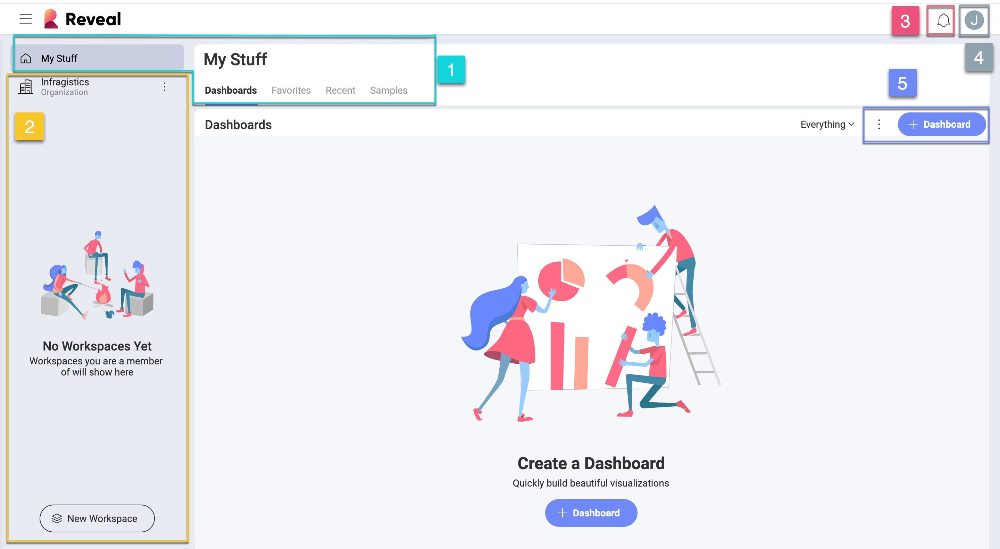

## Logging into Reveal

Welcome to Reveal!  
When opening the app you'll be met with different login options:

Before jumping in, take into account that in Reveal you can join an **Organization**. If you are a member of an organization, you have to log in with your organization’s email. Choose Google or Microsoft (O365) as needed and you'll be associated with the Оrganization workspace. Alternatively, you can log in using your iCloud (*Apple*) account credentials.

> [!NOTE]
> The Organization workspace is named after your organization (e.g. your company's name).  

Depending on which account you used to sign in Reveal, you will have your OneDrive or Google Drive automatically added to your list of [data sources](~/en/datasources/overview.md).

### Your First Screen

Once you get in, you are greeted with your first screen:

You always start in your personal space, **My Stuff**. Below you can find a quick reference for this initial screen:

1.  **My Stuff** - Here you can access your personal space, including dashboards, favorites, recents and predefined samples.

    *  *Dashboards* - This is the central hub for all dashboards. Start from here when you want to create, revise, share, or just open a dashboard you need that was created by other workspace members.

    * *Favorites* - Keep your most important dashboards at hand in *Favorites*.

    * *Recent* - In *Recent*, you will find the dashboards you have viewed or edited, sorted by the most recently used.

    * *Dashboard samples* - In *Samples*, you will find dashboards composed by the Reveal's team. Their rich variety of visualizations will inspire your creativity and help you create your own beautiful dashboards.

2.  **Organization & Workspaces** - On the left side of the screen, you can access the organization workspace plus any other workspace you are a member of. You can also create new workspaces or join existing ones.

3.  **Notifications center** - Select the the bell icon to access workspace and dashboard updates.

4.  **Profile settings** - Select the icon with your initial (photo) to access Reveal's *general settings*, *learning tips*, *Help center* and *give feedback* or ask any questions related to the application.

5.  **+ New button** - By selecting the *+ New* button, you can create folders or go directly to dashboard creation. In addition, here you can also upload a .rdash file (Reveal dashboard).

Once you start using the application, it will look like this:

**Filter** - As soon as you have any dashboards, you can choose from the dropdown menu which dashboards to see in the dashboard module: *Everything*, only created by you or shared with you.

### What About Roles & Permissions?

In Reveal, people can join an organization and one or more workspaces. Roles and permissions apply to both organizations and workspaces.  
Roles represent a set of permissions assigned to a Reveal user in relation to a workspace or an organization. This means every user is assigned a role when joining organizations or workspaces. There are three different roles (owner, member, viewer) with a clear set of permissions each.
