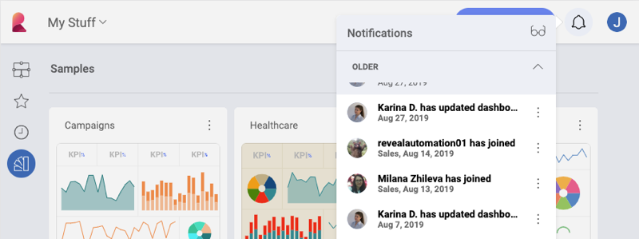
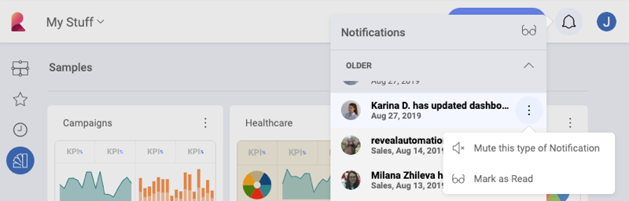

## Notifications Center

The Notifications Center is designed to keep you updated of any workspace and
dashboard changes. Open it by selecting the **bell icon** in the top right section of the application.

Whenever you receive a notification, you will see a change in the
notifications' icon. Depending on your notification settings, you might
also see an in-app notification with the specific change.

In the Notification Center you can:

  - Mark all notifications as **Read** or **Unread** by selecting the
    *glasses icon*.

  - Additionally, you can **turn off notifications** by selecting the *Mute this type of notification* option in the overflow menu.

### Notification Preferences

You can easily edit your notification preferences. Тo do that, click/tap your profile photo in the top right corner of the screen. Then navigate to *Settings* ⇒ *Notifications*.

### Notification Types

You can receive three different types of notifications for both **Workspace**
and **Dashboard** changes:

  - **Email** notifications, which will be delivered to the e-mail address associated with your account.

  - **Push** notifications, which will pop up on your mobile or desktop screen.

  - **In-App** notifications, displayed with a number inside the bell icon.

To **edit** your notifications preferences, select the *pencil icon* next to workspace or dashboard notifications. To **turn on/off** notifications, click/tap the *toggle button* on the right.

#### Workspace Notifications

You can configure your Reveal account to receive notifications when you
are removed from a workspace, or whenever new members join a workspace you are
already part of.

For Workspaces, the following settings are enabled by default:

|                              | Email                                                         | Push | In-App                                                         |
| ---------------------------- | ------------------------------------------------------------- | ---- | -------------------------------------------------------------- |
| I’m removed from a Workspace |  |      |  |
| New members join             |                                                               |      |  |
#### Dashboard Notifications

You can configure your account to receive notifications whenever dashboards are shared with you or with a workspace, or when they are updated.

For Dashboards, the following settings are enabled by default:

|                                          | Email                                                         | Push                                                          | In-App                                                        |
| ---------------------------------------- | ------------------------------------------------------------- | ------------------------------------------------------------- | ------------------------------------------------------------- |
| Dashboard is shared with me              |                                                               |  |  |
| Folder is shared with me                 |                                                               |  |  |
| Dashboard shared with a Workspace i’m in |                                                               |  |  |
| Folder shared with a Workspace i’m in    |                                                               |  |  |
| Dashboard is updated                     |                                                               |  |  |
| Dashboard access is requested            |  |  |  |

