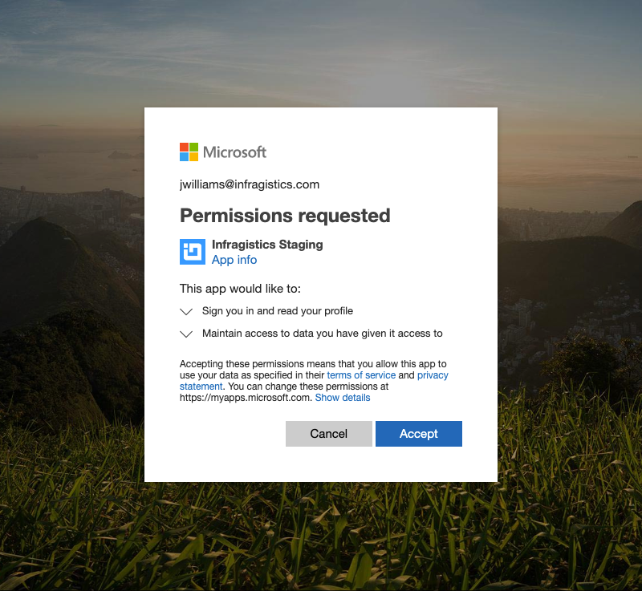

## Logging into Reveal

When you first install and open the application, you will be presented with the following screen:

In Reveal, you can use your Office 365, Google or iCloud (*Apple*) account credentials to
log in. You can also create an Infragistics user account. You'll only
need to sign in once to automatically be logged in to the application,
so there's no need to remember multiple passwords.

### Permissions Requests for Office 365 and Google Accounts

When you sign in for the first time in Reveal with your **Office 365**
account, you will be asked to give permissions to Reveal to read your
profile and maintain access to it.

If you use your **Google** account to sign in, you will only have to type in your account credentials.

Depending on which account you used to sign in Reveal, you will have your OneDrive or Google Drive automatically added to your list of [data sources](~/en/datasources/overview.md). You will be additionally asked for **limited permissions** only the first time you use your [OneDrive](~/en/datasources/OneDrive.md) and [Google Drive](~/en/datasources/Google-Drive.md).
