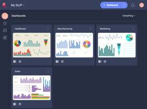
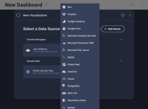

## Themes and Localization

The User Experience (UX) can be customized applying application themes, changing localization and regional settings, or even including further customization with the Reveal SDK.

### Application Themes

Color themes allow you to modify the colors in the Reveal interface to
suit your preferences. In order to change your current theme, click/tap
the icon with your initial (photo) in the right top corner of the
initial screen. Then navigate to *Settings* ⇒ *General Settings* ⇒ *UI
Theme*.

You can choose between a Light (Default) and Dark Theme. These colors
will change some of the application's UI, including the dashboard name
background color, the data source dialog, and others. The following are
just some examples of screens with each theme.

| **Screen Name**     | **Light**                                                                                   | **Dark**                                                                                  |
| ------------------- | ------------------------------------------------------------------------------------------- | ----------------------------------------------------------------------------------------- |
| Dashboard Selector  |            |            |
| Data Source Creator |  |  |
| Teams Creator       |                        |                        |

If you switch the *Match OS* function on, your theme in Reveal will automatically change every time your operating system's theme changes. 

### Localization

Reveal will detect and apply the language and regional settings configured in the different platforms, including:

  - **Web browser**

  - **Windows**

  - **Mobile devices (Android and iOS)**

> [!NOTE]
>**About Date Format in Visualizations** 
>The date format used in Reveal visualizations can be customized by field **in the Visualization editor**. Doing so will effectively override the "general" format.

#### Languages

The available languages are English, German, Spanish, French, Italian,
Japanese, Korean, Malay, Dutch, Portuguese, Russian, Chinese
(Traditional and Simplified).

In addition, you can explicitly configure within Reveal the language
used for email notifications and the Notification center. To do this, go
to: **Settings -> General Settings -> Language for Notifications**.
