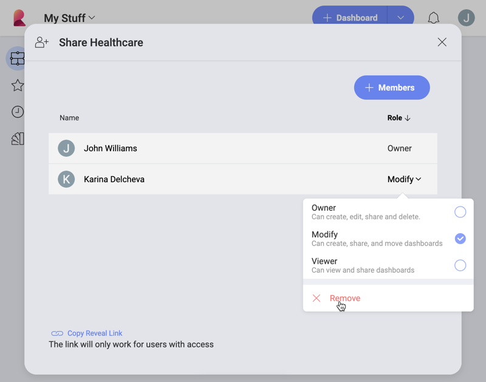

## Welcome to the Reveal help!

Reveal is a modern BI solution that was built for embedded analytics. You can easily integrate data analytics into your application, taking advantage of rich APIs that give you control over Reveal data visualizations, while also enhancing the user's experience with your app.

Built by user experience experts and designed for the business user, Reveal makes it simple for you to create, view, and share data visualizations with your teams. Offering you a seamless, identical experience no matter what device you are on: Web, Desktop, iOS, or Android.

Interested on embedded analytics? [Download Reveal SDK](https://www.revealbi.io/download-sdk). To find out how to start using it, refer to the [Reveal SDK help](developer/index.md).

### Reveal Application Highlights

<h4 style="color:#2328B0;">Securely Connect to your Data and Build Powerful Data Visualizations</h4>

Connect to the most popular data sources without setting anything up on the server. Get real-time insights by connecting directly to SharePoint Online, Google Drive, OneDrive, Microsoft Analysis Services, Microsoft SQL Server, CRM, and many more.

With an intuitive drag and drop interface, Reveal makes it simple to create dashboards within minutes. Choose from more than 20 different visualizations to present your data and tell your story the best way.

<h4 style="color:#2328B0;">Customize your Data Visualizations</h4>

Sort, filter and aggregate your data as you wish! Each chart type provides you with different settings to design your visualizations the way you want.

<h4 style="color:#2328B0;">Interact with your Dashboards</h4>

Once your dashboard is created, interact with your visualizations with drill-down support, or even the ability to change visualization on the fly. Create and share annotated images of your visualizations for deeper insights.

<h4 style="color:#2328B0;">Share Insights with your Teams </h4>

Give everyone the power of data by sharing your dashboards within your Organization's repository, teams you are part of or with individual coworkers. Assign different levels of permissions to users to give them the level of access you want them to have to your dashboard.

<h4 style="color:#2328B0;">Leverage Advanced Predictive Analysis </h4>

Get even more insight from your visualizations with advanced predictive analysis, using statistical functions.
You can use the Time series forecast, Linear regression and Detect outliers to make predictions, recognize and evaluate trends, or discover outliers in your data series.

<h4 style="color:#2328B0;">Get Better Insights with Machine Learning</h4>

Use your trained models' data from BigQuery or Azure Machine Learning Studio in Reveal. In just three steps, choose your data source, build a visualization, and use the integration to connect to a trained machine learning model.

### What's new?

* [Amazon Redshift](~/en/datasources/supported-data-sources/redshift.md) data source – You can now use and gain new insights from your data in the Amazon Redshift cloud data warehouse.
* [Marketo](~/en/datasources/supported-data-sources/marketo.md) data source – Connect to your account in the marketing platform Marketo and use your data in Reveal.
* [Process Data on Server](~/en/datasources/process-data-server-side.md) – You can now have server-side aggregation of the data coming from the MS SQL, MySQL and Postgres data sources.

### Coming Soon to Reveal

Coming Soon...

### Where Can I Get Reveal?

Reveal offers you a seamless, almost identical experience no matter what device you are on.
You can use a web browser or get native applications on iOS, Android, and Desktop, making it easy for you to work across different devices and platforms.

Try our [**free demo**](https://app.revealbi.io/Login?provider=Demo&_ga=2.197140908.2008019520.1580398635-1419162557.1572354605) version to discover what Reveal can do for your business!

Below you can find the versions supported for each platform:

| PLATFORM | SUPPORT |
| --- | --- |
|**Android**|Android 5.0 (Lollipop) or higher (except for the Kindle Fire).|
|**Desktop**|Any Windows 7 SP1 or newer with .NET Framework 4.6.2 installed. For more information on .NET Framework system requirements, check [this Microsoft article](https://docs.microsoft.com/en-us/dotnet/framework/get-started/system-requirements).|
|**IOS**|iOS 12 or higher.|
|**Web**|All major browsers on Mac and Windows (latest 2 releases). Web browsers are not supported in mobile devices.|
