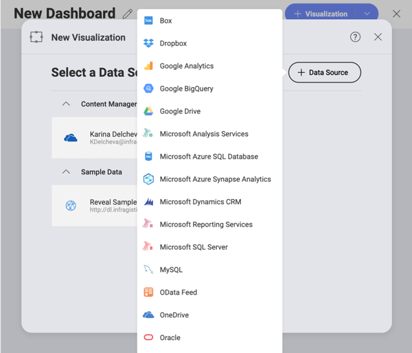
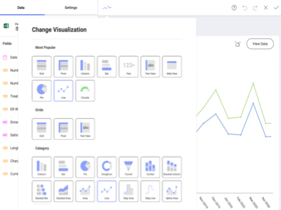
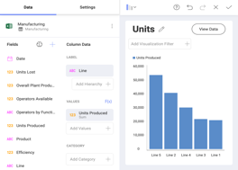
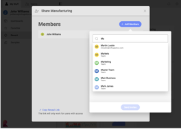

## Welcome to the Reveal Help Center!

 
Reveal is an affordable, true self-service BI tool, enabling you to make
data-driven decisions faster. Built by user experience experts and
designed for the business user, Reveal makes it simple for you to
create, view and share dashboards with your teams. It offers you a
seamless, identical experience no matter what device you are on: Web,
Desktop, iOS, or Android. 

Reveal is purposely designed to be embedded into applications. Reveal SDK allows you to provide your users with analytical capabilities by integrating quickly and seamlessly into your Windows or web-hosted applications. Interested? [Download Reveal SDK](https://www.revealbi.io/download-sdk). To find out how to start using it, refer to the [Reveal SDK help](developer/index.md). 

### You can use Reveal to:

<table class="tg">
<colgroup>
<col style="width: 30%" />
<col style="width: 70%" />
</colgroup>
  <tr>
    <th class="tg-0pky"></th>
    <th class="tg-0pky"><a href="~/en/datasources/overview.md">Securely connect to your data</a>: Connect to the most popular data sources without setting anything up on the server. Get real-time insights by connecting directly to <a href="~/en/datasources/sharepoint.md">SharePoint Online</a>, <a href="~/en/datasources/google-drive.md">Google Drive</a>, <a href="~/en/datasources/onedrive.md">OneDrive</a>, <a href="~/en/datasources/microsoft-analysis-services.md">Microsoft Analysis Services</a>, <a href="~/en/datasources/microsoft-sql-server.md">Microsoft SQL Server</a>, <a href="~/en/datasources/microsoft-dynamics-crm.md">CRM</a>, and many more.</th>
  </tr>
  <tr>
    <td class="tg-0pky"></td>
    <td class="tg-0pky"><a href="~/en/dashboards/creating-dashboards.md">Easily create dashboards</a>: With an intuitive drag and drop interface, Reveal makes it simple to create dashboards within minutes. Choose from more than 20 different visualizations to present your data and tell your story the best way.</td>
  </tr>
  <tr>
    <td class="tg-0pky"></td>
    <td class="tg-0pky"><a href="~/en/data-visualizations/visualizations-editor.md">Customize your visualizations</a>: Sort, filter and aggregate your data as you wish! Each chart type provides you with different settings to design your visualizations the way you want.</td>
  </tr>
  <tr>
    <td class="tg-0pky"></td>
    <td class="tg-0pky"><a href="~/en/dashboards/exporting-dashboards/overview.md">Interact with your dashboards</a>: Once your dashboard is created, interact with your visualizations with drill-down support, or even the ability to change visualization on the fly. Create and share annotated images of your visualizations for deeper insights.</td>
  </tr>
  <tr>
    <td class="tg-0pky"></td>
    <td class="tg-0pky"><a href="~/en/dashboards/sharing-dashboards/sharing-dashboards.md">Share insights with your teams</a>: Give everyone the power of data by sharing your dashboards within your <a href="~/en/dashboards/teams/teams-collaboration-privacy.html#organization-team">Organization's repository</a>, teams you are part of or with individual coworkers. Assign different levels of permissions to users to give them the level of access you want them to have to your dashboard.</td>
  </tr>
</table>

### What's New

  - [**New TreeMap visualization**](~/en/data-visualizations/treemap-view.md) – You can use this new visualization type to present large hierarchies with a set of nested rectangles. Rectangles' size will show you part-to-whole relationships amongst a variety of metrics, helping you identify patterns and relations between similar data.

  - [**Export to Excel**](~/en/dashboards/exporting-dashboards/excel-data-format.md) enhancements – You can include more visualization types in your spreadsheets upon export. Scatter, Bubble and Sparkline charts are now available.

  - Various **UI/UX improvements** – Various minor changes were added to improve user experience in the Visualization, Dashboard, New Data Source dialog, etc.
  
  - Added **support for Shared Drives in Google Drive** – If you have a GSuite Business account, you can now access your Shared Drives data and use it to build visualizations in Reveal. You will see your Shared Drives after you add your [Google Drive](~/en/datasources/google-drive.md) as a data source in Reveal.

Still not sure? Try our [**free demo**](https://app.revealbi.io/Login?provider=Demo&_ga=2.197140908.2008019520.1580398635-1419162557.1572354605) version to discover what Reveal can do for your business!
