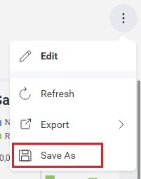

# Saving Dashboards

The saving of a dashboard is invoked by the end-user interacting with the save buttons within the `RevealView` control in your application.

There are two types of save operations supported by the `RevealView`:
- **Save** - saves the current dashboard and overwrites the current **.rdash** file on disk
- **Save As** - saves the current dashboard as a new **.rdash** file on disk. Leaving the original **.rdash** file untouched.

The **Save** operation is invoked when the end-user is in edit mode, and clicks the **Check Button** in the top right corner of the `RevealView`.


The **Save As** opertion is invoked when the end-user opens the **Kabob Menu** located in the top right corner of the `RevealView`, and selects the **Save As** menu item.



## Implementing Save
By default, the Reveal SDK provides a **Save** functionality if you are following the convention of placing your dashboards in the **Dashboards** folder on the server. However, if you are not storing your dashboards in a **Dashboards** folder on the server, and have created a custom `IRVDashboardProvider`, then you will need to implement your own custom save logic as well. We cover how to load dashboards from custom locations in the [Loading Dashboards](loading-dashboards.md#load-from-custom-file-path) topic.

Start by modifying the existing `IRVDashboardProvider` class to implement the `IRVDashboardProvider.SaveDashboardAsync` method. In this example, we are saving the dashboard files into a folder named **MyDashboards**.

```cs
public class DashboardProvider : IRVDashboardProvider
{
    public Task<Dashboard> GetDashboardAsync(IRVUserContext userContext, string dashboardId)
    {
        var filePath = Path.Combine(Environment.CurrentDirectory, $"MyDashboards/{dashboardId}.rdash");
        var dashboard = new Dashboard(filePath);
        return Task.FromResult(dashboard);
    }

    public async Task SaveDashboardAsync(IRVUserContext userContext, string dashboardId, Dashboard dashboard)
    {
        var filePath = Path.Combine(Environment.CurrentDirectory, $"MyDashboards/{dashboardId}.rdash");
        await dashboard.SaveToFileAsync(filePath);
    }
}
```

> [!NOTE]
> The source code to this sample can be found on [GitHub](https://github.com/RevealBi/sdk-samples-javascript/tree/master/SavingDashboards-Server)

## Implementing Save As
The Reveal SDK provides the **Save** functionality by default. However, the Reveal SDK does not provide a **Save As** implementation.  This means that you as the developer will be required to write all neccessary code to perform the **Save As** operation within your application. The **Save As** operation must be handled by the client application.

To perform saving operations on the client, you must add an event hanlder to the `RevealView.onSave` event. This will instruct the Reveal SDK that all saving operations will be controlled by the client application.

```javascript
revealView.onSave = (rv, args) => {
    //handle save
};
```

The `RevealView.onSave` event provides two parameters; the `RevealView`, and the `DashboardSaveEventArgs`.

The `DashboardSaveEventArgs` object provides the following properties and methods to help you save dashboards:
- **name** - this is actually the Title of the current dashboard (the text displayed at the top of the dashboard in the `RevealView`). It's important that the Name of the **.rdash** match the Title of the dashboard.
- **dashboardId** - the ID of the dashboard being saved, for existing dashboards this is the ID used when loading it. For new dashboards or "save as" operation the value will be null. You should set the value of this property when "saving as" an existing dashboard or saving a new one before calling saveFinished, if not set it will be assumed to match the dashboard name.
- **isNew** - a flag indicating if this event was originated by saving a newly created dashboard, it will be false when saving or "saving as" an existing dashboard.
- **saveAs** - determines if this is a **Save As** operation
- **serialize()** - serializes the current dashboard to the '.rdash' file format, using the current name.
- **serializeWithNewName()** - changes the dashboard's Title and serializes the current dashboard to the '.rdash' file format with the name provided.
- **savedFinished() - REQUIRED** - performs the save operation. This method will place the `RevealView` out of edit mode and into view mode.

## Example: Implementing Save As

Let's start by creating an API endpoint on the ASP.NET Core Web API server that will let us know if a dashboard name already exists. Open and modify the `Program.cs` file with the following code.

```cs
app.Map("/isduplicatename/{name}", (string name) =>
{
    var filePath = Path.Combine(Environment.CurrentDirectory, "Dashboards");
    return File.Exists($"{filePath}/{name}.rdash");
});
```

We'll also want to add a function to our client application that we can call in order to use our new API.

```javascript
function isDuplicateName(name) {
    return fetch(`https://localhost:7111/isduplicatename/${name}`).then(resp => resp.text());
}
```

Now, let's determine if we are dealing with a **Save** or **Save As** operation.

```javascript
revealView.onSave = (rv, args) => {
    if (args.saveAs) {

    }
    else {
        
    }
};
```

Now, let's implement the **Save As** operation. First, let's capture the new name from the end-user.  Next, we want to check to see if the name the user provided is a duplicate. If there is no duplicate, we'll save the dashboard with a new name. If there is a duplicate, we will prompt the user to override the existing file.

```javascript
revealView.onSave = (rv, args) => {
    if (args.saveAs) {
        var newName = prompt("Please enter the dashboard name");
        isDuplicateName(newName).then(isDuplicate => {
            if (isDuplicate === "false") {
                args.name = newName;
                args.dashboardId = newName;
                args.saveFinished();
            }
            else {
                if (window.confirm("A dashboard with name:" + newName + " already exists. Do you want to override it?")) {
                    args.name = newName;
                    args.dashboardId = newName;
                    args.saveFinished();                                  
                }
            }
        });
    }
    else {
        
    }
};
```

Finally, let's implement the **Save** operation. We just need to make a single call to `DashboardSaveEventArgs.saveFinished`. This will invoke the default **Save** functionality implemented on the server.

```javascript
...

    else {
        args.saveFinished();
    }
```

The final code looks like this:

```javascript
revealView.onSave = (rv, args) => {
    if (args.saveAs) {
        var newName = prompt("Please enter the dashboard name");
        isDuplicateName(newName).then(isDuplicate => {
            if (isDuplicate === "false") {
                args.name = newName;
                args.dashboardId = newName;
                args.saveFinished();
            }
            else {
                if (window.confirm("A dashboard with name:" + newName + " already exists. Do you want to override it?")) {
                    args.name = newName;
                    args.dashboardId = newName;
                    args.saveFinished();                                  
                }
            }
        });
    }
    else {
        args.saveFinished();
    }
};
```

> [!NOTE]
> The source code to this sample can be found on [GitHub](https://github.com/RevealBi/sdk-samples-javascript/tree/master/SavingDashboards-Client)


## Disabled Saving

You can prevent the end-user from invoking either the **Save** or **Save As** operations by either disabling editing or hiding the **Save As** UI elements.

To disable the **Save** operation, you must disable editing completely by setting the `RevealView.canEdit` property to `false`:

```javascript
revealView.canEdit="false";
```

To disable the **Save As** operation, you must set the `RevealView.canSaveAs` property to `false`:

```javascript
revealView.canSaveAs="false";
```