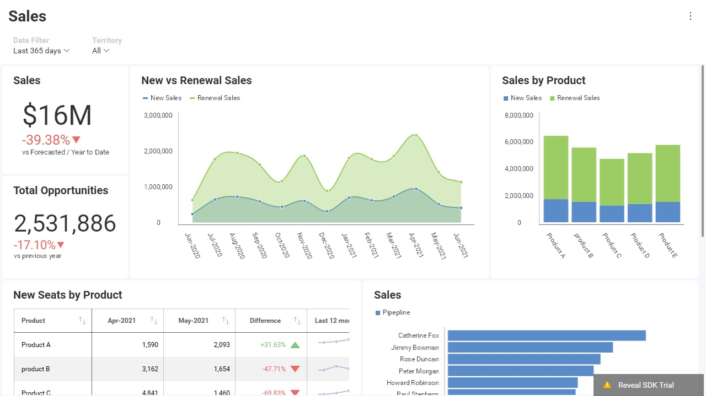

# Theming Dashboards

## Built-In Themes

Reveal SDK comes with four built-in themes that can applied:

| Theme              | RevealView                                                   |
| -----              | :--------:                                                   |
| **Mountain Light** |   |
| **Mountain Dark**  |    |
| **Ocean Light**    |      |
| **Ocean Dark**     |       |

## Apply a Theme

To apply a built-in theme, you need to assign the `RevealSdkSetting.theme` property to an instance of your preferred theme.

##### Mountain Light

```javascript
$.ig.RevealSdkSettings.theme = new $.ig.MountainLightTheme();
```

##### Mountain Dark

```javascript
$.ig.RevealSdkSettings.theme = new $.ig.MountainDarkTheme();
```

##### Ocean Light

```javascript
$.ig.RevealSdkSettings.theme = new $.ig.OceanLightTheme();
```

##### Ocean Dark

```javascript
$.ig.RevealSdkSettings.theme = new $.ig.OceanDarkTheme();
```

> [!NOTE]
> The `RevealSdkSetting.theme` property is a static property and will apply to all instances of `RevealView` in your application.

## Custom Themes

When embedding the Reveal SDK into your existing applications, it is important that the dashboards match your application's look and feel. If any of the built-in Reveal SDK themes do not match your application's theme, you can create a custom theme that more closely matches your application's look and feel.

A theme is a class of type `RevealTheme`. It allows you to define colors and fonts for various elements of the the Reveal SDK UI controls.

The `RevealTheme` has the following properties:

| Name                                              | Description                                                                                                    |
| ----                                              | -----------                                                                                                    |
| **chartColors**                                   | The colors used to show the series in your visualizations. You can add an unlimited number of colors. Once all colors are used in a visualization, Reveal will autogenerate new shades of these colors. This way your colors won’t repeat and each value will have its own color.            |
| **accentColor**                                   | The default accent color in Reveal is a shade of blue that you can find in the + Dashboard button and other interactive actions. You can change the color to match the same accent color you use in your applications.                                                                    |
| **dashboardBackgroundColor**                      | Sets the background color of the dashboards. This is the main background color.                                |
| **visualizationBackgroundColor**                  | Sets the background color of the visualizations. This is a secondary background color.                         |
| **conditionalFormatting**                         | Changes the default colors of the bounds you can set when using conditional formatting.                        |
| **regularFont**                                   | Sets the regular font style.                                                                                   |
| **boldFont**                                      | Sets the bold font style.                                                                                      |
| **mediumFont**                                    | Sets the medium font style.                                                                                    |
| **fontColor**                                     | Sets the color of the font.                                                                                    |
| **highlightColor**                                | Sets the highlighting color in specific dashboard scenarios (forecast and outliers statistical functions).     |
| **useRoundedCorners**                             | Rounded corners in buttons, tooltips, containers, visualizations, etc. If set to false, squared corners will be shown.                                                                                                                                                                        |

> [!NOTE]
> When updating theme properties or applying a new theme at runtime, you must call the `RevealView.refreshTheme` method in order to have theme changes applied to the `RevealView`.

### Clone Existing Theme

If you would like to create a theme based on the values of the an existing theme, you can clone the current `RevealTheme` before making making any changes to it.  To clone a theme, simply use the `RevealTheme.clone()` method. Once you have cloned the theme, you can set the theme properties and use it as the new theme.

```javascript
function cloneCurrentTheme() {
    var theme = $.ig.RevealSdkSettings.theme.clone();

    theme.fontColor = "#0000cc";
    theme.accentColor = "#009900";
    theme.dashboardBackgroundColor = "#ffff66";
    theme.visualizationBackgroundColor = "#cccccc";

    theme.chartColors = ["rgb(192, 80, 77)", "rgb(101, 197, 235)", "rgb(232, 77, 137)"];

    return theme;
}
```

After you have cloned and modified and existing theme, you can now apply the theme.

```javascript
$.ig.RevealSdkSettings.theme = this.cloneCurrentTheme();
```

> [!NOTE]
> You can use either `rgb(255, 255, 255)` (RGB) or `#000000` (HEX) colors to specify the color values.

### Create a Custom Theme

If you would like a theme that is more maintainable and easier to reuse and share, we recommend creating a custom theme. Creating a custom theme can be accomplished by creating a new class instance of a `RevealTheme`, and modifying it's properties.

Here is an example of a custom theme:

```javascript
function createCustomTheme(){
    var theme = new $.ig.RevealTheme();

    theme.fontColor = "#ff0000";
    theme.accentColor = "rgb(192, 80, 77)";
    theme.dashboardBackgroundColor = "#000000";
    theme.visualizationBackgroundColor = "rgb(153, 255, 255)";

    theme.chartColors = ["rgb(192, 80, 77)", "rgb(101, 197, 235)", "rgb(232, 77, 137)"]

    theme.mediumFont = "Gabriola";
    theme.boldFont = "Wingdings";

    return theme;
};
```

After you have created your custom theme, you can now apply the theme.

```javascript
$.ig.RevealSdkSettings.theme = this.createCustomTheme();
```

> [!NOTE]
> The source code to this sample can be found on [GitHub](https://github.com/RevealBi/sdk-samples-javascript/tree/main/ThemingDashboards)