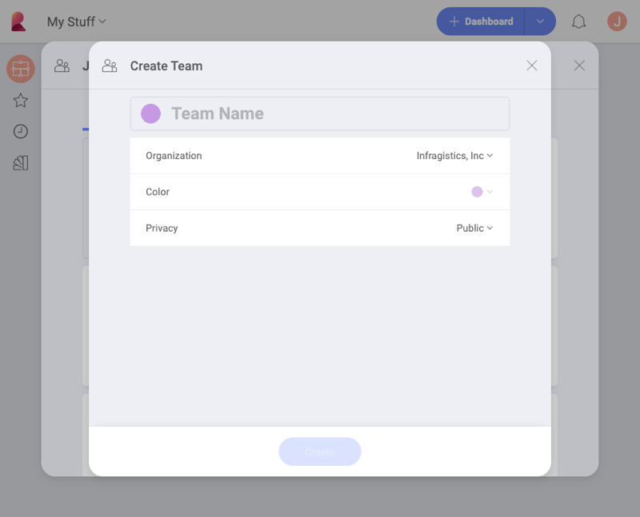

## Creating and Joining Teams

*Teams* in Reveal enables easy collaboration within and out of your
organization. Now you can access and join freely all your organization’s
teams and also make your own team available for others in the
organization to join and work with you.

Start using Teams by [creating a team from scratch](#create-team-scratch) or [joining an existing team](#join-team).

### Creating a Team from Scratch

1.  Click *My Stuff* at the top left corner and select the *Join or Create a Team* button in the popover menu.

  

  >[!NOTE]
  > When signing in for the first time, you might already have a team. This is your [Organization team](teams-collaboration-privacy.html#organization-team) including other members of your organization, who have logged in Reveal with their Office365 account at least once.

2.  Click/Tap the *+ Create Team* blue button. The following screen
    opens:

    

    Here you will need to:

      - assign a *name* to your team;

      - choose team’s *color*;

      - decide on team’s
        [*privacy*](teams-collaboration-privacy.html#team-privacy-levels);

      - choose if your team will belong to the main *Organization*.

          - [Organization team](teams-collaboration-privacy.html#organization-team) (this
            option will appear with the name of your organization, e.g.
            *Infragistics, Inc*) - if you associate your team with the
            main Organization team, your team will appear in the list of
            teams that every member of the main Organization can
            [join](#join-team) (unless you make your team private).

          - *Personal organization* - your new team does not belong to
            the main Organization and cannot be joined by other users
            without invitation.

            >[!NOTE]
            >Carefully choose the *Organization* property for your team as you cannot change it later.

3.  Click/Tap *Create* to continue and start inviting members to your team by adding their emails to the list. They will receive an
invitation by email.

    

    *Member* is the default role for every user you invite, unless you
    assign them a different role.

    >[!NOTE]
    >When adding members, whose emails are not auto-completed by Reveal, type the whole email and press Enter to add it to the list of users you want to invite.

4.  After clicking/tapping *Send Invites* button your new team is
    created. You will find it in the teams' list under *My Stuff* in the
    popover menu shown below:

    

### Joining an Existing Team

If your account has been automatically added to an [Organization team](teams-collaboration-privacy.html#organization-team), you can **discover
and join other teams that belong to your organization**.
To join an existing team, follow the steps below.

1.  Click/Tap the popover menu in the top left corner (next to the
    *Reveal* icon)

2.  Click/tap the *Join or Create a Team* blue button.

3.  The following screen shows up:

    

    Here you will find all the
    [public](teams-collaboration-privacy.html#team-privacy-levels) teams that
    belong to your organization.

4.  After clicking/tapping the *Join* button, you will automatically be
    added as a new member with Member’s
    [permissions](teams-collaboration-privacy.html#members-roles-permissions)
    to the team you have chosen. The team will appear in your [teams' list](organizing-teams-list.md).
