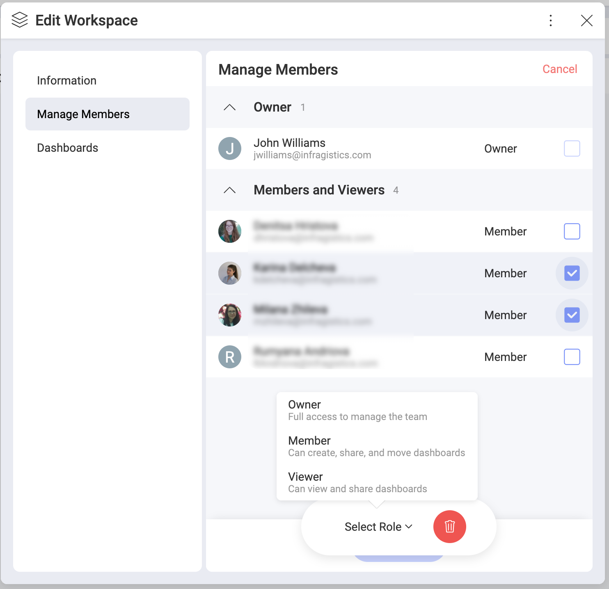
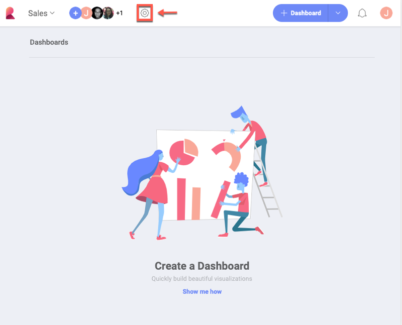

## Managing Teams

As an [Owner](overview.html#members-roles-permissions) of
a team you can:

  - manage team members;

  - manage team properties;

  - [delete](#delete-team) the team;

As a special type of team, the [Organization repository](overview.html#organization-team) management
corresponds to the general rules of team management in Reveal. In the
cases when there are differences in Organization repository management,
they will be explicitly mentioned in this topic.

### Managing Team Members

Only the Owner of a team can invite members.

To see the full members' list of a team: go to your teams' list → click/tap the overflow button of a team → select *Manage Members*, as shown below.

Here you can change members' roles, remove members and add new ones.

Additionally to the members who are already part of your team, you will
also see those who still have not accepted your invitation. Their names
appear grayed out. You cannot change their role before they accept the
invitation.

#### Changing the role or removing more than one member at the same time

1. Select the checked box on the right of the *+Members* blue button.
2. Checkboxes on the right of members' roles appear.
3.  Select the trash icon or a role from the menu at the bottom center
    of the screen.

### Managing Team Properties

To change your team's properties:
go to your teams' list → click/tap the overflow button of a team → select *Team Settings*, as shown below.

Here you can change team's *Privacy* settings, *Color* and name of your
team.

You can also configure your team's **branding** by uploading a logo and
setting a color. The image used as a *logo* must be:

  - jpg, jpeg, png, gif;

  - 5 MB max.

Your branding information will be used when exporting dashboards to PDF
documents and PowerPoint presentations.

**Organization repository**: You cannot change the name of the
Organization repository.

### Deleting a Team

You can delete a team only if you are an Owner. To do this, go to the
team's [settings](#manage-team-properties) and click *Delete Team*.

When you delete a team, it disappears with all its content.

A team is also deleted if its last member leaves it.

**Organization repository**: cannot be deleted.

### Leaving a Team

To leave a team, go to the team's [members' list](#manage-team-members),
click/tap the dropdown menu on the right of your name and select
*Leave*.

If you are the only Owner of a team you cannot leave it without
assigning another member as an Owner.

Reveal shows you all the members of the team who are suitable for an
Owner's role.

**Organization repository**: If you are the only (or last) owner of the
Organization repository and want to leave it, please contact
Infragistics to start the process of assigning a new owner.
