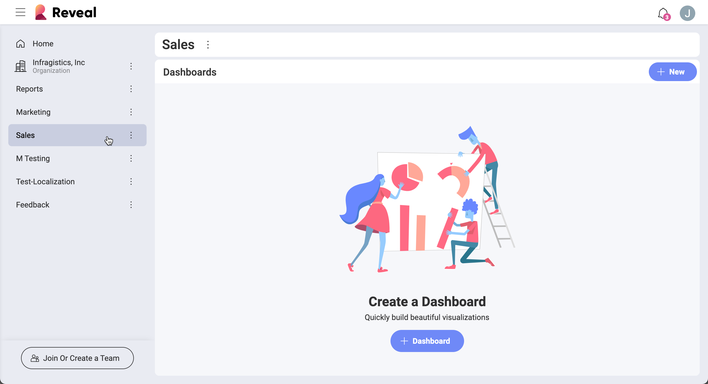

## Team Collaboration and Privacy

*Teams* facilitates effective collaboration on dashboards between any
group of Reveal users while also ensuring a high level of security for
dashboards with sensitive information.

With Teams in Reveal, you can:

  - Organize your group's work in a **team's dashboards** section -
    create and share dashboards directly with other members, view and
    edit their dashboards.

  - [**Share**](~/en/dashboards/sharing-dashboards/share-a-dashboard.md) your team's dashboards with other teams and users in Reveal.

  - Assign every team member to one of [**three members' roles**](#members-roles-permissions) with distinct access level to safeguard dashboards with sensitive information.

  - Bring different departments and employees from across an
    organization working together in an automatically created
    [**Organization repository**](#organization-team).

  - **Discover other teams** that include members who belong to your Organization team.

### Accessing Your Teams

To access your teams click/tap on the popover menu next to the *Reveal* icon:

You will find a list of your teams under *My Stuff* in the popover menu.

### The Organization Repository

Reveal creates the Organization repository automatically when a member
of your organization logs in for the first time with Office365. Members
need to log in with their organization's email to be associated with an
organization and added to the Organization repository.

You will find the Organization team in the teams' list under *My Stuff*.
This team is named after your organization.

Unlike other teams, only [Owners](#members-roles-permissions) can create
and add dashboards to the Organization repository. Only key members in
your organization will be given the owner's role. This limitation
ensures that dashboards in the Organization team contain accurate and
trustworthy data.

### Team Privacy Levels

When creating a team, you can select the level of privacy you want it to
have:

  - **Public**: any member of your main Organization team can search and
    join your team.

  - **Private**: your team won't be found in search results. Users can
    only join it if they get invitations.

### Members' Roles and Permissions

There are three types of team members in Reveal:

  - **Owners**

  - **Members**

  - **Viewers**

The process of assigning these roles in the Organization team differ
from other teams. Below, you will find this process explained as well as
two reference tables illustrating members' permissions in the
Organization and in other teams.

#### Organization Repository - Assigning Members' Roles and Permissions

The first user from an organization, who signs in Reveal, is given the
role of **owner** of the Organization repository. As other users from
the same organization log in they will also be added as owners. After an
owner assigns someone(s) as a **viewer** or a **member** for the first
time, all new users that sign in will be added as members, not owners.

The following table shows the different permissions of members in the
Org team:

| PERMISSION                                                      | Owner                                   | Member                                  | Viewer                                  |
| --------------------------------------------------------------- | --------------------------------------- | --------------------------------------- | --------------------------------------- |
| Can view **dashboards**                                         | Yes | Yes | Yes |
| Can create **dashboards** in the Org repository                 | Yes | No  | No  |
| Can share **dashboards** outside the Org with edit permissions  | Yes | No  | No  |
| Can share **dashboards** outside the Org with view permissions  | Yes | Yes | Yes |
| Can manage **members** in the Organization repository           | Yes | No  | No  |
| Can invite **members** to the Org                               | Yes | No  | No  |
| Can join **public teams** as a member                           | Yes | Yes | Yes |
| Can view **private teams**                                      | No  | No  | No  |
| Can create their own public or private team in the organization | Yes | Yes | No  |

#### Teams - Assigning Members' Roles and Permissions

When a user creates a team, they are the owner of that team and can
distribute levels of permissions there. The owner invites new members to
their team and assigns their roles.

The table below shows what permissions members of teams different from
the Organization team have.

| PERMISSION                                                      | Owner                                   | Member                                  | Viewer                                  |
| --------------------------------------------------------------- | --------------------------------------- | --------------------------------------- | --------------------------------------- |
| Can view **dashboards**                                         | Yes | Yes | Yes |
| Can create **dashboards** in the team                           | Yes | Yes | No  |
| Can share **dashboards** outside the team with edit permissions | Yes | Yes | No  |
| Can share **dashboards** outside the team with view permissions | Yes | Yes | Yes |
| Can manage team **members**                                     | Yes | No  | No  |
| Can invite **members** to the team                              | Yes | No  | No  |
| Can join **public teams** as a member                           | Yes | Yes | Yes |
| Can view **private teams**                                      | No  | No  | No  |

If you want to know more about managing teams' and Organization
repository's properties and members, please read the [Managing Teams](managing-your-team.md) topic.
