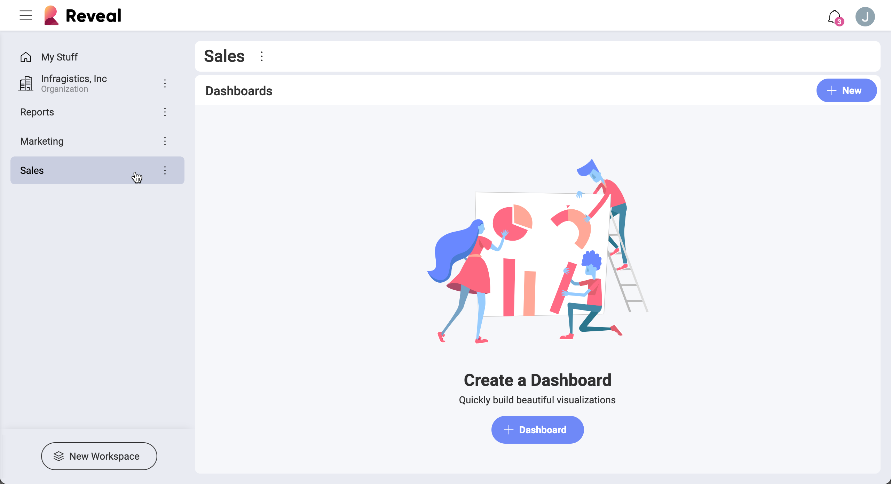

## Workspaces Collaboration and Privacy

The *workspaces* facilitate effective collaboration on dashboards between any
group of Reveal users. They also ensure a high level of security for dashboards with sensitive information.

With workspaces in Reveal, you can:

  - organize your group's work in the workspace section - create and share dashboards directly with other members, view and edit their dashboards.

  - [**Share**](~/en/dashboards/sharing-dashboards/share-a-dashboard.md) the dashboards in your workspace with other workspaces and with individual users in Reveal.

  - Assign every workspace member to one of [**three members' roles**](#members-roles-permissions) with distinct access level to safeguard dashboards with sensitive information.

  - Bring different departments and employees from across an organization working together in an automatically created [**Organization workspace**](#organization-workspace).

  - **Discover other workspaces** that include members who belong to your Organization workspace.

### Accessing Your Workspaces

You can access your workspaces on to the left side of the screen, below the *Reveal* icon:

You will find a list of your workspaces under the *My Stuff* and *Organization* panel. There you can also create new workspaces or join existing ones.

### The Organization Workspace

Reveal creates the Organization workspace automatically when a member of your organization logs in for the first time with Office365. Members need to log in with their organization's email to be associated with an organization and added to the Organization workspace.

You will find the Organization workspace right below _My Stuff_. This workspace is named after your organization.

Unlike other workspaces, only [owners](#members-roles-permissions) can create
and upload dashboards in the Organization workspace. Only key members in
your organization will be given the owner's role. This limitation ensures that dashboards in the Organization workspace contain accurate and trustworthy data.

### Workspace Privacy Levels

When creating a workspace, you can select the level of privacy you want it to
have.

  - **Public**: any member of your main Organization workspace can search and
    join your workspace.

  - **Private**: your workspace won't be found in search results. Users can
    only join it if they get invitations.

### Members' Roles and Permissions

There are three types of workspace members in Reveal:

  - **Owners**

  - **Members**

  - **Viewers**

The process of assigning these roles in the Organization workspace differ
from other workspaces. Below, you will find this process explained as well as
two reference tables illustrating members' permissions in the
Organization and in other workspaces.

#### Organization Workspace - Assigning Members' Roles and Permissions

The first user from an organization, who signs in Reveal, is given the
role of **owner** of the Organization workspace. Other users from the same organization who sign in for the first time will also be added as owners. After one of the owners assigns someone as a **viewer** or a **member** for the first
time, future new users will be added as members, not owners.

The following table shows the different permissions of members in the
Org workspace:

| PERMISSION                                                      | Owner                                   | Member                                  | Viewer                                  |
| --------------------------------------------------------------- | --------------------------------------- | --------------------------------------- | --------------------------------------- |
| Can view **dashboards**                                         | Yes | Yes | Yes |
| Can create, edit, delete **dashboards** in the Org workspace                 | Yes | No  | No  |
| Can share **dashboards** outside the Org with edit permissions  | Yes | No  | No  |
| Can share **dashboards** outside the Org with view permissions  | Yes | Yes | Yes |
| Can manage **members** in the Organization workspace           | Yes | No  | No  |
| Can **invite** users to the Org                               | Yes | No  | No  |
| Can discover and join **public workspaces**                           | Yes | Yes | Yes |
| Can discover **private workspaces**                                      | No  | No  | No  |
| Can create their own workspace in the Organization | Yes | Yes | No  |

#### Workspaces - Assigning Members' Roles and Permissions

When a user creates a workspace, they are the owner of that workspace and can
distribute levels of permissions there. The owner invites new members and assigns their roles.

The table below shows the user permissions inside workspaces different from
the Organization workspace.

| PERMISSION                                                      | Owner                                   | Member                                  | Viewer                                  |
| --------------------------------------------------------------- | --------------------------------------- | --------------------------------------- | --------------------------------------- |
| Can view **dashboards**                                         | Yes | Yes | Yes |
| Can create, edit, delete **dashboards** in the workspace                           | Yes | Yes | No  |
| Can share **dashboards** outside the workspace with edit permissions | Yes | Yes | No  |
| Can share **dashboards** outside the workspace with view permissions | Yes | Yes | Yes |
| Can manage workspace **members**                                     | Yes | No  | No  |
| Can **invite** users                             | Yes | No  | No  |
| Can join **public workspaces** as a member                           | Yes | Yes | Yes |
| Can discover **private workspaces**                                      | No  | No  | No  |

If you want to know more about managing workspaces' and Organization's properties and members, please read the [Managing Workspaces](managing-your-workspace.md) topic.
