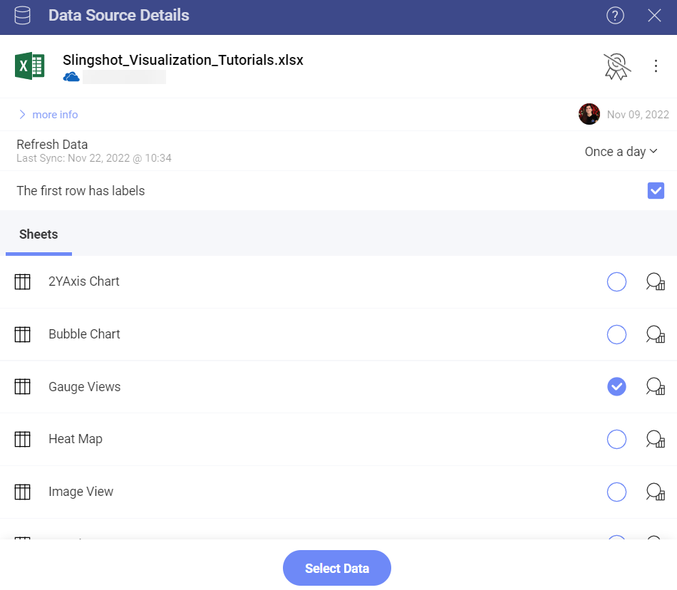
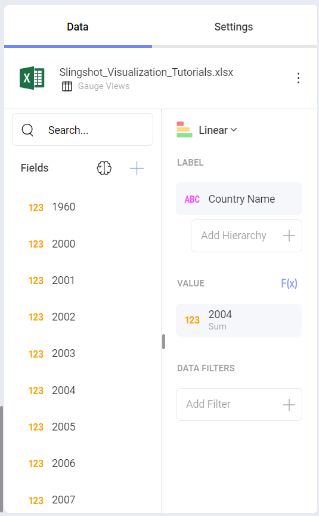
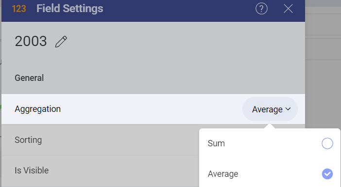
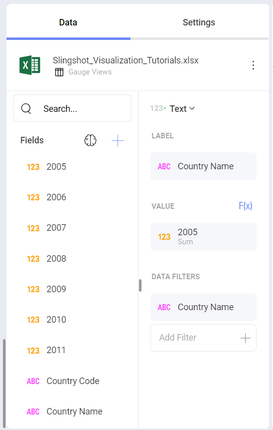
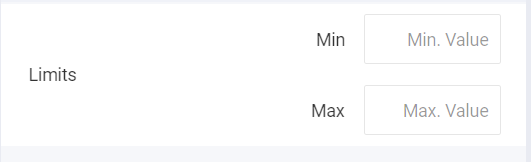

# Creating Gauge Visualizations

In this tutorial, you will learn how to create gauge visualizations
using a sample spreadsheet.

Access the links below for the gauge view walkthroughs:

  - [How to create a Linear Gauge](https://www.slingshotapp.io/en/help/docs/analytics/visualization-tutorials/gauge-charts#creating-a-linear-gauge)

  - [How to create a Circular Gauge](https://www.slingshotapp.io/en/help/docs/analytics/visualization-tutorials/gauge-charts#creating-a-circular-gauge)

  - [How to create a Text Gauge](https://www.slingshotapp.io/en/help/docs/analytics/visualization-tutorials/gauge-charts#creating-a-text-gauge)

  - [How to create a Bullet Graph](https://www.slingshotapp.io/en/help/docs/analytics/visualization-tutorials/gauge-charts#creating-a-bullet-graph)

  - [How to add bounds to your gauge visualizations](https://www.slingshotapp.io/en/help/docs/analytics/visualization-tutorials/gauge-charts#adding-bounds-to-your-gauge)

  - [How to change band colors](https://www.slingshotapp.io/en/help/docs/analytics/visualization-tutorials/gauge-charts#changing-band-colors)

## Key Concepts

There are three different layouts to choose from when using gauge charts:

  - **Bounds Configuration**. The bounds configuration for gauges covers
    the lowest and highest possible values in your gauges. It is usually
    set to the lowest value in your data source by default, but you can
    change it to exclude specific data.

  - **Bands Configuration**. The bands configuration allows you to
    establish three different ranges for your information (Higher than,
    between, and Less than). You can override the default values with
    ranges tailored to your data source.

## Sample Data Source

For this tutorial, you will use the "Gauge Views" sheet in the [Reveal Tutorials Spreadsheet](https://download.infragistics.com/reportplus/help/samples/Reveal_Visualization_Tutorials.xlsx).

>[!NOTE]
>Excel files as local files are not supported in this release. In order to follow these tutorials, make sure you upload the file to one of the supported cloud services or add it as a [Web Resource](~/en/datasources/supported-data-sources/web-resource.md).

## Creating a Linear Gauge

1. Select the **+ Dashboard** button in the top right-hand corner in the **My Analytics** section.

                                         

2. Select your data source(**Reveal Tutorials Spreadsheet**) from the list of data sources. If the data source is new, you will need to first add it from the **+ Data Source** button in the top-right corner.

                                             

3. Choose the **Gauge Views** sheet.
  
   
         
4. Open the *Visualization Picker* and select any of the **Gauges** visualizations. By default, the visualization type will be set to *Column*. 

   

5. This linear gauge, for example, will display life expectancy per Country. Drag and drop the **Country Name** field to **Label** and one of the year fields into **Values**.
  
                            

## Creating a Circular Gauge

1. Select the **+ Dashboard** button in the top right-hand corner of **My Analytics**.

                                         

2. Select your data source(**Reveal Tutorials Spreadsheet**) from the list of data sources. If the data source is new, you will need to first add it from the **+ Data Source** button in the top-right corner.

                                             

3. Choose the **Gauge Views** sheet.
  
   
         
4. Open the *Visualization Picker* and select any of the **Gauges** visualizations. By default, the visualization type will be set to *Column*. 

   

5. This linear gauge, for example, will display life expectancy per Country. Drag and drop the **Country Name** field to **Label** and one of the year fields into **Values**.
  
    

Circular Gauges are particularly useful to show average values as well
as sum of values. In order to change the aggregation for the field
displayed in Values:

|                                              |                                                                            |                                                                                           |
| -------------------------------------------- | -------------------------------------------------------------------------- | ----------------------------------------------------------------------------------------- |
| 1\. **Access Field Settings for your Value** |  | Select the field in **Value** to access                                                  |
| 2\. **Choose a different Aggregation**       |          | Expand the **Aggregation** dropdown and select a different option (for example, Average). |

## Creating a Text Gauge

1. Select the **+ Dashboard** button in the top right-hand corner of **My Analytics**.

                                         

2. Select your data source(**Reveal Tutorials Spreadsheet**) from the list of data sources. If the data source is new, you will need to first add it from the **+ Data Source** button in the top-right corner.

                                             

3. Choose the **Gauge Views** sheet.
  
   
         
4. Open the *Visualization Picker* and select the *Text Gauge*. By default, the visualization type will be set to *Column*. 

   

5. This text gauge, for example, will display life expectancy per Country. Drag and drop one of the year fields into "Values", and then the "Country Name" field into "Data Filters". Then, select the specific country you want by selecting the field. 

   

The text gauge sample above utilizes
the average aggregation. In order to learn how to change your field's
aggregation, [review these instructions](#aggregation-instructions).

## Creating a Bullet Graph

1. Select the **+ Dashboard** button in the top right-hand corner of **My Analytics**.

                                         

2. Select your data source(**Reveal Tutorials Spreadsheet**) from the list of data sources. If the data source is new, you will need to first add it from the **+ Data Source** button in the top-right corner.

                                             

3. Choose the **Gauge Views** sheet.
  
   
         
4. Open the *Visualization Picker* and select any of the *Bullet Graph* visualizations. By default, the visualization type will be set to *Column*. 

   

5. This bullet graph, for example, will display life expectancy per Country. Drag and drop the *Country Name* field to **Label**, one of the years into **Values**, and another year into **Target**.

   

## Adding Bounds to your Gauge

Bounds allow you to set the lowest and highest values in your gauges; as
mentioned in [Key Concepts](###ey-concepts), you can change it to exclude
specific data. In order to do this:

|                                                |                                                                        |                                                                                                                                       |
| ---------------------------------------------- | ---------------------------------------------------------------------- | ------------------------------------------------------------------------------------------------------------------------------------- |
| 1\. **Change Settings**                        |  | Go to the **Settings** section of the Visualization Editor.                                                                           |
| 2\. **Change the Default selection in Limits** |          | Depending on whether you want to set the minimum or maximum value (or both), enter the value you want the chart to start or end with. |

## Changing Band Colors

The colors for the three different ranges (Higher than, Lower than and
Between) can be changed between the predefined colors. In order to do
so:

|                                    |                                                                        |                                                                          |
| ---------------------------------- | ---------------------------------------------------------------------- | ------------------------------------------------------------------------ |
| 1\. **Change Settings**            |  | Go to the **Settings** section of the Visualization Editor.              |
| 2\. **Access the Colors dropdown** |      | Expand the dropdown of the range for which you want to change the color. Select one of Reveal's three predefined colors for your band color.|

