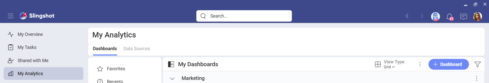
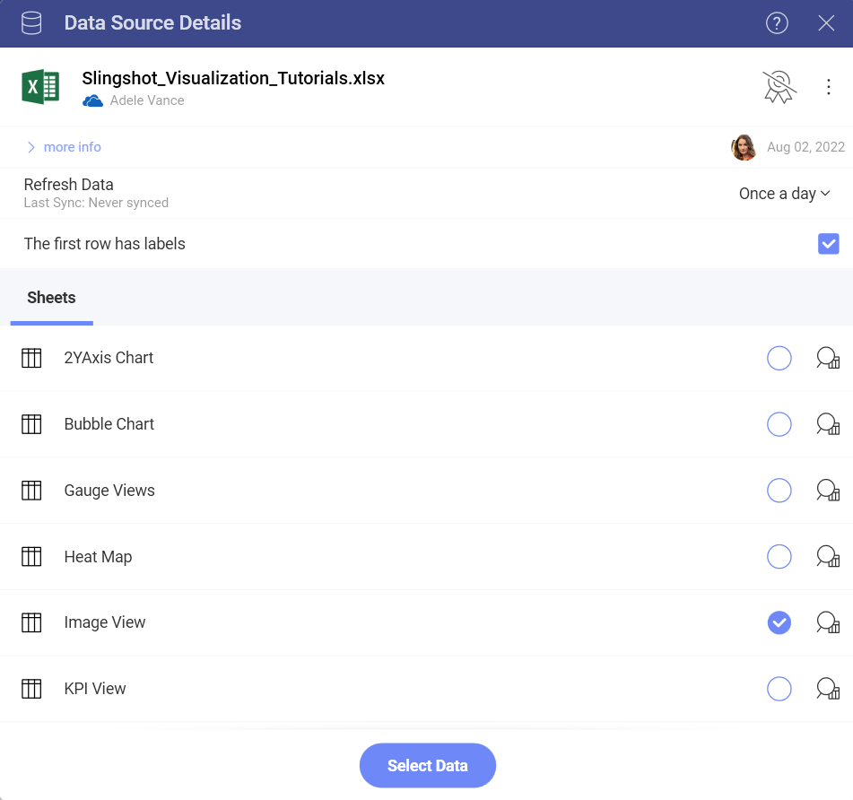

# Creating an Image Chart

In this tutorial, you will learn how to create an Image visualization
using a sample spreadsheet.

## Key Concepts

As mentioned in the Data Visualization section, the [Image Chart](image-chart.md) displays information in an embedded browser by making
a request to a URL and displaying the results. The data source,
therefore, will need to:

  - Include a link to a web resource to be displayed in the widget.

  - Include it **in the first row of the data set**.

## Sample Data Source

For this tutorial, you will use the "Image Chart" sheet in the [Slingshot Visulization Tutorials](https://download.infragistics.com/reportplus/help/samples/Reveal_Visualization_Tutorials.xlsx).

## Creating an Image Chart

|                                          |                                                                                                |                                                                                                                                                      |
| ---------------------------------------- | ---------------------------------------------------------------------------------------------- | ---------------------------------------------------------------------------------------------------------------------------------------------------- |
| 1\. **Create a Dashboard**               |                    | In **My Analytics**, select the **+ Dashboard button** in the top right-hand corner. |
| 2\. **Configure your Data Source**       |                        | A dialog will open, contening a list of already added data source. The Visualization Tutorial file will be there as a data source if you have already used it. In case you haven't added the file, you can click/tap on **+Data Source** > **Data Files** > **+New** >**Upload** >select the file and click/tap on **Select and Continue** to include it in the list.|
| 3\. **Select the Tutorials Spreadsheet** |  | Once the data source is configured, select the *Image View* sheet.                                |
| 4\. **Select your Visualization**        |                            | By default, the visualization type will be set to *Column*. Select the *Image* option.                                                               |
| 5\. **Organize your Data**               |          | Drag any of the available fields into **URL**.                                                                                                       |
