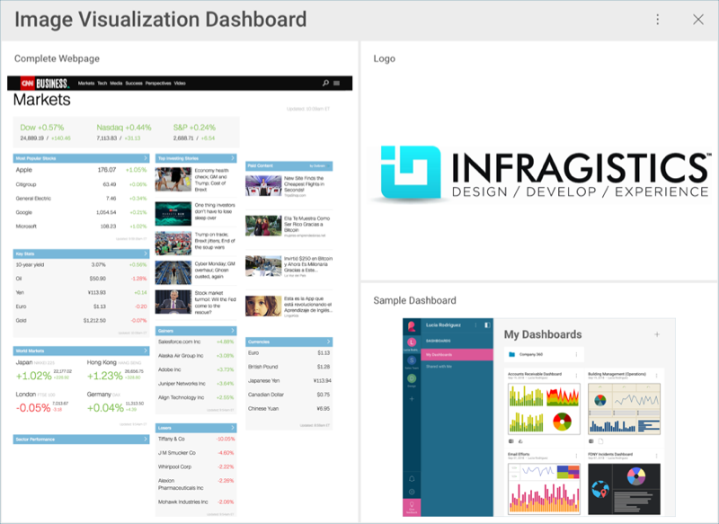
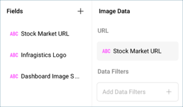

# Creating an Image Chart

In this tutorial, you will learn how to create an Image visualization
using a sample spreadsheet.

## Key Concepts

As mentioned in the Data Visualization section, the [Image Chart](image-chart.md) displays information in an embedded browser by making
a request to a URL and displaying the results. The data source,
therefore, will need to:

  - Include a link to a web resource to be displayed in the widget.

  - Include it **in the first row of the data set**.

## Sample Data Source

For this tutorial, you will use the "Image Chart" sheet in the [Reveal Tutorials Spreadsheet](https://download.infragistics.com/reportplus/help/samples/Reveal_Visualization_Tutorials.xlsx).

>[!NOTE]
>Excel files as local files are not supported in this release. In order to follow these tutorials, make sure you upload the file to one of the supported cloud services or add it as a [Web Resource](~/en/datasources/supported-data-sources/web-resource.md).

## Creating an Image Chart

|                                          |                                                                                                |                                                                                                                                                      |
| ---------------------------------------- | ---------------------------------------------------------------------------------------------- | ---------------------------------------------------------------------------------------------------------------------------------------------------- |
| 1\. **Create a Dashboard**               |                    | In the dashboard viewer, select the + button in the top right-hand corner of the "My Dashboards" screen. Then, select "Dashboard" from the dropdown. |
| 2\. **Configure your Data Source**       |                        | In the *New Visualization* window, select the + button in the bottom right corner and select your data source.                                       |
| 3\. **Select the Tutorials Spreadsheet** |  | Once the data source is configured, select the **Reveal Tutorials Spreadsheet**. Then, choose the "Image View" sheet.                                |
| 4\. **Open the Visualizations Menu**     |      | Select the **grid icon** in the top bar of the Visualizations Editor.                                                                                |
| 5\. **Select your Visualization**        |                            | By default, the visualization type will be set to "Grid". Select the **Image** option.                                                               |
| 6\. **Organize your Data**               |          | Drag any of the available fields into **URL**.                                                                                                       |
