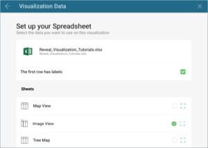
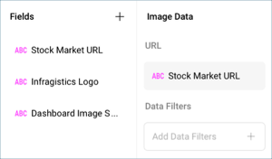

## Creating an Image View

In this tutorial, you will learn how to create an Image visualization
using a sample spreadsheet.

### Key Concepts

As mentioned in the Data Visualization section, the [Image View](image-view.md) displays information in an embedded browser by making
a request to a URL and displaying the results. The data source,
therefore, will need to:

  - Include a link to a web resource to be displayed in the widget.

  - Include it **in the first row of the data set**.

### Sample Data Source

For this tutorial, you will use the "Image View" sheet in the [Reveal Tutorials Spreadsheet](http://download.infragistics.com/reportplus/help/samples/Reveal_Visualization_Tutorials.xlsx).

>[!NOTE]
>Excel files as local files are not supported in this release. In order to follow these tutorials, make sure you upload the file to one of the supported [cloud services](data-sources.md) or add it as a [Web Resource](web-resource.md).

### Creating an Image View

|                                          |                                                                                                |                                                                                                                                                      |
| ---------------------------------------- | ---------------------------------------------------------------------------------------------- | ---------------------------------------------------------------------------------------------------------------------------------------------------- |
| 1\. **Create a Dashboard**               |                    | In the dashboard viewer, select the + button in the top right-hand corner of the "My Dashboards" screen. Then, select "Dashboard" from the dropdown. |
| 2\. **Configure your Data Source**       |                        | In the *New Visualization* window, select the + button in the bottom right corner and select your data source.                                       |
| 3\. **Select the Tutorials Spreadsheet** |  | Once the data source is configured, select the **Reveal Tutorials Spreadsheet**. Then, choose the "Image View" sheet.                                |
| 4\. **Open the Visualizations Menu**     |      | Select the **grid icon** in the top bar of the Visualizations Editor.                                                                                |
| 5\. **Select your Visualization**        |                            | By default, the visualization type will be set to "Grid". Select the **Image** option.                                                               |
| 6\. **Organize your Data**               |          | Drag any of the available fields into **URL**.                                                                                                       |
