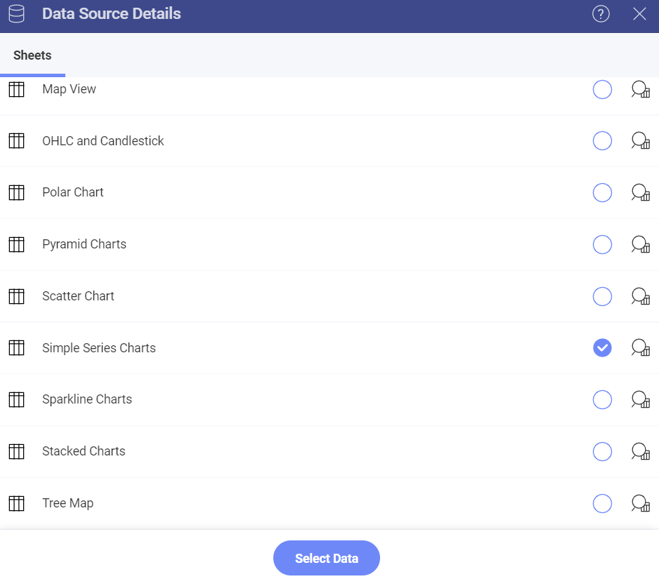
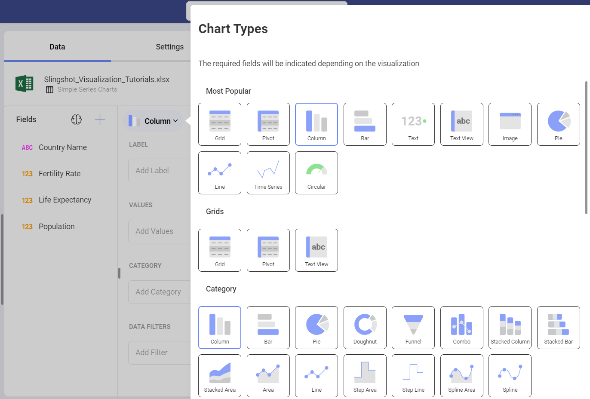
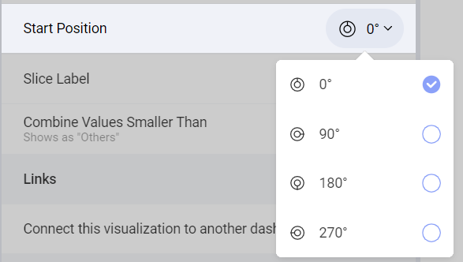
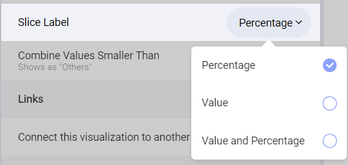

# Creating Simple-Series Charts

In this tutorial, you will learn how to create a simple-series chart
visualization using a sample spreadsheet.

Access the links below for the Simple chart view walkthroughs:

  - [How to create an Area chart](https://www.slingshotapp.io/en/help/docs/analytics/visualization-tutorials/simple-charts#creating-your-chart)

  - [How to add a trendline to your chart](https://www.slingshotapp.io/en/help/docs/analytics/visualization-tutorials/simple-charts#adding-a-trendline-to-your-chart)

  - [How to change your axis configuration](https://www.slingshotapp.io/en/help/docs/analytics/visualization-tutorials/simple-charts#changing-your-axis-configuration)

  - [How to set your axis configuration to logarithmic](https://www.slingshotapp.io/en/help/docs/analytics/visualization-tutorials/simple-charts#setting-your-axis-configuration-as-logarithmic)

  - [How to change the start position for Doughnut and Pie charts](https://www.slingshotapp.io/en/help/docs/analytics/visualization-tutorials/simple-charts#changing-the-start-position-for-doughnut-and-pie-charts)

  - [How to change the slice labels for Funnel,Pie and Doughnut harts](https://www.slingshotapp.io/en/help/docs/analytics/visualization-tutorials/simple-charts#changing-the-slice-labels-for-doughnut-funnel-and-pie-charts)

## Key Concepts

When working with charts, you can add extra information on top of the
data you want to display. This comes in the form of:

  - **Chart Trendlines**, which will display as lines across your chart.
    These are particularly useful when you want to display the
    relationship between your variables or the overall direction your
    information is taking. There are several algorithms, also known as
    regressions, which you can apply to your charts; you can select them
    within the *Chart Trendline* dropdown.

  - **Axis Configuration**: the axis configuration lets you configure
    the minimum and maximum values for your charts. The minimum value is
    set to 0 by default and the maximum calculated automatically
    depending on your values.

      - *Logarithmic Axis Configuration*: if you check the "Logarithmic"
        checkbox, the scale for your values will be calculated with a
        non-linear scale which takes magnitude into account instead of
        the usual linear scale.

  - **Start Position**: for Doughnut and Pie charts, you can configure
    the start position for the chart to rotate the slices and change the
    order in which your data is presented.

  - **Slice Labels**: for Doughnut, Funnel, and Pie Charts, you can
    change the slice labels to display values, percentages, or both at
    the same time.

## Sample Data Source

For this tutorial, you will use the "Simple Series Charts" sheet in the
[Reveal Tutorials Spreadsheet](https://download.infragistics.com/reportplus/help/samples/Reveal_Visualization_Tutorials.xlsx).

>[!NOTE]
>Excel files as local files are not supported in this release. In order to follow these tutorials, make sure you upload the file to one of the supported cloud services or add it as a [Web Resource](~/en/datasources/supported-datasources/web-resource.md).

## Creating your Chart

1. Select the **+ Dashboard** button in the top right-hand corner of **My Analytics**.

                                         

2. Select your data source(**Reveal Tutorials Spreadsheet**) from the list of data sources. If the data source is new, you will need to first add it from the **+ Data Source** button in the top-right corner.

                                             

3. Choose the **Simple Series Charts** sheet.     

   

4. Open the *Visualization Picker* and select any of the **chart** visualizations. By default, the visualization type will be set to *Column*. 

    
 
 5. The charts in the table above, for example, display the population for a select list of countries. Drag and drop the "Country Name" field to "Label" and the "Population" field into "Values".                                                        
                                      

## Adding a Trendline to your Chart

You can add a chart trendline to display the relationship between your
chart variables, or to display the overall direction of your
information. In order to do this:

|                                     |                                                                        |                                                                  |
| ----------------------------------- | ---------------------------------------------------------------------- | ---------------------------------------------------------------- |
| 1\. **Change Settings**             |  | Go to the **Settings** section of the Visualization Editor.      |
| 2\. **Access the Chart Trendlines** |  | Expand the Chart Trendline dropdown by selecting the down arrow to select one of Reveal's predefined trendlines. |

## Changing your Axis Configuration

Similarly to the [Gauge bands](~/en/data-visualizations/gauge-charts.html#bands-configuration), the
chart axis configuration allows you to set the lowest and highest values
in your chart. You can use this feature to include or exclude specific
data.

|                                        |                                                                                      |                                                                                                                                       |
| -------------------------------------- | ------------------------------------------------------------------------------------ | ------------------------------------------------------------------------------------------------------------------------------------- |
| 1\. **Change Settings**                |                | Go to the **Settings** section of the Visualization Editor.                                                                           |
| 2\. **Access the Axis Bounds section** |                            | Navigate to *Axis Bounds*. Depending on whether you want to set the minimum or maximum value (or both), enter the value you want the chart to start or end with. |

## Setting your Axis Configuration as Logarithmic

|                                           |                                                                          |                                                             |
| ----------------------------------------- | ------------------------------------------------------------------------ | ----------------------------------------------------------- |
| 1\. **Change Settings**                   |    | Go to the **Settings** section of the Visualization Editor. |
| 2\. **Access the Axis option**            |                | Expand the Axis dropdown by selecting the down arrow and select *Logarithmic*.      |       

## Changing the Start Position for Doughnut and Pie Charts

|                                                   |                                                                                |                                                                                           |
| ------------------------------------------------- | ------------------------------------------------------------------------------ | ----------------------------------------------------------------------------------------- |
| 1\. **Change Settings**                           |          | Go to the **Settings** section of the Visualization Editor.                               |
| 2\. **Access the Start Position section**         |                | Expand the *Start Position* dropdown by selecting the down arrow. Select one of Reveal's predefined start positions for your chart (0°, 90°, 180° or 270°).                          |

## Changing the Slice Labels for Doughnut, Funnel, and Pie Charts

|                                                |                                                                          |                                                                                                        |
| ---------------------------------------------- | ------------------------------------------------------------------------ | ------------------------------------------------------------------------------------------------------ |
| 1\. **Change Settings**                        |    | Go to the **Settings** section of the Visualization Editor.                                            |
| 2\. **Access the Slice Label section**         |                | Expand the Slice Labels dropdown by selecting the down arrow. Select one of Reveal's predefined labeling options ("Percentage", "Value", or "Value and Percentage").                                       |
