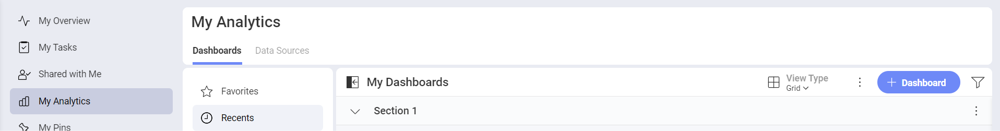
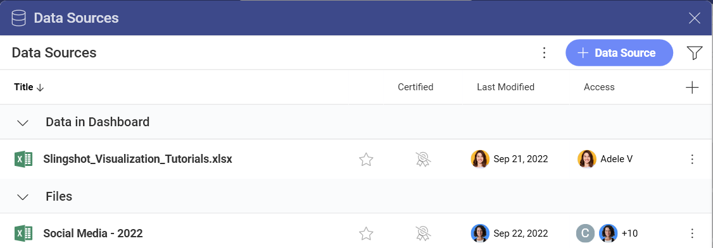
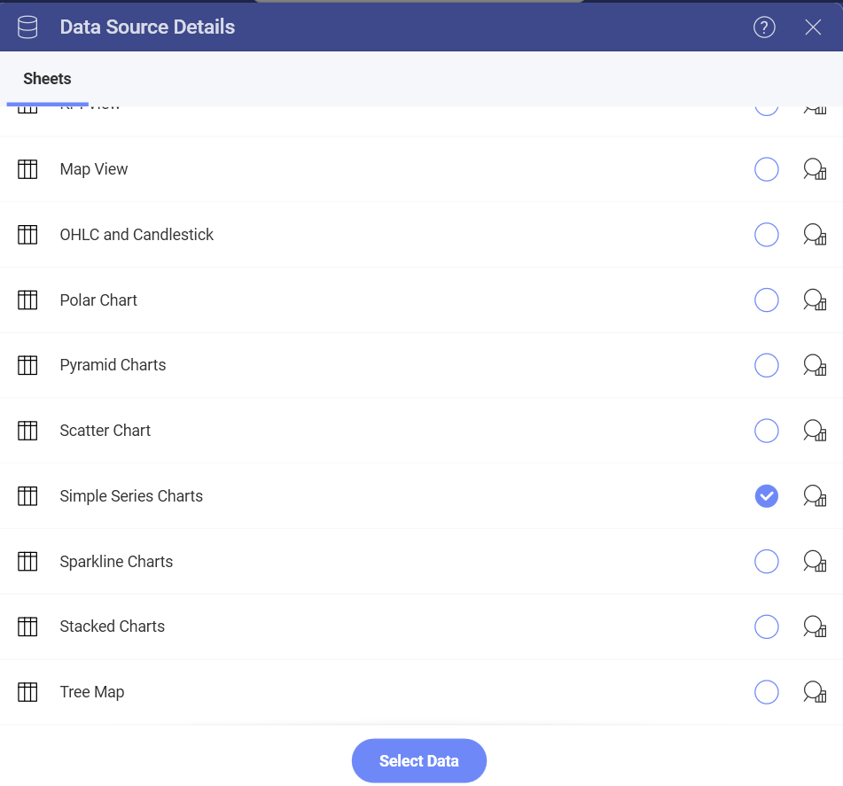
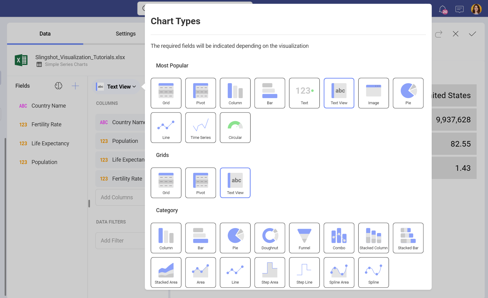
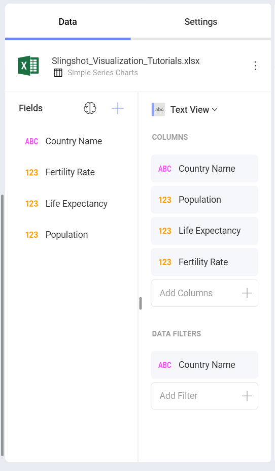
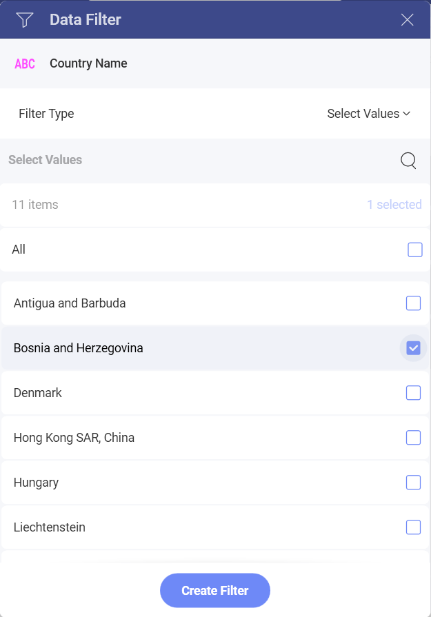

# Creating a Text View

In this tutorial, you will learn how to create a text view visualization
using a sample spreadsheet.

Access the links below for the Text view walkthroughs.

  - [How to create a basic Text View](#creating-text-view)

  - [How to change the selected row](#changing-selected-row)

## Key Concepts

Text views display information in a key-value pattern, but **they only
display the first row of data paired with a column's label**. You can,
however, add filters to make sure Reveal displays the row you need.

## Sample Data Source

For this tutorial, you will use the "Simple Series Charts" sheet in the
[Reveal Tutorials Spreadsheet](https://download.infragistics.com/reportplus/help/samples/Reveal_Visualization_Tutorials.xlsx).

>[!NOTE]
>Excel files as local files are not supported in this release. In order to follow these tutorials, make sure you upload the file to one of the supported *cloud services* or add it as a [Web Resource](datasources/supported-data-sources/web-resource.md).

## Creating a Text View

 1. Click/tap on the **+ Dashboard** button in the top right-hand corner in *My Analytics*.

                                                             
 2. You can choose the data source you want to work with from the list of data sources. If the data source is new, you will need to add it from the **+ Data Source** button.

                                                              
 3. Once the data source is configured, select the **Reveal Tutorials Spreadsheet**. Then, choose the "Simple Series Charts" sheet.  

                                                                                           
 4.  Open the *Visualization Picker* and select **Text View**. By default, the visualization type will be set to **Column**.   
 
                                                                                                      
 5. The above text view, for example, displays the population, life expectancy, and fertility rate for a specific country. Drag and drop "Country Name", "Population", "Life Expectancy" and "Fertility Rate" into Columns.

             

## Changing the Selected Row

Text View displays the first row of the sheet by default. You can add a
filter to your data in order to change this. For example, let's make the
text view display row 9 (Bosnia and Herzegovina).

1. Drag and drop the "Country Name" field into Data Filters.  
 
                                                          
2. Select "Filter Type" to enable the dropdown menu, and then choose **Select Values**. 
 
                                                           
3. By default, all values will be selected. Uncheck the "All" box, and select only **Bosnia and Herzegovina**. Then, select **Create Filter** 

     
