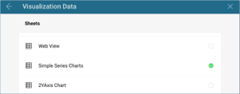

## Creating a Text View

In this tutorial, you will learn how to create a text view visualization
using a sample spreadsheet.

Access the links below for the Text view walkthroughs.

  - [How to create a basic Text View](#creating-text-view)

  - [How to change the selected row](#changing-selected-row)

### Key Concepts

Text views display information in a key-value pattern, but **they only
display the first row of data paired with a column's label**. You can,
however, add filters to make sure Reveal displays the row you need.

### Sample Data Source

For this tutorial, you will use the "Simple Series Charts" sheet in the
[Reveal Tutorials Spreadsheet](http://download.infragistics.com/reportplus/help/samples/Reveal_Visualization_Tutorials.xlsx).

>[!NOTE]
>Excel files as local files are not supported in this release. In order to follow these tutorials, make sure you upload the file to one of the supported [cloud services](data-sources.md) or add it as a [Web Resource](web-resource.md).

### Creating a Text View

|                                          |                                                                                                                   |                                                                                                                                                                                                                         |
| ---------------------------------------- | ----------------------------------------------------------------------------------------------------------------- | ----------------------------------------------------------------------------------------------------------------------------------------------------------------------------------------------------------------------- |
| 1\. **Create a Dashboard**               |                                       | In the dashboard viewer, select the + button in the top right-hand corner of the "My Dashboards" screen. Then, select "Dashboard" from the dropdown.                                                                    |
| 2\. **Configure your Data Source**       |                                           | In the *New Visualization* window, select the + button in the bottom right corner and select your data source.                                                                                                          |
| 3\. **Select the Tutorials Spreadsheet** |  | Once the data source is configured, select the **Reveal Tutorials Spreadsheet**. Then, choose the "Simple Series Charts" sheet.                                                                                         |
| 4\. **Open the Visualizations Menu**     |                         | Select the **grid icon** in the top bar of the Visualizations Editor.                                                                                                                                                   |
| 5\. **Select your Visualization**        |                                 | By default, the visualization type will be set to "Grid". Select the **Text View**.                                                                                                                                     |
| 6\. **Organize your Data**               |                               | The above text view, for example, displays the population, life expectancy, and fertility rate for a specific country. Drag and drop "Country Name", "Population", "Life Expectancy" and "Fertility Rate" into Columns. |

### Changing the Selected Row

Text View display the first row of the sheet by default. You can add a
filter to your data in order to change this. For example, let's make the
text view display row 9 (Bosnia and Herzegovina).

|                           |                                                                       |                                                                                                                                            |
| ------------------------- | --------------------------------------------------------------------- | ------------------------------------------------------------------------------------------------------------------------------------------ |
| 1\. **Add a Data Filter** |        | Drag and drop the "Country Name" field into Data Filters.                                                                                  |
| 2\. **Set your Filter**   |  | Select "Filter Type" to enable the dropdown menu, and then choose **Select Values**.                                                       |
| 3\. **Select your Value** |      | By default, all values will be selected. Uncheck the "All" box, and select only **Bosnia and Herzegovina**. Then, select **Create Filter** |

