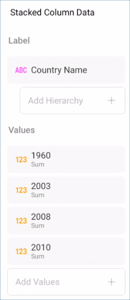
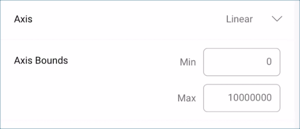

## Creating Stacked Chart Visualizations

In this tutorial, you will learn how to create stacked chart
visualizations using a sample spreadsheet.

<table>
<colgroup>
<col style="width: 33%" />
<col style="width: 33%" />
<col style="width: 33%" />
</colgroup>
<tbody>
<tr class="odd">
<td>
 

<a href="#create-stacked-chart">Stacked Area Chart</a> 

</td>
<td>
 

<a href="#create-stacked-chart">Stacked Bar Chart</a> 

</td>
<td>
 

<a href="#create-stacked-chart">Stacked Columns Chart</a> 

</td>
</tr>
<tr class="even">
<td>
 

<a href="#change-axis-configuration">Stacked Column with Bounds</a> 

</td>
<td>
 

<a href="#set-logarithmic-axis">Stacked Column with Logarithmic Configuration</a> 

</td>
<td>
 

<a href="#enable-percentage-distribution">Stacked Column with Percentage Distribution</a> 

</td>
</tr>
</tbody>
</table>

Access the links below for the Stacked Chart view walkthroughs:

  - [How to create a Stacked Column chart](#create-stacked-chart)

  - [How to change your Stacked chart type](#change-chart-type)

  - [How to change your axis configuration](#change-axis-configuration)

  - [How to set your axis configuration to logarithmic](#set-logarithmic-axis)

  - [How to enable percentage distribution](#enable-percentage-distribution)

### Key Concepts

There are three different layouts to choose from when using stacked
charts: [area](#creating-stacked-chart),
[column](#creating-stacked-chart), and [bar](#creating-stacked-chart).

You can also configure the following settings:

  - **Axis Configuration**: the axis configuration lets you configure
    the minimum and maximum values for your charts. The minimum value is
    set to 0 by default and the maximum calculated automatically
    depending on your values.

      - **Logarithmic Axis Configuration**: if you check the
        "Logarithmic" checkbox, the scale for your values will be
        calculated with a non-linear scale which takes magnitude into
        account instead of the usual linear scale.

### Sample Data Source

For this tutorial, you will use the "Stacked Charts" sheet in the
[Reveal Tutorials Spreadsheet](http://download.infragistics.com/reportplus/help/samples/Reveal_Visualization_Tutorials.xlsx).

>[!NOTE]
Excel files as local files are not supported in this release. In order
to follow these tutorials, make sure you upload the file to one of the
supported [cloud services](data-sources) or add it as a [Web Resource](web-resource.md).

### Creating a Stacked Chart

|                                          |                                                                                                        |                                                                                                                                                                                                                                                 |
| ---------------------------------------- | ------------------------------------------------------------------------------------------------------ | ----------------------------------------------------------------------------------------------------------------------------------------------------------------------------------------------------------------------------------------------- |
| 1\. **Create a Dashboard**               |                            | In the dashboard viewer, select the + button in the top right-hand corner of the "My Dashboards" screen. Then, select "Dashboard" from the dropdown.                                                                                            |
| 2\. **Configure your Data Source**       |                                | In the *New Visualization* window, select the + button in the bottom right corner and select your data source.                                                                                                                                  |
| 3\. **Select the Tutorials Spreadsheet** |  | Once the data source is configured, select the **Reveal Tutorials Spreadsheet**. Then, choose the "Stacked Charts" sheet.                                                                                                                       |
| 4\. **Open the Visualizations Menu**     |              | Select the **grid icon** in the top bar of the Visualizations Editor.                                                                                                                                                                           |
| 5\. **Select your Visualization**        |            | By default, the visualization type will be set to "Grid". Select any of the **stack** visualizations.                                                                                                                                           |
| 6\. **Organize your Data**               |        | Stacked charts require two or more fields to be dragged and dropped into the "Values" placeholder of the data editor. In this case, the "1960", "2003", "2008" and "2010" fields have been dropped into "Values" and "Country Name" in "Label". |

### Changing your Stacked Chart Type

If needed, you can choose a different type of stacked chart better
fitted to your needs. In order to do this:

|                                      |                                                                                              |                                                                                                                                      |
| ------------------------------------ | -------------------------------------------------------------------------------------------- | ------------------------------------------------------------------------------------------------------------------------------------ |
| 1\. **Open the Visualizations Menu** |    | Select the **grid icon** in the top bar of the Visualizations Editor.                                                                |
| 2\. **Select your Visualization**    |  | Select the type of stack chart you need. This section has a [preview of every stack chart type](#creating-stacked-chart) at the top. |

### Changing your Axis Configuration

Similarly to the [Gauge bands](~/en/data-visualizations/gauge-views#bands-configuration), the
chart axis configuration allows you to set the lowest and highest values
in your chart. You can use this feature to include or exclude specific
data.

|                                        |                                                                                      |                                                                                                                                       |
| -------------------------------------- | ------------------------------------------------------------------------------------ | ------------------------------------------------------------------------------------------------------------------------------------- |
| 1\. **Change Settings**                |                | Go to the **Settings** section of the Visualization Editor.                                                                           |
| 2\. **Access the Axis Bounds section** |                            | Navigate to Axis Bounds.                                                                                                              |
| 3\. **Change the Default selection**   |  | Depending on whether you want to set the minimum or maximum value (or both), enter the value you want the chart to start or end with. |

### Setting your Axis Configuration as Logarithmic

|                                           |                                                                          |                                                             |
| ----------------------------------------- | ------------------------------------------------------------------------ | ----------------------------------------------------------- |
| 1\. **Change Settings**                   |    | Go to the **Settings** section of the Visualization Editor. |
| 2\. **Access the Axis option**            |                | Expand the Axis dropdown by selecting the down arrow.       |
| 3\. **Select an Axis Configuration type** |  | Select "Logarithmic".                                       |

### Enabling Percentage Distribution

For stacked charts, you can configure the Percentage Distribution. It
allows you to switch between values and percentage distribution scales
for those types of charts. In order to do this:

|                                        |                                                                                    |                                                                                           |
| -------------------------------------- | ---------------------------------------------------------------------------------- | ----------------------------------------------------------------------------------------- |
| 1\. **Change Settings**                |              | Go to the **Settings** section of the Visualization Editor.                               |
| 2\. **Enable Percentage Distribution** |  | Enable the percentage distribution setting by checking the "Percentage Distribution" box. |
