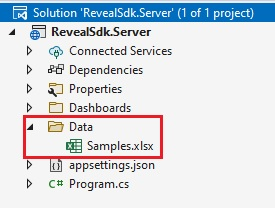

# Adding an Excel File Data Source

**Step 1** - In the ASP.NET Web API server application, create a folder that will contain your Excel files.



**Step 2** - Set the `RevealEmbedSettings.LocalFileStoragePath` property to the location of the folder created in **Step 1**

```cs
builder.Services.AddControllers().AddReveal( builder =>
{
    builder.AddSettings(builder =>
   {
       builder.LocalFileStoragePath = "Data";
   });
});
```

**Step 3** - Add an event handler for the `RevealView.onDataSourcesRequested` event.

First define a `<div>` tag with the `id` set to `revealView`.

```html
<div id="revealView" style="height: 920px; width: 100%;"></div>
```

Initialize the `revealView` and add the event handler.

```javascript
var revealView = new $.ig.RevealView("#revealView");
revealView.onDataSourcesRequested = (callback) => {
    //add code here
    callback(new $.ig.RevealDataSources([], [], true));
};
```

**Step 4** - In the `RevealView.onDataSourcesRequested` event handler, create a new instance of the `RVLocalFileDataSourceItem` object. Set the `Uri` property to the path, including the file name, of the Excel file you want to use as a data source.

```javascript
revealView.onDataSourcesRequested = (callback) => {
    var localFileItem = new $.ig.RVLocalFileDataSourceItem();
    localFileItem.uri = "local:/Samples.xlsx";

    callback(new $.ig.RevealDataSources([], [], true));
};
```

> [!IMPORTANT]
> You must prefix the Excel file path with `local:/`, because this instructs the Reveal SDK to load files using the `RevealEmbedSettings.LocalFileStoragePath` as the root of the file path. If you have subfolders within the root path, be sure to include these subfolders in the `Uri` property. 
>
> For example:
>
> * Without subfolder - `RVLocalFileDataSourceItem.Uri = "local:/FileName.xlsx"`
>
> * With subfolder - `RVLocalFileDataSourceItem.Uri = "local:/SubFolder/FileName.xlsx"`

**Step 5** - Create a new instance of the `RVExcelDataSourceItem` object and pass the `RVLocalFileDataSourceItem` instance you created in the previous step as an argument in the object constructor. Set the `Title` property to a string which describes the data within the Excel file.

Finally, add the `RVExcelDataSourceItem` object to the data source items array in the `callback`.

```javascript
revealView.onDataSourcesRequested = (callback) => {
    var localFileItem = new $.ig.RVLocalFileDataSourceItem();
    localFileItem.uri = "local:/Samples.xlsx";

    var excelDataSourceItem  = new $.ig.RVExcelDataSourceItem(localFileItem);
    excelDataSourceItem .title = "Local Excel File";

    callback(new $.ig.RevealDataSources([], [excelDataSourceItem], true));
};
```

When the application runs, create a new Visualization and you will see the newly created Excel file data source listed in the "Select a Data Source" dialog.


> [!NOTE]
> The source code to this sample can be found on [GitHub](https://github.com/RevealBi/sdk-samples-javascript/tree/main/AddingDataSources/ExcelFile).

> [!IMPORTANT]
> Calling the `$.ig.RevealSdkSettings.setBaseUrl` is required when the server is running on a different URL than the client application. If both the server application and the client application are running on the same URL, this method is not required. This method only needs to be called once.
