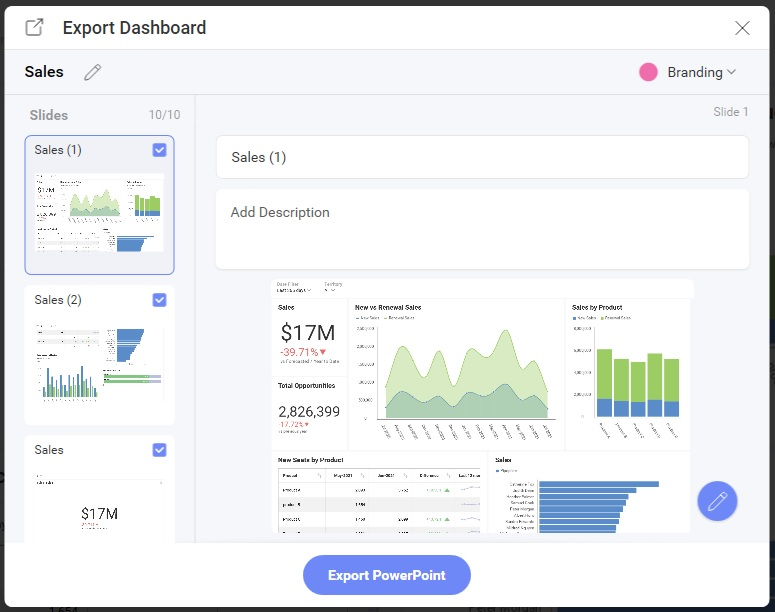

# Exporting

The Reveal SDK allows you to export both dashboards and visualizations to generate new document types or images.

Supported dashboard export formats:
- Excel
- Image
- JSON
- PDF
- Powerpoint

Supported visualization export formats:
- Excel
- Image

All export options can be found under the **Export** menu item in the `RevealView` overflow menu when a dashboard is opened or a visualization is maximized


When the user clicks the **Export** button, they can choose one of the enabled export options.

## Export to Excel
An Excel export is performed when the end-user clicks the **Excel** menu item from the **Export** overflow menu.


The **Excel** menu item can be shown/hidden by setting the `RevealView.showExportToExcel` property.

```javascript
revealView.showExportToExcel = false;
```

When the **Excel** menu item is clicked, the end-user is prompted with various options which allow them to change the title of the workbook, the title of the worksheets, which worksheets to create, and whether or not to include the visualizations.


## Export to Image
There are two ways to export a dashboard or visualization to an image in the Reveal SDK:
- End-User export
- Programmatic export

### End-User Image Export
An end-user image export is performed when the end-user clicks the **Image** menu item from the **Export** overflow menu.


The **Image** menu item can be shown/hidden by setting the `RevealView.showExportImage` property.

```javascript
revealView.showExportImage = false;
```

When the **Image** menu item is clicked, the end-user is prompted with a dialog which allows them to choose either to copy the image to the clipboard, edit them image using the built-in image editor, or save the image to disk as a PNG.


#### Custom Image Export
By default, when an end-user clicks the **Export Image** button in the **Export Image Dialog** the image will be exported and added to the browsers Downloads for the end-user to choose a location to save the image file. However, this behavior can be intercepted and custom image export logic can be used instead.

To use a custom image export, you must add an event handler to the `RevealView.onImageExported` event.

```javascript
revealView.onImageExported = (image) => {

};
```

The `RevealView.onImageExported` event provides the following parameter to help you save image exports:
- **image** - the screenshot of the dashboard that was taken

#### Example: A Custom Image Export

```javascript
revealView.onImageExported = (image) => {
    var body = window.open("about:blank").document.body;
    body.appendChild(image);
};
```

### Programmatic Image Export
To export an image of a dashboard programmatically, without the end-user interaction, you will need to invoke the `RevealView.toImage` method. Calling the `RevealView.toImage` method will create a screenshot of the RevealView component as it is displayed on the screen. The ``RevealView.toImage`` method **does not** prompt the user with the Export Image Dialog.

```cs
revealView.toImage( image => {
    //handle image
});
```

#### Example: Programmatic Image Export

```html
<button onclick="exportToImage()">Export to Image</button>
```

```javascript
function exportToImage() {
    revealView.toImage(image => {
        console.log(image);
        var body = window.open("about:blank").document.body;
        body.appendChild(image);
    });
}
```

> [!NOTE]
> The source code to these sample can be found on [GitHub](https://github.com/RevealBi/sdk-samples-javascript/tree/master/Exporting-Image)

## Export to PDF
A PDF export is performed when the end-user clicks the **PDF** menu item from the **Export** overflow menu.


The **PDF** menu item can be shown/hidden by setting the `RevealView.ShowExportToPDF` property.

```javascript
revealView.showExportToPDF = false;
```

When the **PDF** menu item is clicked, the end-user is prompted with various options which allows them to change the title of the PDF document, choose which visualizations to include in the document, a title and description of each visualization, as well as branding, page orientation, and language.


## Export to PowerPoint
A PowerPoint export is performed when the end-user clicks the **PowerPoint** menu item from the **Export** overflow menu. 


The **PowerPoint** menu item can be shown/hidden by setting the `RevealView.ShowExportToPowerpoint` property.

```javascript
revealView.showExportToPowerPoint = false;
```

When the **PowerPoint** menu item is clicked, the end-user is prompted with various options which allows them to change the title of the PowerPoint document, choose which visualizations to include in the document, a title and description of each visualization, and branding.



## Server Export

Dashboards can be exported to Excel, PDF, or PowerPoint on the server without the need of a UI. Also known as a "headless export". Exporting dashboards on the server is accomplished by using the `IDashboardExporter`.

The `IDashboardExporter` can be obtained by injecting it into your ASP.NET controller or minimal API function as follows:

```csharp
app.MapGet("/dashboards/export/{name}", async (string name, IDashboardExporter dashboardExporter) =>
{

}
```

### How to Export Dashboards
The `IDashboardExporter` provides APIs to export a dashboard as a file stream, or to a file path on disk. Each supported export format has an API to help simplify the export process.

**Excel**
```csharp 
//export to stream
var stream = await dashboardExporter.ExportToExcel(dashboardName);

//export to file
await dashboardExporter.ExportToExcel(dashboardName, filePath);
```

**PDF**
```csharp 
//export to stream
var stream = await dashboardExporter.ExportToPdf(dashboardName);

//export to file
await dashboardExporter.ExportToPdf(dashboardName, filePath);
```

**PowerPoint**
```csharp 
//export to stream
var stream = await dashboardExporter.ExportToPowerPoint(dashboardName);

//export to file
await dashboardExporter.ExportToPowerPoint(dashboardName, filePath);
```

> [!NOTE]
> Exporting to the PDF or PowerPoint formats can be time consuming. If invoking a server side export from the UI, be sure to provide a visual indicator to your user that the export is processing.

### Provide User Context
Sometimes dashboards have data sources that require the Reveal SDK [User Context](user-context.md). In this case, you must provide the Reveal SDK `IRVUserContext` as an argument to the export method to ensure a successful dashboard export.

The first step to obtain the `IRVUserContext` is to inject the `IRVUserContextProvider` and `IHttpContextAccessor` into the ASP.NET controller or minimal API function. Next, make a call to the `IRVUserContextProvider.GetUserContext` passing the `IHttpContextAccessor.HttpContext` as an argument.

```csharp
app.MapGet("/dashboards/export/{name}", async (string name, IDashboardExporter dashboardExporter, 
    IRVUserContextProvider userContextProvider, IHttpContextAccessor httpContextAccessor) =>
{
    var userContext = userContextProvider.GetUserContext(httpContextAccessor.HttpContext);
}
```

Once you have the `IRVUserContext` instance you can pass it as an argument to the export method.

```csharp
//export to stream
var stream = await dashboardExporter.ExportToExcel(dashboardName, userContext);

//export to file
await dashboardExporter.ExportToExcel(dashboardName, filePath, userContext);
```

### Export Options
Each export format supports various options when exporting a dashboard. For example, you can add the author's name to the header of each page, or add the comapny's name to each page footer.

Each export format has a specific options object:
- Excel: use the `ExcelExportOptions` object
- PDF: use the `PdfExportOptions` object
- PowerPoint: use the `PowerPointExportOptions` object

To set options for a dashboard export, create an instance of the export format options class and provide it as an argument to the export method.

```csharp
//create Pdf options
var pdfOptions = new PdfExportOptions()
{
    Landscape = true
};

//export Pdf to stream
var stream = await dashboardExporter.ExportToPdf(dashboardName, options: pdfOptions);
```

### Example: Exporting on the Server
In this example, we will create a service endpoint that will export a dashboard based on the format.

In an ASP.NET minimal API project, create a new route for the dashboard export. Define the dashboard name and the export format as the route parameters. You'll also need to inject the `IDashboardExporter` to perform the export. Next, create the logic to perform the correct export based on the export format route parameter. Be sure to provide the correct content type when returning the results of the export.

```csharp
app.MapGet("/dashboards/export/{name}", async (string name, string format, IDashboardExporter dashboardExporter) =>
{
    Stream stream;
    string contentType = "application/pdf";
    if (format=="xlsx")
    {
        stream = await dashboardExporter.ExportToExcel(name);
        contentType = "application/vnd.openxmlformats-officedocument.spreadsheetml.sheet";
    }
    else if (format == "pptx")
    {
        stream = await dashboardExporter.ExportToPowerPoint(name);
        contentType = "application/vnd.openxmlformats-officedocument.presentationml.presentation";
    }
    else
    {
        stream = await dashboardExporter.ExportToPdf(name);
    }
    
    return Results.File(stream, contentType);
});
```

In the client application. Create a set of buttons that will invoke a function that will make a call to our service endpoint. 
```html
<button onclick="onExportButtonClicked('pdf')">Export as PDF</button>
<button onclick="onExportButtonClicked('xlsx')">Export as Excel</button>
<button onclick="onExportButtonClicked('pptx')">Export as Power Point</button>
```

In this example we are exporting a dashboard named **Sales**, and it will use the export format that was provided by the button being clicked.
```javascript
function onExportButtonClicked(format) {
    fetch(`http://localhost:5111/dashboards/export/Sales?format=${format}`)
    .then(resp => resp.blob())
    .then(blob => 
    {
        downloadFile(blob, format);
    });
}

function downloadFile(blob, format) {
    var a = document.createElement("a");
    a.download = `Sales.${format}`;
    a.href = window.URL.createObjectURL(blob);
    a.click();
}
```

> [!NOTE]
> The source code to this sample can be found on [GitHub](https://github.com/RevealBi/sdk-samples-javascript/tree/main/Exporting-Server).