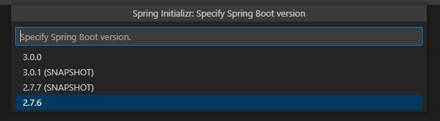
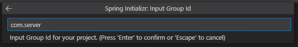
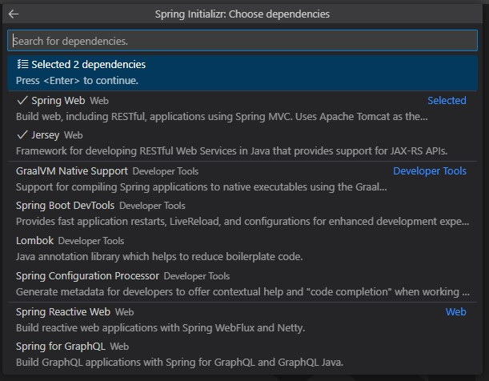

# Setting up the Reveal SDK Server with Spring Boot and Jersey

## Step 1 - Create a Spring Boot with Jersey Project

The steps below describe how to create a new Java Spring Boot with Jersey project. If you want to add the Reveal SDK to an existing application, go to Step 2.

1 - Start Visual Studio Code, open the Command Palette and type **>Spring Initializr: Create a Maven Project** and press **Enter**.


2 - Select the Spring Boot version **2.7.6**.



> [!WARNING]
> Version 3.0.0 is currently not supported

3 - Select **Java**  as the language.


4 - Provide the Group Id. In this example, we are using **com.server**.



5 - Provide the Artifact Id. In this example we are using **reveal**.


6 - Select the **War** package type.


7 - Choose the **Spring Web** and **Jersey** dependencies.



8 - Save and open the newly created project project.


## Step 2 - Add Reveal SDK

1 - Update the **pom.xml** file.

First, add the Reveal Maven repository.

```xml
<repositories>
    <repository>
        <id>reveal.public</id>
        <url>https://maven.revealbi.io/repository/public</url>
    </repository>	
</repositories>
```

Next, add the Reveal SDK as a dependency.

```xml
<dependency>
    <groupId>com.infragistics.reveal.sdk</groupId>
    <artifactId>reveal-sdk</artifactId>
    <version>1.3.0</version>
</dependency>
```

2 - Create a Jersey Config class and initialize the Reveal SDK by calling the `RevealEngineInitializer.initialize` method. In order for the Reveal SDK to function properly with Jersey, we need to register all of the Reveal SDK classes with Jersey. To register the Reveal SDK classes, loop through the classes returned by the `RevealEngineInitializer.getClassesToRegister` method, and register them with the Jersey Config.

```java
import org.glassfish.jersey.server.ResourceConfig;
import org.springframework.stereotype.Component;

import com.infragistics.reveal.engine.init.InitializeParameterBuilder;
import com.infragistics.reveal.engine.init.RevealEngineInitializer;

import javax.ws.rs.ApplicationPath;

@Component
@ApplicationPath("/")
public class RevealJerseyConfig extends ResourceConfig 
{
    public RevealJerseyConfig()
    {
        RevealEngineInitializer.initialize();
        
        //register all Reveal classes in JAX-RS context
        for (Class<?> clazz : RevealEngineInitializer.getClassesToRegister()) {
        	register(clazz);
        }
    }
}
```

## Step 3 - Create Dashboard Provider

1 - In Visual Studio Code, select the **resources** folder and then click the New Folder button in the Explorer. Name the new folder **dashboards**.


2 - Next, create a dashboard provider that will load the Reveal dashboards from the newly created **dashboards** folder.

```java
import com.infragistics.reveal.sdk.api.IRVUserContext;

import java.io.IOException;
import java.io.InputStream;

import com.infragistics.reveal.sdk.api.IRVDashboardProvider;

public class RevealDashboardProvider implements IRVDashboardProvider {

    @Override
    public InputStream getDashboard(IRVUserContext userContext, String dashboardId) throws IOException {
        InputStream dashboardStream = getClass().getResourceAsStream("/dashboards/" + dashboardId + ".rdash");
		return dashboardStream;
    }

    @Override
    public void saveDashboard(IRVUserContext arg0, String arg1, InputStream arg2) throws IOException {
        
    }	
}
```

3 - Finally, register the Dashboard Provider with the `RevealEngineInitializer` in the `RevealJerseyConfig` class.

```java
RevealEngineInitializer.initialize(new InitializeParameterBuilder()
.setDashboardProvider(new RevealDashboardProvider())
.build());
```

## Step 4 - Setup CORs Policy (Debugging)

While developing and debugging your application, it is common to host the server and client app on different URLs. For example; your Server my be running on `https://localhost:24519`, while your Angular app may be running on `https://localhost:4200`. If you were to try and load a dashboard from the client application, it would fail because of a Cross-Origin Resource Sharing (CORS) policy. To enable this scenario, you must create a CORS policy and enable it in the server project.

1 - Create a CorsFilter

```java
import java.io.IOException;

import javax.ws.rs.container.ContainerRequestContext;
import javax.ws.rs.container.ContainerRequestFilter;
import javax.ws.rs.container.ContainerResponseContext;
import javax.ws.rs.container.ContainerResponseFilter;
import javax.ws.rs.container.PreMatching;
import javax.ws.rs.core.Response;

@PreMatching
public class CorsFilter implements ContainerRequestFilter, ContainerResponseFilter {

    /**
     * Method for ContainerRequestFilter.
     */
    @Override
    public void filter(ContainerRequestContext request) throws IOException {

        // If it's a preflight request, we abort the request with
        // a 200 status, and the CORS headers are added in the
        // response filter method below.
        if (isPreflightRequest(request)) {
            request.abortWith(Response.ok().build());
            return;
        }
    }

    /**
     * A preflight request is an OPTIONS request
     * with an Origin header.
     */
    private static boolean isPreflightRequest(ContainerRequestContext request) {
        return request.getHeaderString("Origin") != null
                && request.getMethod().equalsIgnoreCase("OPTIONS");
    }

    /**
     * Method for ContainerResponseFilter.
     */
    @Override
    public void filter(ContainerRequestContext request, ContainerResponseContext response)
            throws IOException {

        // if there is no Origin header, then it is not a
        // cross origin request. We don't do anything.
        if (request.getHeaderString("Origin") == null) {
            return;
        }


        // If it is a preflight request, then we add all
        // the CORS headers here.
        if (isPreflightRequest(request)) {
            response.getHeaders().add("Access-Control-Allow-Credentials", "true");
            response.getHeaders().add("Access-Control-Allow-Methods",
                "GET, POST, PUT, DELETE, OPTIONS, HEAD");
            response.getHeaders().add("Access-Control-Allow-Headers",
                // Whatever other non-standard/safe headers (see list above) 
                // you want the client to be able to send to the server,
                // put it in this list. And remove the ones you don't want.
                "X-Requested-With, Authorization, " +
                "Accept-Version, Content-MD5, CSRF-Token, Content-Type");
        }

        // Cross origin requests can be either simple requests
        // or preflight request. We need to add this header
        // to both type of requests. Only preflight requests
        // need the previously added headers.
        response.getHeaders().add("Access-Control-Allow-Origin", "*");
    }
}
```

2 - Register the `CorsFilter` in the `RevealJerseyConfig` class.

```java
@Component
@ApplicationPath("/")
public class RevealJerseyConfig extends ResourceConfig 
{
    public RevealJerseyConfig()
    {
        RevealEngineInitializer.initialize(new InitializeParameterBuilder()
        .setDashboardProvider(new RevealDashboardProvider())
        .build());
        
        //register all Reveal classes in JAX-RS context
        for (Class<?> clazz : RevealEngineInitializer.getClassesToRegister()) {
        	register(clazz);
        }

        //register the cors filter for debugging
        register(CorsFilter.class);  
    }
}
```

Next Steps:
- [Create an Angular Client App](getting-started-angular.md)
- [Create an Html/JS Client App](getting-started-javascript.md)
- [Create a React Client App](getting-started-react.md)

> [!NOTE]
> The source code to this sample can be found on [GitHub](https://github.com/RevealBi/sdk-samples-javascript/tree/main/01-GettingStarted/server/spring-boot-jersey).