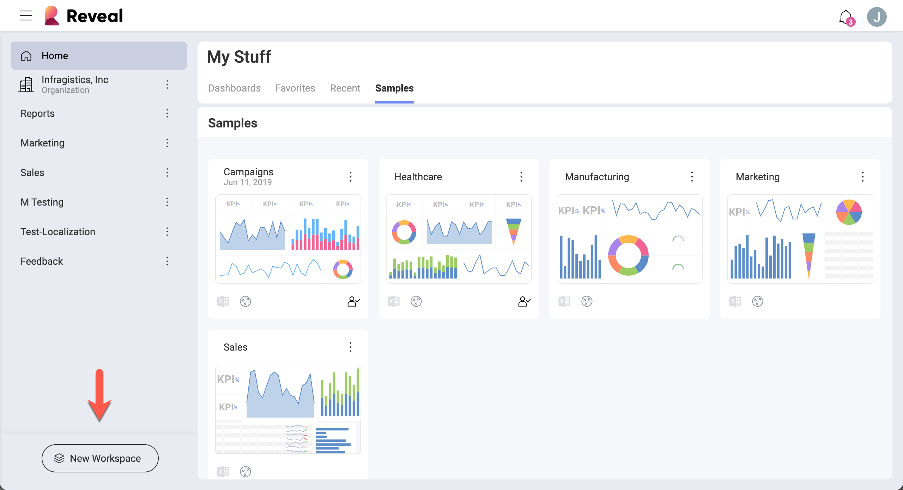
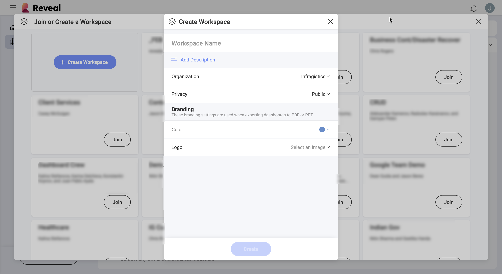
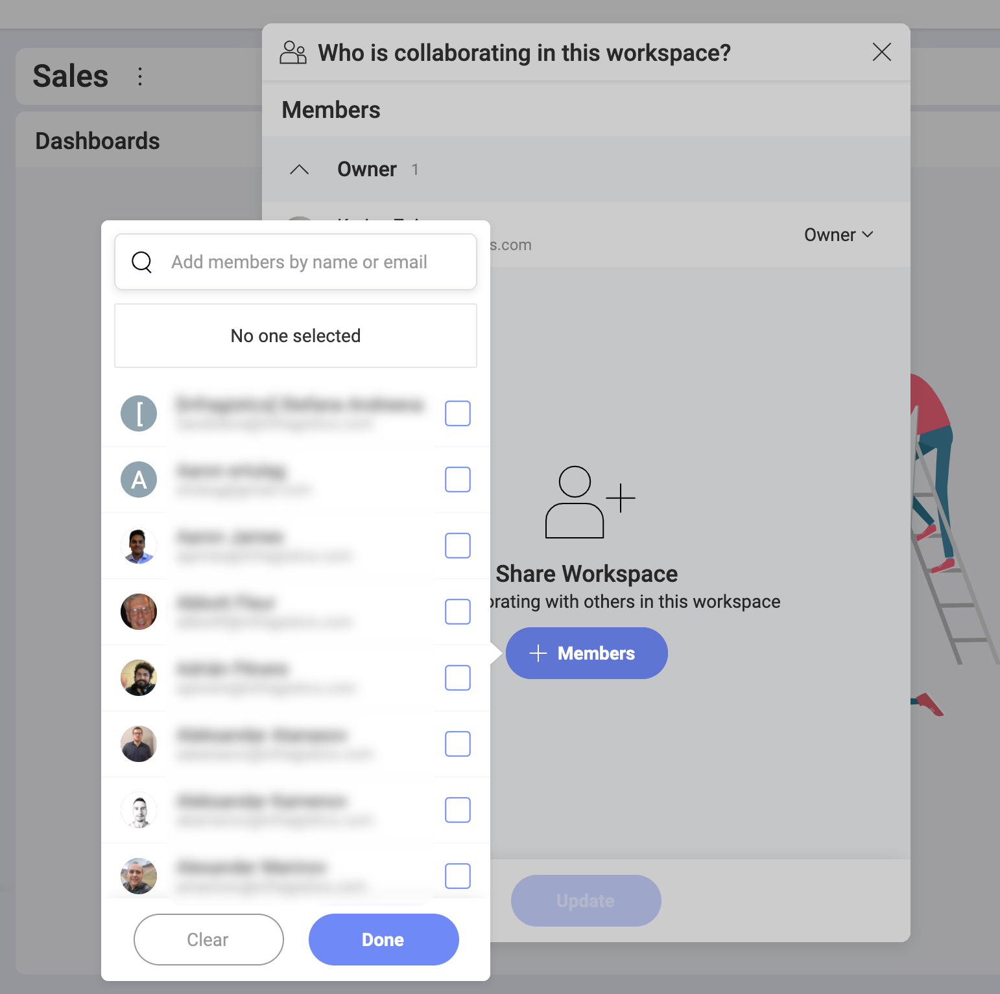
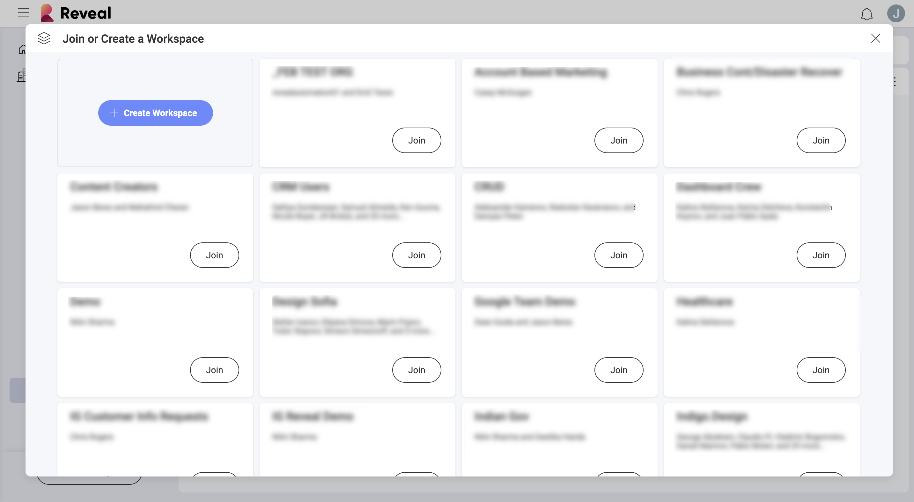

## Creating and Joining Workspaces

The *workspaces* in Reveal enable easy collaboration within and out of your
organization. Now you can access and join freely all your organization's
workspaces and also make your own workspace available for others in the
Organization to join and work with you.

Start using Workspaces by [creating a workspace from scratch](#create-workspace-scratch) or [joining an existing workspace](#join-workspace).

### Creating a Workspace from Scratch

1.  Click/tap *New Workspace* at the bottom left corner of the screen.

    

    >[!NOTE]
    > When signing in for the first time, you might already have a workspace. This is your [Organization workspace](overview.html#organization-workspace) including other members of your organization, who have logged in Reveal with their Office365 account at least once.

2.  Click/Tap the *+ Create Workspace* blue button. The following screen opens:

    

    Here you will need to:

      - assign a *name* to your workspace;

      - choose if your workspace will belong to the main *Organization*.

          - [Organization workspace](overview.html#organization-workspace) (this
            option will appear with the name of your organization, e.g.
            *Infragistics, Inc*) - if you associate your workspace with the
            main Organization, your workspace will appear in the list of
            workspaces that every member of the main Organization can
            [join](#join-workspace) (unless you make it private).

          - *Personal organization* - your new workspace does not belong to
            the main Organization and cannot be joined by other users
            without invitation.

            >[!NOTE]
            >Carefully choose the *Organization* property for your workspace as you cannot change it later.
      
      - decide on workspace's [*privacy*](overview.html#workspace-privacy-levels) - this option will not be available if you choose _Personal Organization_ for your workspace. Choose *public* if you want your workspace to be discovered and joined without invitation.

      - configure _branding_ settings - choose a main color and logo to be used when the workspaces' dashboards are exported as [PDF documents](~/en/dashboards/exporting-dashboards/export-as-pdf-document.md) and [PPT presentations](~/en/dashboards/exporting-dashboards/export-as-powerpoint-presentation).
      
        >[!NOTE] **Requirements for logo images**. The image you upload for a logo must be no bigger than **5 MB** and one of the following formats: jpg, jpeg, png, gif.

      - choose *Status*, *Start Date*, *Due Date* - these settings are *optional* but very handy when you are working on a project  
  

3.  Click/tap *Create*. Your workspace is now created and you can find it in the workspaces' list on the left side of the screen.

### Inviting Users to the Workspace

After you create your workspace, you will be prompted to invite other users. 

1. Click/tap the *+ Members* blue button. You can choose users from the dropdown list (see below). You can also use the search to add the emails of users who are outside of your Organization. Select _Done_ when you are ready.

    

2. *Member* is the default role when you invite users unless you assign them a different role. You can choose between *Owner*, *Member* and *Viewer* in the dropdown next to each user name. Learn more about workspace roles in [Workspace Collaboration and Privacy](overview.html#members-roles-permissions)

5. After deciding on the roles, click _Update_ to send the invites. The users will receive them by email and will also be notified inside Reveal.

### Joining an Existing Workspace

If your account has been automatically added to an [Organization workspace](overview.html#organization-workspace), you can **discover
and join other workspaces that belong to your organization**.
To join an existing workspace, follow the steps below.

1.  Click/tap the *New Workspace* blue button located in the bottom left of the screen.

2.  The *Join or Create a Workspace* dialog shows up:

    

    Here you will find all the
    [public](overview.html#workspace-privacy-levels) workspaces that
    belong to your organization.

4.  After clicking/tapping the *Join* button, you will automatically be
    added as a new member with Member's
    [permissions](overview.html#members-roles-permissions)
    to the workspace you have chosen. The workspace will appear in your workspaces' list.
