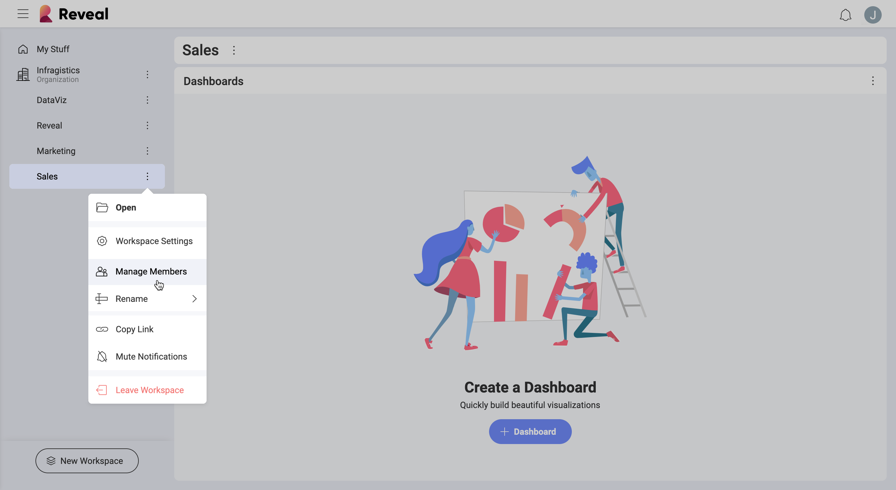
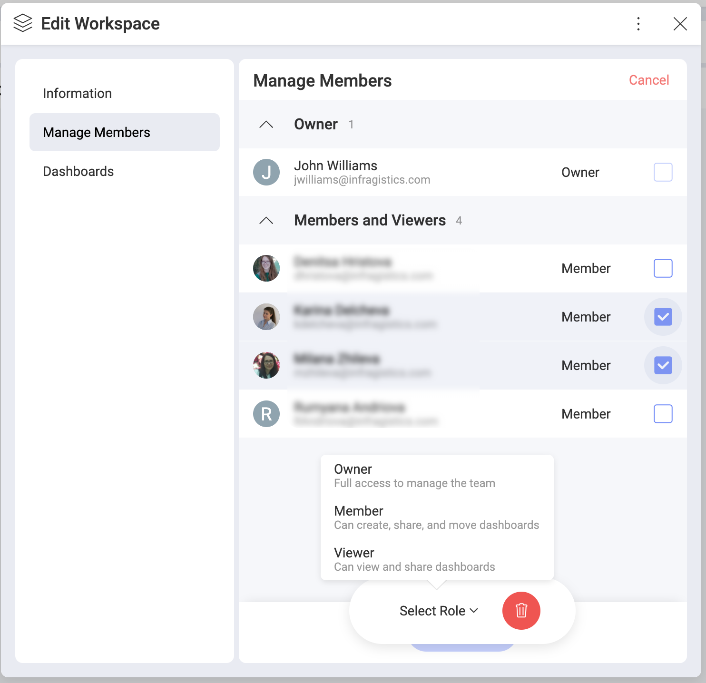
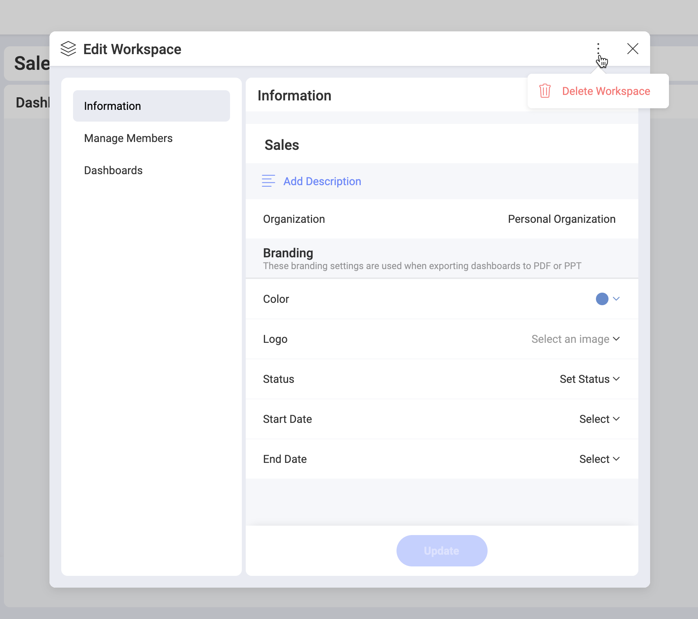

## Managing Workspaces

As an [Owner](overview.html#members-roles-permissions) of
a workspace you can:

  - manage workspace members;

  - manage workspace properties;

  - [delete](#delete-workspace) the workspace;

As a special type of workspace, the [Organization](overview.html#organization-workspace) management
corresponds to the general rules of workspace management in Reveal. In the
cases when there are differences in the Organization workspace management,
they will be explicitly mentioned in this topic.

### Managing Workspace Members

Only the Owner of a workspace can invite other users.

To see the full members' list of a workspace:

select a workspace > click/tap its overflow menu > select *Manage Members* (see below).

In this menu, you can change users' roles, remove members and add new ones.

#### Changing the role or removing more than one member at the same time

1. Select the checked box on the right of the *+Members* blue button.
2. Checkboxes on the right of users' roles appear.
3.  Select the trash icon or a role from the menu at the bottom center of the screen.

### Managing Workspace Properties

Only owners can change workspace properties. To do this:

select a workspace > click/tap the overflow menu next to it > select *Workspace Settings*.

Here you can change workspace's *privacy* settings, *name* and *description*.

You can also configure your workspace's **branding** by uploading a *logo* and setting a *color*. The accepted format for the logo image is:

  - jpg, jpeg, png, gif;

  - 5 MB max.

Your branding information will be used when exporting dashboards to PDF documents and PowerPoint presentations.

**Organization workspace**: You cannot change the name of the Organization workspace.

### Deleting a Workspace

You can delete a workspace only if you are an owner. To do this:

go to the workspace's [settings](#manage-workspace-properties) > click/tap the overflow button next to the Close button > select *Delete Workspace*.

When you delete a workspace, it disappears with all its content.

A workspace is also deleted if its last member leaves it.

**Organization workspace**: cannot be deleted.

### Leaving a Workspace

To leave a workspace, go to the workspace's [members' list](#manage-workspace-members),
click/tap the dropdown menu on the right of your name and select *Leave*.

If you are the only Owner of a workspace you cannot leave it without assigning another member as an Owner. To do this, change the role of a user from member/viewer to owner and select *Update*. Now you can leave the workspace.

**Organization workspace**: If you are the only (or last) owner of the Organization workspace and want to leave it, please contact Reveal's [support](https://www.infragistics.com/my-account/submit-support-request/reveal) to start the process of assigning a new owner.
