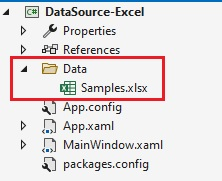

# Adding an Excel File Data Source

**Step 1** - Create a folder that will contain your Excel files



> [!NOTE]
> Make sure to set the "Copy to Output Directory" property of the Excel files to "Copy Always" or "Copy if Newer" in the Visual Studio Properties window.

**Step 2** - Set the `RevealSdkSettings.LocalDataFilesRootFolder` property to the location of the folder created in **Step 1**

```cs
RevealSdkSettings.LocalDataFilesRootFolder = Path.Combine(Environment.CurrentDirectory, "Data");
```

This instructs the Reveal SDK to use this location to load any files bing used as a file-based data source.

**Step 3** - Add an event handler for the `RevealView.DataSourcesRequested` event.

```html
<rv:RevealView x:Name="_revealView" DataSourcesRequested="RevealView_DataSourcesRequested" />
```

In the event handler, define two collections; one for the data sources, and one for the data source items. These two collections are used a parameters to the `RevealDataSources` object which is required in the event handler callback.

```cs
private void RevealView_DataSourcesRequested(object sender, Reveal.Sdk.DataSourcesRequestedEventArgs e)
{
    var dataSources = new List<RVDashboardDataSource>();
    var items = new List<RVDataSourceItem>();

    ...

    e.Callback(new RevealDataSources(dataSources, items, true));
}
```

**Step 4** - In the `RevealView.DataSourcesRequested` event handler, create a new instance of the `RVLocalFileDataSourceItem` object. Set the `Uri` property to the path, including the file name, of the Excel file you want to use as a data source.

```cs
private void RevealView_DataSourcesRequested(object sender, Reveal.Sdk.DataSourcesRequestedEventArgs e)
{
    var dataSources = new List<RVDashboardDataSource>();
    var items = new List<RVDataSourceItem>();

    var localFileItem = new RVLocalFileDataSourceItem();
    localFileItem.Uri = "local:/Samples.xlsx";

    e.Callback(new RevealDataSources(dataSources, items, true));
}
```

> [!IMPORTANT]
> You must prefix the Excel file path with `local:/`, because this instructs the Reveal SDK to load files using the `RevealSdkSettings.LocalDataFilesRootFolder` as the root of the file path. If you have subfolders within the root path, be sure to include these subfolders in the `Uri` property. 
>
> For example:
>
> * Without subfolder - `RVLocalFileDataSourceItem.Uri = "local:/FileName.xlsx"`
>
> * With subfolder - `RVLocalFileDataSourceItem.Uri = "local:/SubFolder/FileName.xlsx"`

**Step 5** - Create a new instance of the `RVExcelDataSourceItem` object and pass the `RVLocalFileDataSourceItem` instance you created in the previous step as an argument in the object constructor. Set the `Title` property to a string which describes the data within the Excel file.

Finally, add the `RVExcelDataSourceItem` object to the data source items collection.

```cs
private void RevealView_DataSourcesRequested(object sender, Reveal.Sdk.DataSourcesRequestedEventArgs e)
{
    var dataSources = new List<RVDashboardDataSource>();
    var items = new List<RVDataSourceItem>();

    var localFileItem = new RVLocalFileDataSourceItem();
    localFileItem.Uri = "local:/Samples.xlsx"; // "local:/" is a required prefix

    var excelDataSourceItem = new RVExcelDataSourceItem(localFileItem);
    excelDataSourceItem.Title = "Local Excel File";
    items.Add(excelDataSourceItem);

    e.Callback(new RevealDataSources(dataSources, items, true));
}
```

When the application runs, create a new Visualization and you will see the newly created Excel file data source listed in the "Select a Data Source" dialog.


> [!NOTE]
> The source code to this sample can be found on [GitHub](https://github.com/RevealBi/sdk-samples-wpf/tree/master/AddingDataSources/ExcelFile).