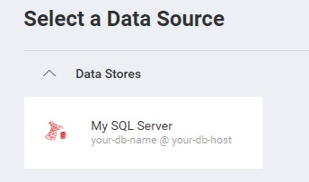
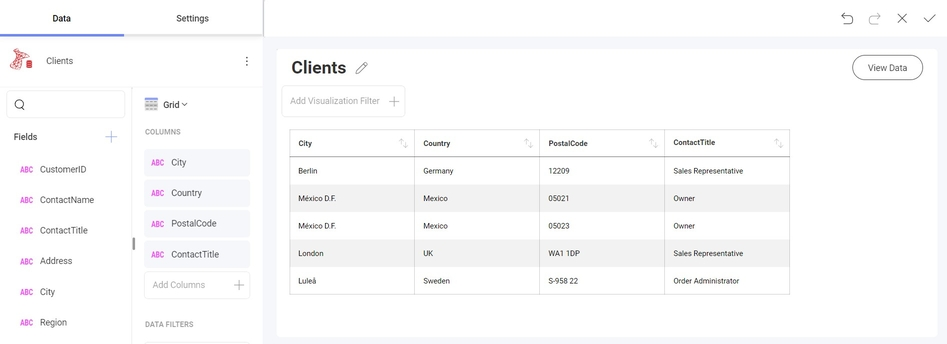

# Adding an MS SQL Server Data Source

**Step 1** - Add an event handler for the `RevealView.DataSourcesRequested` event.

```html
<rv:RevealView x:Name="_revealView" DataSourcesRequested="RevealView_DataSourcesRequested" />
```

In the event handler, define two collections; one for the data sources, and one for the data source items. These two collections are used a parameters to the RevealDataSources object which is provided in the event handler callback.

```csharp
private void RevealView_DataSourcesRequested(object sender, Reveal.Sdk.DataSourcesRequestedEventArgs e)
{
    var dataSources = new List<RVDashboardDataSource>();
    var items = new List<RVDataSourceItem>();

    ...

    e.Callback(new RevealDataSources(dataSources, items, true));
}
```

**Step 2** - In the `RevealView.DataSourcesRequested` event handler, create a new instance of the `RVSqlServerDataSource` object. Set the `Host`, `Database`, `Port`, and `Title` properties to values that correspond to your MS SQL Server. After you have created the `RVSqlServerDataSource` object, add it to the data sources collection.

```csharp
private void RevealView_DataSourcesRequested(object sender, Reveal.Sdk.DataSourcesRequestedEventArgs e)
{
    var dataSources = new List<RVDashboardDataSource>();
    var items = new List<RVDataSourceItem>();

    var sqlDataSource = new RVSqlServerDataSource()
    {
        Host = "your-db-host",
        Database = "your-db-name",
        Port = 1234,
        Title = "My SQL Server",
    };
    dataSources.Add(sqlDataSource);

    e.Callback(new RevealDataSources(dataSources, items, true));
}
```

When the application runs, create a new Visualization and you will see the newly created MS SQL Server data source listed in the "Select a Data Source" dialog.



**Step 3** - Add a new Data Source Item by creating a new instance of the `RVSqlServerDataSourceItem` object. Set the `Id`,`Title`, and `Table` properties that correspond to your database table. After you have created the `RVSqlServerDataSourceItem` object, add it to the data source items collection.

```csharp
private void RevealView_DataSourcesRequested(object sender, Reveal.Sdk.DataSourcesRequestedEventArgs e)
{
    var dataSources = new List<RVDashboardDataSource>();
    var items = new List<RVDataSourceItem>();

    var sqlDataSource = new RVSqlServerDataSource()
    {
        Host = "your-db-host",
        Database = "your-db-name",
        Port = 1234,
        Title = "My SQL Server",
    };
    dataSources.Add(sqlDataSource);

    var sqlServerDsi = new  RVSqlServerDataSourceItem(sqlDataSource);
    sqlServerDsi.Id = "MyCustomId";
    sqlServerDsi.Title = "My SQL Server Item";
    sqlServerDsi.Table = "TableName";    
    items.Add(sqlServerDsi);

    e.Callback(new RevealDataSources(dataSources, items, true));
}
```

When the application runs, create a new Visualization and you will see the newly created MS SQL Server data source item listed in the "Select a Data Source" dialog.


### Custom SQL Queries


CustomQuery Propery of an [**RVSqlBasedDataSourceItem**](https://help.revealbi.io/api/aspnet/latest/Reveal.Sdk.RVSqlBasedDataSourceItem.html#properties) allows you to perform a "Custom SQL query to use when getting data" from the server.

#### **Example: Define a Custom MS SQL Server Query in Data Source Definition** 
<br>
In WPF, create an `RVSqlServerDataSource` and `RVSqlServerDataSourceItem` instance within the `RevealApi.RevealView.DataSourcesRequested` method in this case `revealView.DashboardSelectorRequested += RevealView_DashboardSelectorRequested;` and add the line `your_DS_Item.customQuery = "SELECT TOP 5 CustomerID,ContactName,ContactTitle,Address,City,Region,PostalCode,Country,Phone,Fax FROM [TABLE]";`.
<br>
Then, include the newly created `RVSqlServerDataSourceItem` in the callback ` e.Callback(new RevealDataSources(datasources, datasourceItems, true));`:

```csharp
         private void RevealView_DataSourcesRequested(object sender, DataSourcesRequestedEventArgs e)
        {
            var datasources = new List<RVDashboardDataSource>();
            var datasourceItems = new List<RVDataSourceItem>();


            var sqlDs = new RVSqlServerDataSource();
            sqlDs.Title = "Title";
            sqlDs.Id = "SqlDataSource1";
            sqlDs.Host = "your_host_name";
            sqlDs.Port = sql_port_number;
            sqlDs.Database = "your_database_name";

            var sqlDsi = new RVSqlServerDataSourceItem(sqlDs);
            sqlDsi.Title = "Title";
            sqlDsi.Id = "SQLDatsaource11";
            sqlDsi.CustomQuery = "SELECT TOP 5 CustomerID,ContactName,ContactTitle,Address,City,Region,PostalCode,Country,Phone,Fax FROM Customers";
			datasourcItems.Add(sqlDSi);
          
            e.Callback(new RevealDataSources(datasources, datasourceItems, true));
        }
```

#### **Example: Define a Custom MS SQL Server Query in Data Source Replacement** 
<br>
In the `MyDatasourceProvider` implementation as described in [**Replacing Data Sources-MS SQL SERVER**](https://help.revealbi.io/en/wpf/replacing-data-sources/ms-sql-server.html) input the following line `sqlServerDsi.CustomQuery = "SELECT TOP 5 CustomerID,ContactName,ContactTitle,Address,City,Region,PostalCode,Country,Phone,Fax FROM [TABLE]";`.

```csharp
public class MyDataSourceProvider : IRVDataSourceProvider
{
public Task<RVDataSourceItem> ChangeDataSourceItemAsync(RVDashboardFilter filter, RVDataSourceItem dataSourceItem)
{
    var sqlServerDsi = dataSourceItem as RVSqlServerDataSourceItem;
    if (sqlServerDsi != null)
    {
        // Change SQL Server host and database
        var sqlServerDS = (RVSqlServerDataSource)sqlServerDsi.DataSource;
        sqlServerDS.Host = "10.0.0.20";
        sqlServerDS.Database = "Adventure Works";

        // Change SQL Server table/view
		sqlServerDsi.CustomQuery = "SELECT TOP 5 CustomerID,ContactName,ContactTitle,Address,City,Region,PostalCode,Country,Phone,Fax FROM [TABLE]";
        return Task.FromResult((RVDataSourceItem)sqlServerDsi);
    }

    return Task.FromResult(dataSourceItem);
}
```

