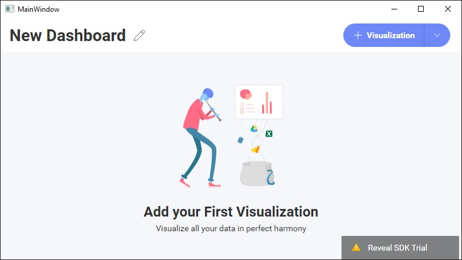

# Creating Dashboards

Creating new dashboards is really easy. You just need to set the `RevealView.Dashboard` property to a new instance of a `RVDashboard` object.

Start by defining a `RevealView` control in XAML and give it an `x:Name` so you can access the control in the code behind of the file:
```xml
<rv:RevealView x:Name="_revealView"/>
```

Next, in the code behind of your xaml file set the `RevealView.Dashboard` property to a new instance of a `RVDashboard` object:
```cs
_revealView.Dashboard = new RVDashboard();
```

Run the application and you will be prompted with a new, empty, dashboard.



As you can see, while this gives you a new dashboard instance to use, unless you have provided a data source to the `RevealView` for your dashboard to use, your end-users will not be able to create any new visualizations in the new dashboard.

Next steps:
- [Adding Datasources](adding-data-sources/in-memory-data.md)
- [Loading Dashboards](loading-dashboards.md)