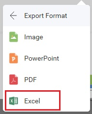

# Exporting

The Reveal SDK allows you to export both dashboards and visualizations to generate new document types or images.

Supported dashboard export formats:
- Excel
- Image
- JSON
- PDF
- Powerpoint

Supported visualization export formats:
- Excel
- Image

All export options can be found under the **Export** menu item in the `RevealView` overflow menu when a dashboard is opened or a visualization is maximized


When the user clicks the **Export** button, they can choose one of the enabled export options.

## Export to Excel
An Excel export is performed when the end-user clicks the **Excel** menu item from the **Export** overflow menu.



The **Excel** menu item can be shown/hidden by setting the `RevealView.ShowExportToExcel` property.

```xml
<rv:RevealView x:Name="_revealView" ShowExportToExcel="False" />
```

When the **Excel** menu item is clicked, the end-user is prompted with various options which allow them to change the title of the workbook, the title of the worksheets, which worksheets to create, and whether or not to include the visualizations.


## Export to Image
There are two ways to export a dashboard or visualization to an image in the Reveal SDK:
- End-User export
- Programmatic export

### End-User Image Export
An end-user image export is performed when the end-user clicks the **Image** menu item from the **Export** overflow menu.


The **Image** menu item can be shown/hidden by setting the `RevealView.ShowExportImage` property.

```xml
<rv:RevealView x:Name="_revealView" ShowExportImage="False" />
```

When the **Image** menu item is clicked, the end-user is prompted with a dialog which allows them to choose either to copy the image to the clipboard, edit them image using the built-in image editor, or save the image to disk as a PNG.


#### Custom Image Export
By default, when an end-user clicks the **Export Image** button in the **Export Image Dialog** a **Save File Dialog** will be shown to the end-user to choose a name and location to save the image file. However, this behavior can be intercepted and custom image export logic can be used instead.

To use a custom image export, you must add an event handler to the `RevealView.ImageExported` event.

```cs
private void RevealView_ImageExported(object sender, ImageExportedEventArgs e)
{

}
```

The `ImageExportedEventArgs` object provides the following properties to help you save image exports:
- **Image** - the screenshot of the dashboard that was taken as a `BitmapSource`
- **CloseExportDialog** - a boolean property which controls the visibility of the Export Dialog. True, the dialog will close; False, the dialog will remain open.

#### Example: A Custom Image Export

```cs
private void RevealView_ImageExported(object sender, ImageExportedEventArgs e)
{
    var image = e.Image;

    var saveDialog = new SaveFileDialog()
    {
        DefaultExt = ".png",
        FileName = _revealView.Dashboard.Title + ".png",
    };

    if (saveDialog.ShowDialog() == true)
    {
        using (var fileStream = new FileStream(saveDialog.FileName, FileMode.Create))
        {
            BitmapEncoder encoder = new PngBitmapEncoder();
            encoder.Frames.Add(BitmapFrame.Create(image));
            encoder.Save(fileStream);
        }
    }
    else
    {
        e.CloseExportDialog = false;
    }
}

```

### Programmatic Image Export
To export an image of a dashboard programmatically, without the end-user interaction, you will need to invoke the `RevealView.ToImage` method. Calling the `RevealView.ToImage` method will create a screenshot of the RevealView component as it is displayed on the screen. The ``RevealView.ToImage`` method **does not** prompt the user with the Export Image Dialog.

```cs
var image = _revealView.ToImage();
```

#### Example: Programmatic Image Export

```cs
private void ExportButton_Click(object sender, RoutedEventArgs e)
{
    var image = _revealView.ToImage();
    var desktopPath = Environment.GetFolderPath(Environment.SpecialFolder.DesktopDirectory);
    var filePath = Path.Combine(desktopPath, $"{_revealView.Dashboard.Title}.png");

    using (var fileStream = new FileStream(filePath, FileMode.Create))
    {
        BitmapEncoder encoder = new PngBitmapEncoder();
        encoder.Frames.Add(BitmapFrame.Create(image));
        encoder.Save(fileStream);
    }            
}
```

> [!NOTE]
> The source code to these sample can be found on [GitHub](https://github.com/RevealBi/sdk-samples-wpf/tree/master/Exporting-Image)

## Export To JSON
Exports a dashboard into a **JSON** string.

```cs
var json = dashboard.ExportToJson();
```

## Export to PDF
A PDF export is performed when the end-user clicks the **PDF** menu item from the **Export** overflow menu.


The **PDF** menu item can be shown/hidden by setting the `RevealView.ShowExportToPDF` property.

```xml
<rv:RevealView x:Name="_revealView" ShowExportToPDF="False" />
```

When the **PDF** menu item is clicked, the end-user is prompted with various options which allows them to change the title of the PDF document, choose which visualizations to include in the document, a title and description of each visualization, as well as branding, page orientation, and language.


## Export to PowerPoint
A PowerPoint export is performed when the end-user clicks the **PowerPoint** menu item from the **Export** overflow menu. 


The **PowerPoint** menu item can be shown/hidden by setting the `RevealView.ShowExportToPowerpoint` property.

```xml
<rv:RevealView x:Name="_revealView" ShowExportToPowerpoint="False" />
```

When the **PowerPoint** menu item is clicked, the end-user is prompted with various options which allows them to change the title of the PowerPoint document, choose which visualizations to include in the document, a title and description of each visualization, and branding.

