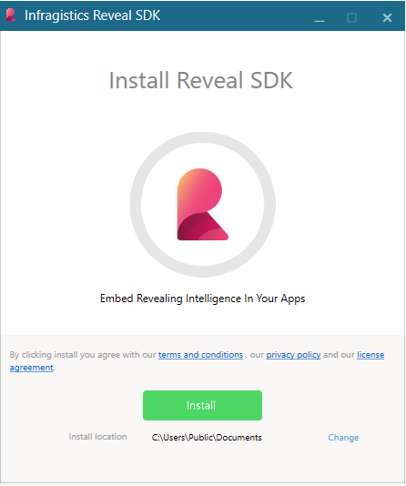

# Installation

## System Requirements

- Windows 10 or higher
- Visual Studio 2019 or higher
- .NET Framework 4.6.2 or higher- 

## Installing the Reveal SDK

To install the Reveal SDK, you need to download and execute the Reveal SDK Installer. To achieve this, use the following steps:
1. Download the Reveal SDK Installer from the [Reveal website](https://www.revealbi.io/download-sdk)
2. Fill out the "Try the Reveal SDK" form on the webpage
3. Save the Reveal SDK installer to a known location on your disk

Before extracting the saved Reveal SDK Installer zip file, you should unblock it. Right-click the zip file and select **Properties**. The properties dialog will appear with a checkbox option to unblock the file. Check the **Unblock** option and press **Apply**.


After unblocking the platform installer zip file, follow these steps:
1. Extract the zip to the current location.
2. Find the extracted Reveal SDK Installer EXE file and double click to start it.
3. Select the install location
4. Accept the terms of the license agreement and continue the installation process. (By clicking install you agree)



Once the installation is completed, you will be presented the Reveal SDK installer’s finish screen. At this point, feel free to explore the Reveal SDK samples by clicking the "Open SDK Sample" button, read our [documentation](https://help.revealbi.io/), visit our community [blogs](https://www.revealbi.io/blog), or learn a few tips and tricks by watching our [videos](https://www.youtube.com/revealbi).


## What Gets Installed

Once the installation is complete, you should have the following items installed in the local folder **"%public%\Documents\Infragistics\Reveal\SDK\"**:

- The Reveal SDK Binaries (for manual use)
- The Reveal SDK NuGet Packages
- The Reveal SDK Samples

There is also a local NuGet package source automatically added to Visual Studio that points to the Reveal SDK NuGet packages.


> [!NOTE]
> You can also use the NuGet feeds covered in the Infragistics NuGet Feed topic.

## Adding Your License Key

To remove the dashboard watermarks, the license key needs to be set as shown here:
``` csharp
    RevealSdkSettings.License = "YOUR LICENSE HERE";
```
