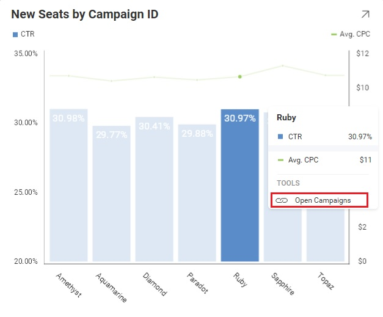

# Linking Dashboards

The Reveal SDK supports dashboard linking, which allows users to navigate through dashboards. By moving from dashboard to dashboard, you can go from a high level overview of the business' reality to a more detailed view with the specifics.

From a Reveal SDK perspective, dashboard linking is invoked when an end-user clicks on a link in a visualization which invokes the loading of another dashboard.



For further details about the Dashboard Linking functionality, refer to [Dashboard Linking](../dashboards/dashboard-linking.md) from the Reveal’s User Guide.

> [!NOTE]
> Currently, dashboard links cannot be created with the Reveal SDK. You must use a native Reveal application such as [https://app.revealbi.io/](https://app.revealbi.io/)

## Respond to a Dashboard Link

To respond to when a **Dashboard Link** is clicked within a dashboard, add an event handler to the `RevealView.VisualizationLinkingDashboard` event.

```xml
<rv:RevealView x:Name="_revealView" 
                VisualizationLinkingDashboard="RevealView_VisualizationLinkingDashboard" />
```

```cs
private void RevealView_VisualizationLinkingDashboard(object sender, VisualizationLinkingDashboardEventArgs e)
{

}
```
The `VisualizationLinkingDashboardEventArgs` has the following properties:
- **DashboardId** - the id of the dashboard being requested
- **Title** - the title of the dashboard being requested
- **Url** - the URL of the dashboard being requested (if applicable)
- **Callback** - this delegate is used to provide the `RVDashboard` stream back to the `RevealView` to be loaded

## Example: Linking to a Dashboard

In this example, we are handling the `RevealView.VisualizationLinkingDashboard` event in response to an end-user clicking on a visualization in our **Marketing** dashboard. This link should take us to the **Campaigns** dashboard when clicked.

To do this, we get the file path to the **Campaigns.rdash** file from our **Dashboards** directory. Once we have the file path, we then create a new `FileStream` using our path and provide that stream to the `e.Callback`.

```cs
private void RevealView_VisualizationLinkingDashboard(object sender, VisualizationLinkingDashboardEventArgs e)
{
    var path = Path.Combine(Environment.CurrentDirectory, "Dashboards/Campaigns.rdash");
    using (var stream = File.OpenRead(path))
    {
        e.Callback(e.DashboardId, stream);
    }
}
```

> [!NOTE]
> The source code to this sample can be found on [GitHub](https://github.com/RevealBi/sdk-samples-wpf/tree/master/LinkingDashboards)