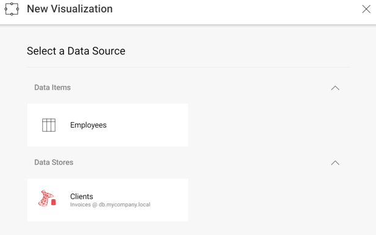

## Creating New Visualizations and Dashboards

### Overview

As described in [**Editing & Saving
Dashboards**](editing-saving-dashboards-client-web.md), there are two ways
to handle how you save changes to dashboards: **client-side and
server-side**. Those scenarios work fine when users make minor changes
to existing dashboards like:

  - Adding/modifying filters
  - Changing the type of visualization (chart, gauge, grid, etc.)
  - Changing the theme

However, to add new visualizations the user needs to **select the data source** to be used. To do that, the containing application needs to provide information to the SDK, so it can display the list of data sources available for a new visualization.

### Displaying a List of Data Sources

The callback you need to use to display a list of data sources is
[**onDataSourcesRequested**](api-reference-client-web.html#RevealView+onDataSourcesRequested).
In the case that you don’t set your own function to this callback, when a new visualization is created, Reveal will display all data sources used in the dashboard (if any).

#### Code:

The code below shows how to configure the *data source selection* screen to show an “in-memory” item and a SQL Server data source.

``` js
window.revealView.onDataSourcesRequested = function (callback) {
    var inMemoryDSI = new $.ig.RVInMemoryDataSourceItem("employees");
    inMemoryDSI.title("Employees");
    inMemoryDSI.description("Employees");

    var sqlDs = new $.ig.RVSqlServerDataSource();
    sqlDs.title("Clients");
    sqlDs.id("SqlDataSource1");
    sqlDs.host("db.mycompany.local");
    sqlDs.port(1433);
    sqlDs.database("Invoices");

    callback(new $.ig.RevealDataSources([sqlDs], [inMemoryDSI], false));
};
```

The “false” value in the third parameter prevents existing data sources on the dashboard from being displayed. So, when creating a new widget using the “+” button, you should get the following screen:



Please note that the “employees” parameter passed to the “RVInMemoryDataSourceItem” constructor, is the same dataset id used in [**In-Memory Data Support**](in-memory-data-server-web.md) and identifies the dataset to be returned on the server side.

### Creating New Dashboards

Creating dashboards from scratch is really simple, you just need to:

  - Initialize [**$.ig.RevealView**](api-reference-client-web.html#_revealview.md) and [**$.ig.RevealSettings**](api-reference-client-web.html#_revealsettings.md) object, without setting the dashboard attribute to $.ig.RevealSettings and without using [**$.ig.RevealUtility.loadDashboard**](api-reference-client-web.html#RevealUtility.loadDashboard);

  - Set *startInEditMode* to true, to start the dashboard in edit mode:

<!-- end list -->

``` js
var revealSettings = new $.ig.RevealSettings(null);
revealSettings.startInEditMode = true;
var revealView = new $.ig.RevealView("#revealView", revealSettings);
```

You can find a working example, **CreateDashboard.cshtml**, in the
*UpMedia* web application distributed with the SDK.

### Related content

  - [Configuring the RevealView Object](configuring-revealview-client-web.md)
  - [Editing and Saving Dashboards](editing-saving-dashboards-client-web.md)
  - [Exporting a Dashboard or a Visualization](exporting-dashboard-visualization-web.md)
  - [Setting Up Initial Filter Selections](setting-initial-filters-client-web.md)
  - [Maximizing Visualizations and Single Visualization Mode](maximizing-visualizations-client-web.md)
  - [Setting Up Dynamic Filter Selections](setting-dynamic-filters-client-web.md)
  - [Dashboard Linking](dashboard-linking-client-web.md)
  - [Handling User Click Events](handling-click-events-client-web.md)
  - [Creating New Visualizations and Dashboards (Desktop)](../../desktop-sdk/using-the-desktop-sdk/creating-visualizations-dashboards-desktop.md)
