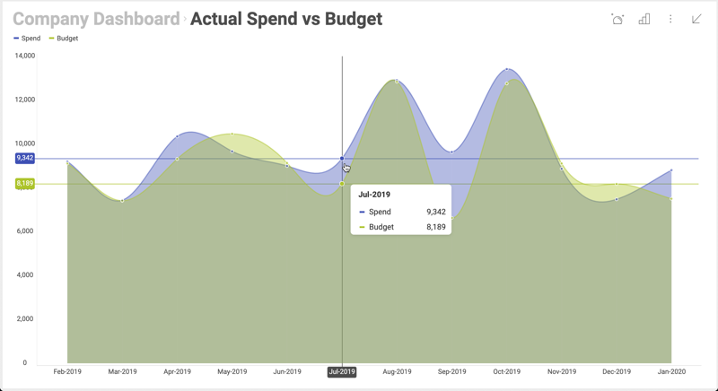

## Maximizing Visualizations and Single Visualization Mode

### Overview

When displaying a dashboard to the user, there are some cases in which
you’d like to display just one maximized visualization. In addition, you
might also want to lock the initial visualization and prevent the user
from accessing the whole dashboard. You can achieve both scenarios using
the Web Client SDK.



#### Example Details

Let’s assume that you have a dashboard with three visualizations, where
each visualization is showing data for a different division of your
company, i.e., “Marketing”, “Sales” and “HR”.


In this example, you’d like to showcase these visualizations in your
corporate application. You want to include them as part of the
information displayed on each division’s home page.

### Maximizing Visualizations

To open a dashboard with a maximized visualization, you need to use the
__MaximizedVisualization__
attribute of
__$.ig.RevealSettings__.
When you don’t set a visualization in this attribute, the whole
dashboard is displayed.

As shown in [**Configuring the $.ig.RevealView object**](configuring-revealview-client-web.md), you can display a specific dashboard in your page. This time, you also need to set the
__MaximizedVisualization__
attribute. As shown in the code snippet below with the visualization "Sales" from the dashboard with ID "AllDivisions".

``` html
<script type="text/javascript">
...

var dashboardId = 'AllDivisions';
var revealSettings = new $.ig.RevealSettings(dashboardId);

$.ig.RevealUtility.loadDashboard(dashboardId, function (dashboard) {
    revealSettings.dashboard = dashboard;

    revealSettings.maximizedVisualization = dashboard.getVisualizationByTitle('Sales');

    new $.ig.RevealView("#revealView", revealSettings);
}, function (error) {
    console.log(error);
});
</script>

<div id="revealView" style="height:500px;" />
```

Although the initial maximized visualization will be the one with title
‘Sales’, the end user can still return to the dashboard and see the
rest of the visualizations.

### Single Visualization Mode

You may also want to lock the initial visualization, making it the only
one displayed at all times. This way the dashboard works like a single
visualization dashboard. This is the concept behind “single
visualization mode”.

To turn on the “single visualization mode”, just set the
__singleVisualizationMode__
to true as shown below.

``` js
$.ig.revealSettings.singleVisualizationMode = true;
```

After adding this single line, the dashboard will work as a single
visualization dashboard. You can can do the same for each division’s
home page, just replace the title of the visualization in
__getVisualizationByTitle__
with the right one.

#### Dynamically changing a locked visualization

It is also possible for you to dynamically change the single
visualization being displayed, without reloading the page. From the
user’s perspective, your app would be a single page application with a
selector of divisions and a maximized visualization. After the user
chooses one division from the list, the maximized visualization is
updated.

You can achieve this scenario by using the **maximizeVisualization**
method in __$.ig.RevealView__,
as shown below:

``` html
<script type="text/javascript">
    var dashboardId = 'AllDivisions';
    var revealSettings = new $.ig.RevealSettings(dashboardId);

    $.ig.RevealUtility.loadDashboard(dashboardId, function (dashboard) {
        revealSettings.dashboard = dashboard;
        revealSettings.singleVisualizationMode = true;
        revealSettings.maximizedVisualization = dashboard.getVisualizationByTitle('Sales');

        window.revealView = new $.ig.RevealView("#revealView", revealSettings);
    }, function (error) {
        console.log(error);
    });
    function maximizeVisualization(title) {
        window.revealView.maximizeVisualization(
            window.revealView.dashboard.getVisualizationByTitle(title)
        );
    }
</script>

<section style="display:grid;grid-template-rows:30px auto;">
    <section style="display:grid;grid-template-columns:auto auto auto;">
        <button onclick="maximizeVisualization('Sales')">Sales</button>
        <button onclick="maximizeVisualization('HR')">HR</button>
        <button onclick="maximizeVisualization('Marketing')">Marketing</button>
    </section>
    <div id="revealView" style="height:500px;" />
</section>
```

To take into account:
  - The
    __$.ig.RevealView__
    object is set in \_window.revealView\</emphasis\> in order to use it
    later when **maximizeVisualization** is called.
  - The buttons added to the section before the div are used just as an
    example. They were added as a means to switch the maximized
    visualization, in your case you’ll have to to use a similar code in
    your application.
  - In this example, the buttons are hardcoded to match the
    visualizations in the sample dashboard, but you can also generate
    the list of buttons dynamically by iterating the list of
    visualizations in the dashboard. For further details see
    __$.ig.RVDashboard.visualizations__.

### Related content

  - [Configuring the RevealView Object](configuring-revealview-client-web.md)
  - [Editing and Saving Dashboards](editing-saving-dashboards-client-web.md)
  - [Exporting a Dashboard or a Visualization](exporting-dashboard-visualization-web.md)
  - [Setting Up Initial Filter Selections](setting-initial-filters-client-web.md)
  - [Maximizing Visualizations and Single Visualization Mode (Desktop)](../../desktop-sdk/using-the-desktop-sdk/maximizing-visualizations-desktop.md)
  - [Setting Up Dynamic Filter Selections](setting-dynamic-filters-client-web.md)
  - [Dashboard Linking](dashboard-linking-client-web.md)
  - [Handling User Click Events](handling-click-events-client-web.md)
  - [Creating New Visualizations and Dashboards](creating-visualizations-dashboards-client-web.md)
