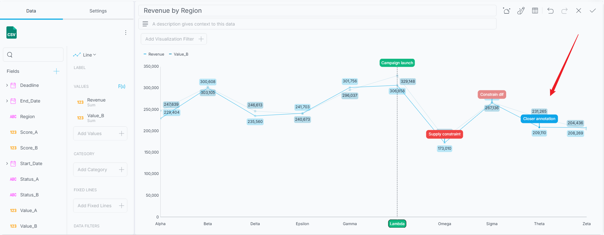
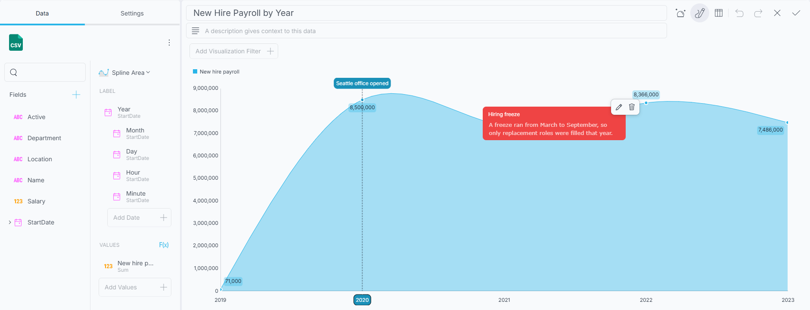

# チャートの注釈

数値がそれ自体で説明してくれることはほとんどありません。ライン チャートの急上昇は、記録的なキャンペーンの成果かもしれませんし、データ入力の誤りかもしれません。それがどちらであるかを知っているのは、実際に調査した人だけです。**チャートの注釈**を使用すると、その説明をチャートに直接書き込むことができるため、コンテキストが別のメールや会議のメモに残るのではなく、ダッシュボードとともに伝わります。

注釈は、チャート上の特定の位置に固定される短いメモ (タイトルと省略可能な説明) です。保存すると、それはダッシュボードとともに格納され、ダッシュボードを開いたすべてのユーザーが同じ位置に同じメモを表示できます。

## 注釈をサポートするチャート

注釈は、カテゴリ チャート ファミリで使用できます。

* エリア
* バー
* 柱状
* ライン
* スプライン
* スプライン エリア
* ステップ エリア
* ステップ ライン
* 時系列

積層型柱状チャートや積層型バー チャートなどの積層型チャートのバリエーションは、注釈をサポートしません。積層型チャートでは、各セグメントがそれ自体の値ではなく累積された位置に描画されるため、クリックした値に注釈を確実に固定できません。

表示形式がサポートされているタイプではない場合、表示形式エディターの **[注釈]** ボタンは無効になります。

## 注釈の追加

1. 注釈を付ける表示形式を[表示形式エディター](visualization-editor.md)で開きます。

2. エディターの上部ツールバーにある **[注釈]** ボタンをクリックまたはタップします。幅の狭いレイアウトでは、**[注釈]** はオーバーフロー メニューにあります。注釈モードがオンの間、ボタンは強調表示されたままになります。

   

3. 注釈モードがオンの状態で、以下の[注釈のタイプ](#注釈のタイプ)で説明する 3 つの操作のいずれかを使用して注釈を配置します。

4. **[注釈の追加]** ダイアログが開きます。**[タイトル]** を入力し、必要に応じて **[説明]** と**マーカーの色**を入力します。

5. **[保存]** をクリックまたはタップします。

注釈モードは保存後もオンのままになるため、注釈を続けて配置できます。完了したら、**[注釈]** をもう一度クリックまたはタップしてモードをオフにします。

:::note
**[タイトル]** は必須です。タイトルを入力するまで **[保存]** ボタンは無効のままです。**[キャンセル]**、**[X]** ボタン、**Esc** キーなど、他の方法でダイアログを閉じると、配置しようとしていた注釈は破棄されます。
:::

## 注釈のタイプ

Reveal は、ユーザーが行った操作から作成する注釈の種類を判断します。3 つのタイプはすべて、注釈モードがオンの状態で配置されます。

### ポイント

チャート上の**データ ポイントをクリックまたはタップ**します。

**ポイント**注釈は、1 つの系列上の 1 つのデータ ポイント (たとえば、1 つのメジャーの特定の月の値) に付加されます。特定の 1 つの数値についての説明を記述する場合に適しています。

クリックした位置で複数の系列が重なっている場合 (エリア チャートやスプライン エリア チャートでは容易に発生します)、Reveal は上に描画された図形ではなく、クリックした位置に最も近いデータ ポイントを持つ系列に注釈を固定します。

### スライス

**カテゴリ軸のラベルをクリックまたはタップ**します。

**スライス**注釈は、チャート内のすべての系列にわたって 1 つのカテゴリ全体 (特定の月、地域、製品など) をマークします。メモの内容がカテゴリ内の 1 つのメジャーではなく、カテゴリ自体に関するものである場合に使用します。

### ストリップ

プロット領域で**範囲をドラッグ**します。

**ストリップ**注釈は、四半期、キャンペーン期間、障害発生期間など、複数のカテゴリにまたがる範囲をマークします。**スライス**と同様に、チャート内のすべての系列にまたがります。

:::note
**スライス**注釈と**ストリップ**注釈は、**カテゴリ軸**にのみ固定できます。値軸のラベルをクリックしても注釈は作成されません。カテゴリではなく数値に固定されたマーカーは、データの変化に伴って位置がずれてしまうためです。
:::

## 注釈の表示

注釈が付いたチャートには、各注釈の固定位置にマーカーが表示されます。注釈にマウス ポインターを合わせるかタップすると、注釈のタイトルと説明を示すカードが開きます。

注釈は表示形式の一部であるため、注釈を記述した本人だけでなく、ダッシュボードを表示するすべてのユーザーに表示されます。

## 注釈の編集と削除

注釈のカードを開き、カードのアクション ピルにある**編集**ボタンと**削除**ボタンを使用します。

* **[編集]** を選択すると、保存されているタイトル、説明、色を含む注釈ダイアログが再度開きます。必要な箇所を変更し、**[保存]** をクリックまたはタップします。このダイアログには **[削除]** ボタンも表示されます。

* **[削除]** を選択すると、注釈が削除されます。注釈にはユーザーが記述したテキストが含まれ、元に戻す操作はできないため、Reveal は最初に確認を求めます。

## マーカーの色の選択

注釈ダイアログには、ダッシュボードの現在のテーマから取得された色見本の行が表示されるため、注釈のマーカーはチャートの他の部分と一貫性を保ちます。

色の選択は省略可能です。色を割り当てなかった注釈にはマーカーが描画されません。注釈自体は存在し、マウス ポインターを合わせるとカードも開きますが、固定位置には何も描画されません。注釈をひと目で認識できるようにする場合は、色を選択してください。

選択した色はユーザーの明示的な選択として保存され、テーマを変更しても維持されます。ラベルの色、境界線、間隔など、注釈のその他の外観は有効なテーマから取得されるため、ダッシュボードのスタイルを変更すると注釈もそれに追従します。

## 保存と共有

注釈は表示形式の設定の一部として保存されるため、ダッシュボードとともに伝わります。ダッシュボードを保存、エクスポート、または `.rdash` ファイルを共有すると、注釈も一緒に保存され、次にダッシュボードを開いたユーザーにも表示されます。

:::note
チャートの注釈は表示形式エディターで作成します。プログラムから注釈を作成または変更するための Reveal SDK API はありません。
:::

## 関連トピック

* [表示形式エディター](visualization-editor.md)
* [カテゴリ チャート](chart-types/category-charts.md)
* [時系列チャート](chart-types/time-series-charts.md)
