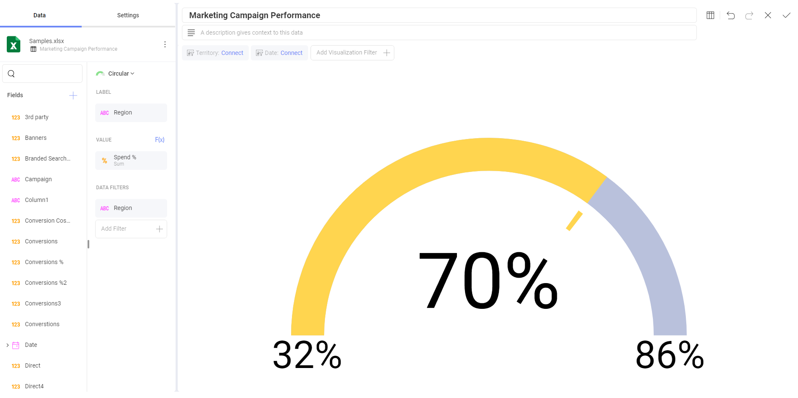

# ゲージ チャート

ゲージ チャートは単一値を表示します。または、それらを範囲しきい値と比較した値のリストを表示します。ゲージはまた、他の範囲の条件付き書式設定を可能にします。Reveal では、次のゲージ チャートを使用できます: [リニア](#リニア-ゲージ)、[円形](#円形ゲージ)、[テキスト](#テキスト-ゲージ)、[KPI](kpi-gauge.md)、[ブレット グラフ](#ブレット-グラフ)。

## リニア ゲージ

リニア ゲージは、ラベル、**[ラベル]** のプレースホルダーの設定から取得された値、および設定 **[値]** のプレースホルダーの値が表示されます。値は、四角形としてチャート化され、バンド内または隣りに数値形式で表示されます。このゲージ タイプは、行の値を並べて比較することに適しています。

## 円形ゲージ

円形ゲージは、バンドの最大および最小のしきい値、および現在の値を表示します。現在の範囲の色で背景も塗りつぶします。

## テキスト ゲージ

テキスト ゲージは、大きなフォントで Value 列データを表示します。このタイプは、非常に優先度の高いメトリックに適しています。デフォルトでは、いずれかのフィルターが適用されていない限り、選択データ行が異なるようにゲージは最初のデータ行の値列のデータを表示します。

## ブレット グラフ

ブレット グラフ ゲージは、リニア ゲージに似ていて、**[ラベル]** のプレースホルダーからラベルを表示し、**[値]** のプレースホルダーから値を表示します。値は水平線でチャート化され、数字形式で右側にも表示されます。

ブレット グラフは新しいビジュアル インジケーターをリニア ゲージに追加します。**[ターゲット]** プレースホルダーの目標値をベースにした垂直マークです。これは新しいインジケーターで数値列から取得されます。**このチャートを構成するには 2 つの数値列とテキスト列が必要です**。

このブレット は、値を左右に並べて比較する際に便利です。また、目標値 (垂直マーク) に対する値 (水平線) からパフォーマンスを評価できます。

## バンドの構成

すべてのゲージ タイプには共通のバンド範囲構成があり、これは表示形式エディターの **[設定]** セクションにあります。構成ダイアログでは、**制限**を設定できます: これらの値は自動的に指定された値の列のデータセット内の最大値/最小値として設定されますが、定数値を使用して手動でオーバーライドすることができます。

バンド構成を設定する際、範囲を 3 つのスペースに分割するために 2 つのしきい値を設定する必要があります。しきい値は、パーセンテージとして定義または定数値として定義することができます。また、ここに各バンドに関連付ける色を定義する必要があります。デフォルトでは上部のバンドは緑、中央は黄、下部は赤です。

バンド構成は、Reveal を通じて適用された書式ではなく、**元のデータに基づいています**。上の円型ゲージでは、表示形式が数値を表示するように書式設定されていても、元のデータはパーセンテージで表されています。したがって、選択された **[値比較タイプ]** は **[パーセンテージ]** であり、範囲は数値ではなくパーセンテージとして定義されます。
