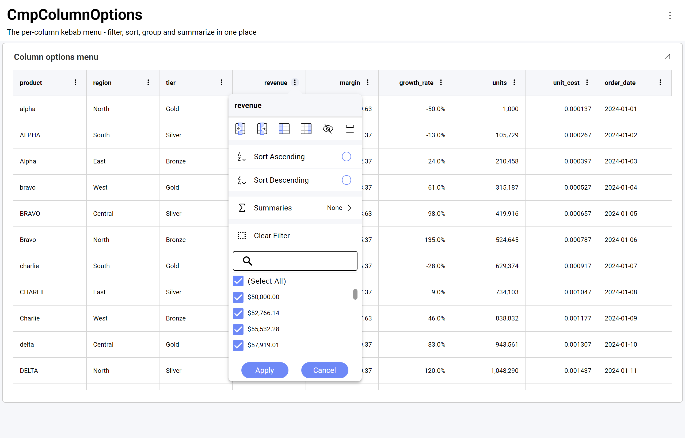
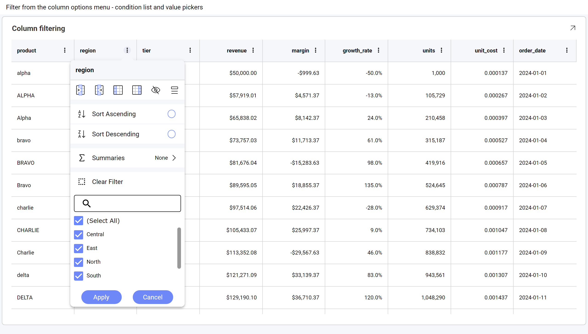
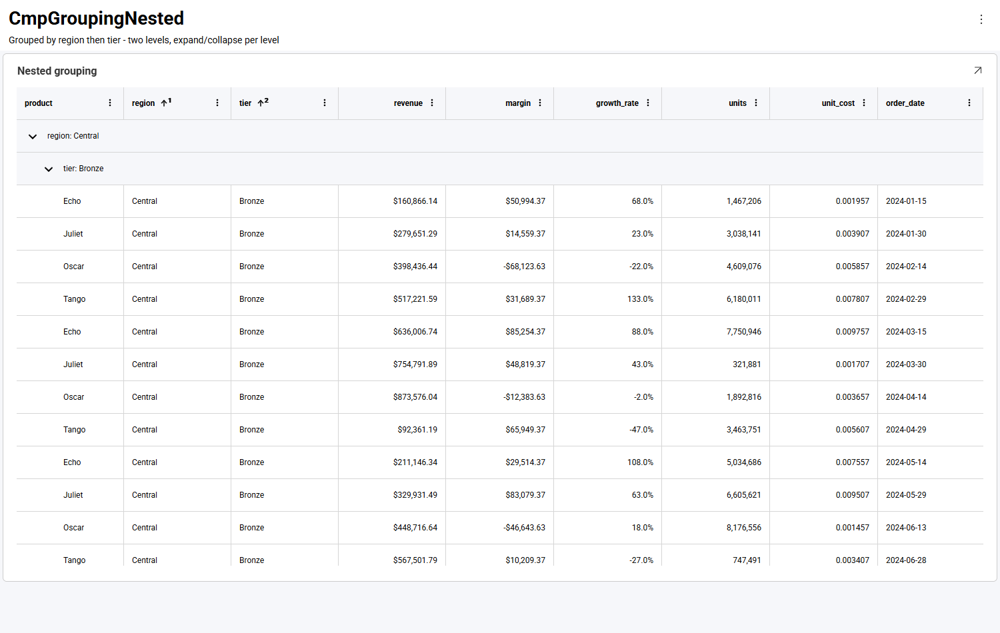
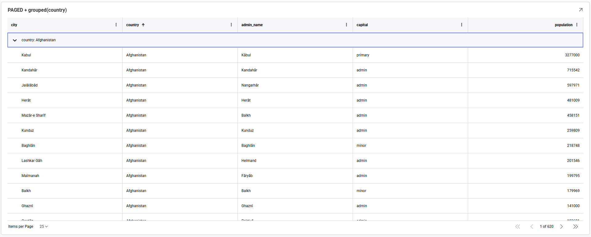
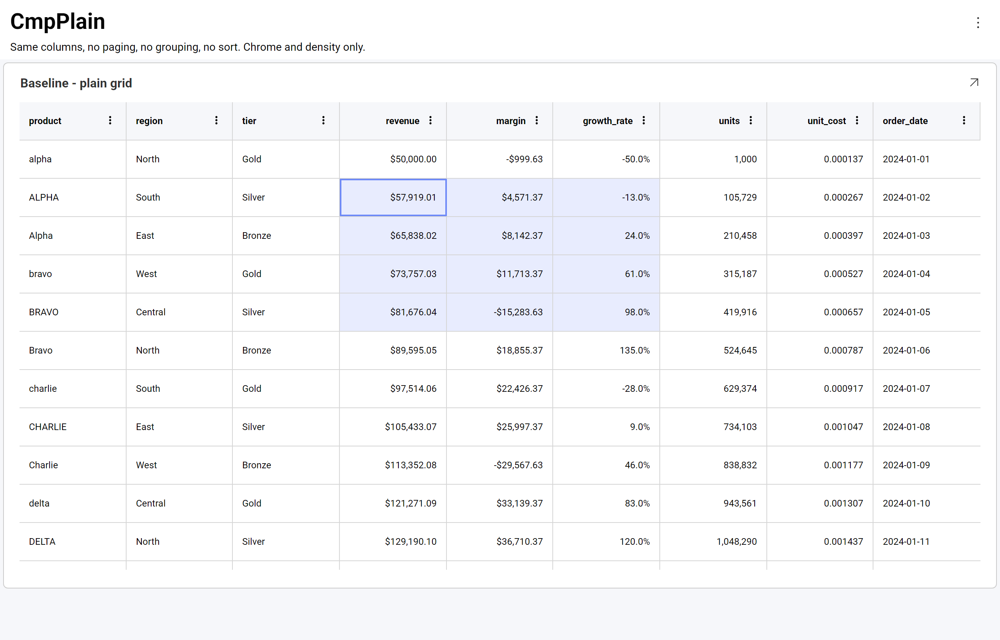
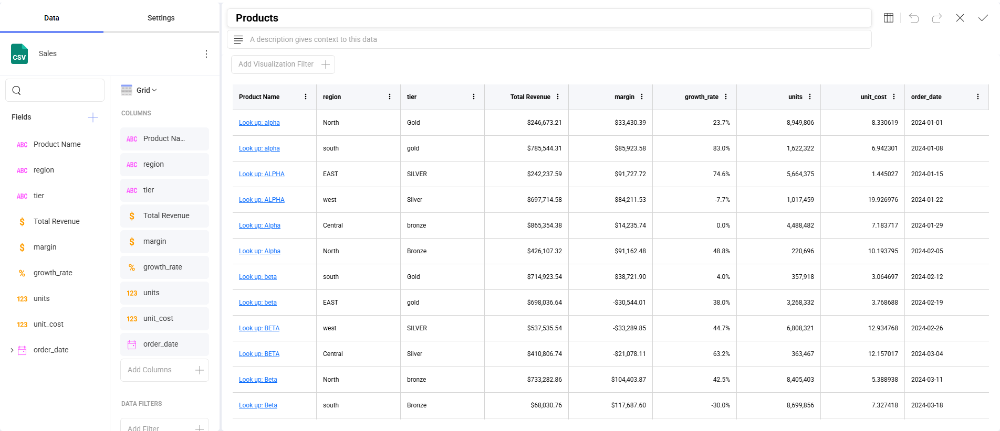
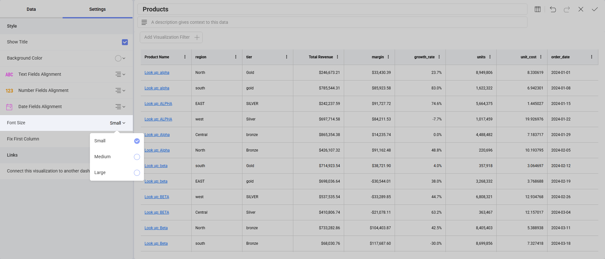

# グリッド チャート

グリッド チャートは、データを行と列の行列で表示します。データを表示するだけでなく、表示形式から直接操作できます。すべての列で、並べ替え、フィルタリング、集計、グループ化、固定、サイズ変更、並べ替え、非表示を、エディターに戻ることなく実行できます。

このトピックでは、まず**ダッシュボード ビュー モード**でグリッドに対して実行できる操作を説明し、次に**表示形式エディター**でグリッドを作成する際に使用できる設定を説明します。

## 列オプション メニュー

すべての列ヘッダーには **⋮** ボタンがあります。このボタンで列オプション メニューが開き、その列に対して実行できる操作が 1 か所にまとめられています。



メニュー上部のアイコン行は、列自体を操作します。

| アイコン | 動作 |
|---|---|
| **左に移動 / 右に移動** | 列を左または右に 1 つ分移動します。 |
| **左に固定 / 右に固定** | グリッドの他の部分を水平方向にスクロールしても表示されたままになるよう、列を左端または右端に固定します。 |
| **列を非表示** | 列を表示から削除します。 |
| **列の表示** | 列の一覧を開き、非表示にした列を再表示できます。 |

アイコンの下には、**[昇順で並べ替え]** と **[降順で並べ替え]**、**[集計]** サブメニュー、**[フィルターのクリア]**、およびフィルタリングに使用する検索可能な値の一覧があります。

:::tip
**ヘッダーのテキスト**をクリックすると列が並べ替えられます。メニューは **⋮** ボタンからのみ開きます。
:::

## ダッシュボード ビュー モードで列を並べ替える

**ダッシュボード ビュー モード**でグリッドの列の並べ替え (昇順や降順) を変更できます。列ヘッダーをクリックするか、**⋮** メニューから **[昇順で並べ替え]** または **[降順で並べ替え]** を選択します。

複数の並べ替え条件を適用できます。2 列目を並べ替えると、前の並べ替えが置き換えられるのではなく**追加**され、並べ替えられた各ヘッダーには並べ替え順序内の位置を示す小さな上付き数字が表示されます。


この例では、`product` が 1 番目、`region` が 2 番目に並べ替えられます。並べ替えでは大文字と小文字が区別されないため、`Alpha`、`alpha`、`ALPHA` は大文字と小文字のブロックに分かれず、まとめて並べ替えられます。

列の並べ替えを解除するには、**⋮** メニューを開いて選択されている並べ替えオプションをクリアします。

## 列のフィルタリング

各列は、その列のオプション メニューからフィルターできます。値の一覧は列の一意の値から作成され、検索が可能です。値の多い列で特に便利です。



**(すべて選択)** ですべての値を一括で切り替え、除外する値のチェックを外してから **[適用]** を選択します。次の例では、`region` 列を **Central** と **East** でフィルターしています。


**[フィルターのクリア]** は、その列のフィルターのみを解除します。異なる列のフィルターは組み合わされるため、`region` でフィルターした後に `tier` でフィルターすると、両方の条件に一致する行に絞り込まれます。列のフィルタリングは、すでに適用されているダッシュボード フィルターに追加して適用されます。

:::info
値は一覧に**書式設定された状態**で、セルに表示されるとおりに表示されます。通貨列であれば `50000` ではなく `$50,000.00` と表示されます。
:::

## 列の集計

数値列では、集計行に集計値を表示できます。列の **⋮** メニューを開いて **[集計]** を選択します。

![5 種類の集計を一覧表示する [集計] サブメニュー](images/data-grid-summaries-menu.png)

**[平均]**、**[最小]**、**[最大]**、**[カウント]**、**[合計]** の 5 種類の集計を使用できます。これらは単一選択ではなくチェックボックスであるため、1 つの列に複数の集計を同時に表示できます。

:::caution
ページングが有効なグリッドでは集計を使用できません。[ページング](#ページング) を参照してください。
:::

## グループ化

行は列によってグループ化できます。その列のオプション メニューから実行するか、エディターで表示形式に **[グループ化列]** を設定します ([表示形式エディターでグリッド チャートを操作する](#表示形式エディターでグリッド-チャートを操作する) を参照してください)。


グループ化は複数のレベルで実行でき、各レベルは個別に展開および折りたたみができます。



:::note
グループはデフォルトで折りたたまれた状態で表示されるため、展開する前に値の全体像を確認できます。
:::

## ページング

:::note
ページングの有無にかかわらず、行数や列数に実用上の制限はありません。グリッドから直接データをフィルター、グループ化、集計できるため、大量の結果セットでも読みやすさが保たれます。
:::

グリッドでページングが有効な場合、行は複数のページに分割され、表示形式の下部にページャーが表示されます。**[1 ページあたりの項目数]** で 1 ページに表示する行数を選択し、矢印でページを移動します。内側の矢印は 1 ページずつ移動し、外側の矢印は最初または最後のページに移動します。

ページングはグループ化と併用できます。次の例では、グリッドを `country` でグループ化し、1 ページあたり 25 行でページングしています。



ページング済みのグリッドでは、グループは折りたたまれた状態ではなく**展開された状態**で表示されるため、現在のページの行がすぐに表示されます。

:::caution
**ページングが有効な間は集計を使用できません**。列オプション メニューに **[集計]** の項目も表示されなくなります。ページング済みのグリッドは一度に 1 ページ分の行のみを保持するため、そこから計算された合計は結果セット全体ではなく現在のページのみを表すことになります。ページング済みのグリッドで合計を表示するには、別の表示形式として追加してください。

並べ替え、フィルタリング、グループ化はページングの影響を受けません。
:::

## 列のサイズ変更と並べ替え

列は利用可能な幅に合わせて調整されます。どちらの操作も列ヘッダーで行います。

| 操作 | 結果 |
|---|---|
| ヘッダーの**右端**をドラッグ | その列のサイズを変更します。隣接する列の幅は維持され、はみ出した分は水平スクロール領域になります。 |
| ヘッダーの**中央**をドラッグ | 列を新しい位置に移動します。[列の移動](#列の移動) を参照してください。 |

### 列の移動

列を移動するには、その列のヘッダーの任意の場所を押したままにして、横方向にドラッグします。ドラッグ中はヘッダーのコピーがポインターに追従して表示され、列が配置される位置が縦線で示されます。


この例では `country` ヘッダーを右にドラッグしており、インジケーターは `city` と `admin_name` の間に表示されています。この位置でポインターを離すと、列がその位置に配置されます。残りの列は場所を空けるために移動します。

この方法で設定した列の順序は、現在表示しているダッシュボードにのみ適用され、ダッシュボードには保存されません。

:::tip
ドラッグ以外の方法もあります。列オプション メニューの **[左に移動]** と **[右に移動]** のアイコンは、列を 1 つずつ移動します。わずかな調整のみが必要な場合や、グリッドが水平方向にスクロールする場合に操作しやすくなります。
:::

列の**表示/非表示**と**固定**は、代わりに列オプション メニューから操作します。[列オプション メニュー](#列オプション-メニュー) を参照してください。

## セルの選択とコピー

セルをクリックすると選択されます。セル間をドラッグすると矩形範囲が選択され、開始セルが枠線で囲まれて強調表示されます。



**Ctrl+C** (macOS では **⌘+C**) を押すと、選択範囲がコピーされます。単一のセルは 1 つの値としてコピーされ、範囲は 1 行 1 レコードのカンマ区切り形式でコピーされます。

```
alpha,North,"$50,000.00",-50.0%,2024-01-01
ALPHA,South,"$57,919.01",-13.0%,2024-01-02
Alpha,East,"$65,838.02",24.0%,2024-01-03
```

値は画面に表示されているとおりに**書式設定された状態**でコピーされます。通貨セルは `50000` ではなく `$50,000.00` としてコピーされます。カンマを含む値は引用符で囲まれるため、区切り文字が曖昧になることはありません。

:::note
一度に選択できる範囲は 1 つのみです。別の範囲を選択すると、前の選択は置き換えられます。

コピーされるテキストはタブ区切りではなくカンマ区切りです。表計算アプリケーションによって扱いが異なり、そのままセルに貼り付けられる場合と、テキスト インポートの手順を経る場合があります。
:::

## 行の網かけ

行は交互の網かけではなく、単一のフラットな背景に配置され、水平の区切り線で区切られます。

:::caution
行の交互の網かけは**現在利用できません**。また、有効にするための設定もありません。

この機能は**意図的に無効化**されています。グループ化、セルの結合、条件付き書式などの機能と競合し、表示が一貫しなくなるためです。すべてのグリッド機能で一貫して動作する設計が決まるまで、無効化されたままとなります。
:::

## 表示形式エディターでグリッド チャートを操作する

グリッドを作成するには、必要なフィールドを **[列]** に追加します。データの各行がグリッドの行になります。



**[設定]** で [フォント サイズ] を変更できます。デフォルト サイズは **[小]** です。**[中]** サイズでは 2px 大きくなり、**[大]** サイズは 4px 大きくなります。



先頭列を固定配置に設定するには、**[設定]** の下の **[最初の固定列]** オプションをチェックします。これは、特に多くの列を処理する場合に便利です。

グループ化もここで設定できます。エンドユーザーが列メニューからグループ化するのに任せるのではなく、フィールドを **[グループ化列]** として追加します。

### 列の書式設定

ハイパーリンク列、フィールド キャプションの変更、セルの書式設定 (通貨、パーセンテージ、小数点以下の桁数、日付) は、いずれもエディターで表示形式に設定し、グリッドで表示されます。数値列は右揃えで表示されるため、桁が揃って比較しやすくなります。ハイパーリンク列については、[グリッド ハイパーリンク列](../../web/hyperlink-columns.md) で説明しています。

複数の条件付き書式ルールが同じセルに一致する場合、ルールは一覧の順に適用され、重複するプロパティについては後のルールが優先されます。

## コードからグリッドを構成する

このセクションは、Reveal SDK を組み込む開発者を対象としています。UI でダッシュボードを操作する場合に必要な情報は、すべて上記で説明しています。

### これらの機能を個別に有効にする必要がありますか?

**いいえ。** クライアントにもサーバーにも機能ごとの切り替えはなく、`.rdash` ファイルに追加するものもありません。グリッドの機能はひとまとまりで提供され、SDK 自体によって構成されます。

そのため、現時点では**個々の機能を無効にする方法はサポートされていません**。たとえば、列オプション メニューを残したままフィルター セクションのみを削除したり、コピー機能を無効にしたりすることはできません。

:::info
**クライアント側のみ。** このグリッドはデフォルトであり、有効化は不要です。どちらのグリッドが表示されるかは、表示形式の構築時にブラウザーで決定されるため、サーバー SDK は関与せず、構成も不要です。1 つのサーバーで、どちらのグリッドを使用するアプリケーションにも対応できます。移行期間中に従来のグリッドが必要な場合は、[ベータ機能](../../web/beta-features.md) の「従来のグリッドを使用する」を参照してください。
:::

### カスタマイズできる項目

| 領域 | 方法 |
|---|---|
| **テーマ** | `RevealSdkSettings.theme` — ヘッダーとセルの背景、テキストと区切り線の色、スクロールバー、選択セルの強調表示、集計行、列オプション メニューは、すべてアクティブなテーマに従います。[ダッシュボードのテーマ設定](../../web/theming-dashboards.md) を参照してください |
| **クリックされたセルへの応答** | `onVisualizationDataPointClicked`。セルの `columnName`、`columnLabel`、`value`、`formattedValue` と、その行のすべてのセルを取得できます。[クリック イベントへの応答](../../web/click-events.md) を参照してください |
| **表示形式のオーバーフロー メニュー** | `onMenuOpening` — [カスタム メニュー項目](../../web/custom-menu-items.md) を参照してください |
| **ツールチップ** | [ツールチップ](../../web/tooltips.md) を参照してください |
| **フィールドの書式設定、キャプション、ハイパーリンク、グループ化** | 表示形式エディターでダッシュボードに設定します |

:::info
テーマは `RevealView` を作成する**前に**設定してください。グリッドは表示時にテーマの色を解決するため、表示後にテーマを割り当てても、すでに画面に表示されているグリッドは再描画されません。
:::

### 現在の制限事項

現時点では、以下の機能は SDK では利用できません。この表が示す区別に注意してください。**「構成できない」ことは「動作しない」ことを意味しません**。セルの選択とクリップボードへのコピーはエンドユーザーの操作では機能し、コードから制御できないだけです。

| 機能 | 状態 |
|---|---|
| **行の交互の網かけ** | **意図的に無効化**されており、有効にするためのプロパティもありません。グループ化、セルの結合、条件付き書式と競合するためです。すべてのグリッド機能で動作する設計が決まるまで保留されています。[行の網かけ](#行の網かけ) を参照してください |
| **選択の構成** | 選択とコピーは**エンドユーザーの操作では機能します** ([セルの選択とコピー](#セルの選択とコピー))。ただし、選択モードを選択したり、コピーを無効にしたり、コードから選択範囲を設定/取得したりする API はありません。クリックされたセルに応答するには `onVisualizationDataPointClicked` を使用します |
| **生の値のコピー** | コピーされる値は常に表示されているとおりに書式設定されます。基になる値をコピーするオプションはありません |
| **複数範囲の選択** | 一度に選択できるセル範囲は 1 つのみです。別の範囲を選択すると置き換えられます |
| **個々の機能の無効化** | グリッドの機能は SDK によって構成され、1 つずつ有効化または無効化することはできません |
| **グリッド ツールバー** | グリッドの上にツールバーはありません。列の固定と列の表示/非表示は、代わりに列オプション メニューから使用できます |
| **セル、ヘッダー、ページャーのテンプレート** | カスタムのセル、ヘッダー、ページャー テンプレートを指定する API はありません。セルの外観は、フィールドの書式設定とテーマで制御します |

:::info
この一覧はリリースごとに変更される可能性があります。最新の状態については、[リリース ノート](../../web/release-notes.md) および [ベータ機能](../../web/beta-features.md) を参照してください。
:::
