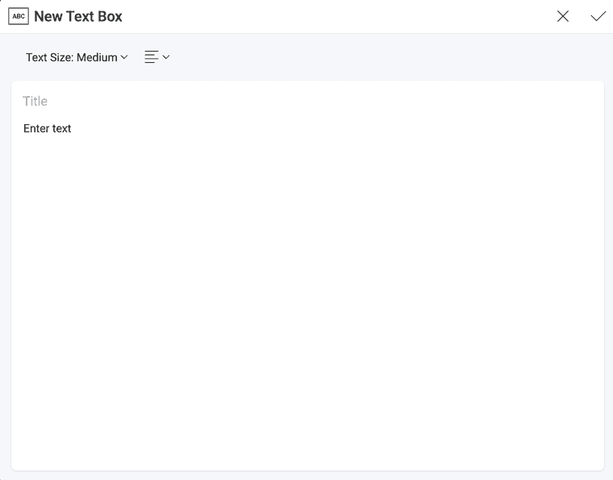

# テキスト ボックス表示形式

テキスト ボックスの表示形式は、その名前が示すように、テキスト本文とオプションのタイトルで構成されます。データ ソースに接続されていません。テキスト ボックスを使用する一般的なシナリオは、レポートにテキストの概要を追加することです。

## ダッシュボードにテキスト ボックスを追加

テキスト ボックスを既存のダッシュボードに追加する方法:

1.  ダッシュボードを**編集モード**で開きます。

2.  **[+ 表示形式]** の分割ボタンの右にある矢印をクリックまたはタップして、**[テキスト ボックス]** を選択します。

:::note
テキスト ボックス表示形式を既存のダッシュボードに追加すると、**ダッシュボードの下部**に表示されます。ドラッグすると移動できます。
:::
## ダッシュボードで最初の表示形式としてテキスト ボックスを作成する方法

概要または簡単な紹介を表示するテキスト ボックス表示形式を作成してダッシュボードを開始することもできます。テキスト ボックスの作成メニューにアクセスするには、以下の手順を実行します。

1.  初期画面の右上にある **[+ ダッシュボード]** ボタンをクリックまたはタップします。

2.  **[新しい表示形式]** ダイアログが開き、データ ソースを選択するように求められます。**[X]** をクリックまたはタップして、ダイアログを閉じます。

    

3.  **[+ 表示形式]** の分割ボタンにある**矢印**をクリックまたはタップして、**[テキスト ボックス]** を選択します。

      

## テキスト ボックス表示形式の作業

新しいテキスト ボックス表示形式を追加すると、以下の空のフォームが表示されます。

このダイアログでは:

  - **小**、**中**、**大**のテキスト サイズを選択できます。

  - テキストの配置 (**[テキスト サイズ]** の隣) を選択できます。

  - テキスト本文 (**[テキストの入力]** ボックス) に独自のテキストを記述できます。

  - **タイトル**を追加できます。(オプション)

