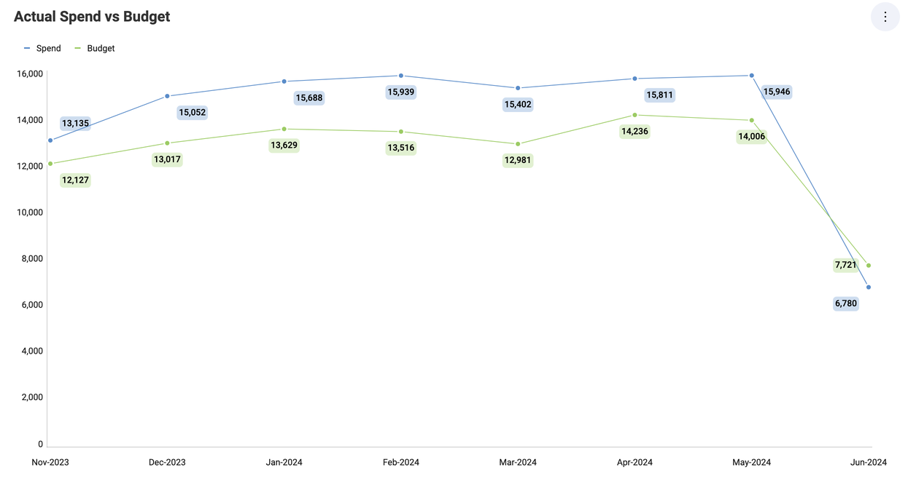

# 時系列チャート

時系列チャートは、時系列でインデックス付けされたデータ ポイントを表示するために使用されます。傾向を一目で検出するために一般的に使用され、時間の経過に伴う開発を簡単に観察できます。

従来の折れ線チャートと非常によく似ていますが、時系列チャートには常に時間ベースの水平軸 (x 軸) があります。

## チャートの近似曲線

チャートの設定で近似曲線の表示を有効にできます。このラインはアルゴリズムに基づいてチャートにラインを表示します。近似曲線でデータセットの傾向を把握し、意思決定のためのしきい値を定義できます。サポートされるトレンド ラインは、二次フィット、キュービック フィット、四次フィット、対数フィット、指数フィト、べき乗フィット、単純平均、指数平均、修正平均、累加平均、加重平均です。

## 時系列チャートの設定

[設定] では:

- **デフォルトで表示される要素を非表示にすることができます**。
  タイトル、凡例、およびツールチップの合計を非表示にすることを選択できます (カテゴリがある場合にのみ使用可能)。また、開始色を選択して、異なる**軸**を表示または非表示にすることもできます。

- **近似曲線を表示できます**。
  チャート設定を使用すると、前のセクションで説明したように、サポートされているさまざまなアルゴリズムから選択して、近似曲線を表示できます。

- **軸を表示範囲に同期できます**。

- **自動的なラベル回転を表示できます**。

- **ズーム レベルを調整できます**。

- **リニア スケールまたは対数を選択できます。**
  対数の場合、値のスケールは通常のリニア スケールを使用する代わりに大きさを使用するリニア スケール以外で計算されます。

- **チャートの最小値および最大値を設定できます。**
  デフォルトで最小は 0 に設定され、最大値は使用されるデータによって設定されます。

- **コンパクトなラベルを選択できます**。
  この設定を使用すると、チャートをズームするときに冗長なラベル情報を回避できます。

- [この表示形式を別のダッシュボードまたは URL に接続します](../dashboard-linking.md)

## ズームとパンニング

時系列チャートが最大化されると、ズームインおよびズームアウトできます。これにより特定の時間間隔に焦点を合わせることができ、コンパクトなラベル設定を使用することが理にかなっている明確なシナリオです。

## 統計関数

Reveal は 3 種類の高度な予測分析を提供します。これらは、[時系列予測](../statistical-functions.md#時系列予測)、[線形回帰](../statistical-functions.md#線形回帰)、および[外れ値の検出](../statistical-functions.md#外れ値の検出)です。それらを使用して、データ シリーズで予測を行い、傾向を認識して評価し、外れ値を検出できます。
