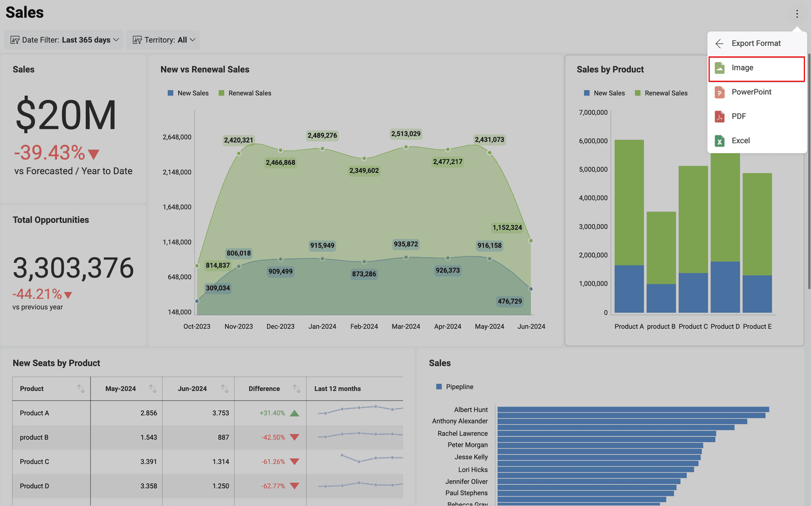

# ダッシュボードを画像としてエクスポート

Reveal では、ダッシュボード全体のスクリーン キャプチャまたは個別の表示形式をエクスポートすることができます。
ローカル スペース/モバイル デバイスに配信されるファイルは **PNG 形式**です。

## ダッシュボード全体を画像としてエクスポート

ダッシュボード全体の画像をエクスポートするには:

1.  ダッシュボードの右上隅にあるオーバーフロー メニューに移動し、**[エクスポート]** を選択します。
  

2. **[画像]** をクリックまたはタップします。

  

3.  **[画像をエクスポート]** ダイアログで、**[画像をエクスポート]** の青いボタンを選択します。

 

**[クリップボードへコピー]** オプションを選択すると、ダウンロードすることなく、クリップボードに画像を取り込むことができます。

## 個別の表示形式を画像としてエクスポート

ダッシュボード全体の画像をエクスポートするには:

1.  ダッシュボードの**ビュー モード**で、右上隅の矢印をクリックまたはタップして、選択した表示形式を**最大化します**。

    

2.  **[エクスポート]** を選択し、オーバーフロー メニューで **[画像]** を選択します。

3.  **[画像をエクスポート]** の青いボタンを選択します。

## 注釈画像

特定の場所に異なる図形のメモやハイライトを含む必要がある場合、**[画像をエクスポート]** メニューでダッシュボードに注釈を追加できます。**注釈セクションにアクセスする**には、**[画像をエクスポート]** ダイアログで鉛筆アイコンを選択します。

注釈メニューの上部ツールバーには、形状の追加やフリースタイルの注釈など、多くのオプションがあります。

テキストのオプションでは画像の上にテキストを追加できます。背景色、フォントの太さ、フォント サイズ、フォント カラーなど、テキストをカスタマイズするオプションを提供します。

