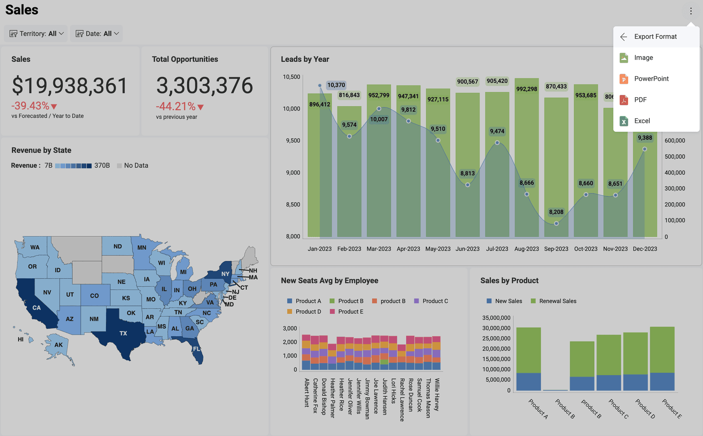

# ダッシュボードのエクスポート

ダッシュボードに表示される情報は、データ ソースの変更に伴って更新されますが、ある時点のデータのスナップショットを共有することもできます。たとえば、予期しない値を強調表示したビジネス インサイトを提供し、注意を促します。

**エクスポート機能にアクセスする**には、右上隅にあるオーバーフロー ボタンを選択し、**[エクスポート]** をクリックまたはタップします。

## エクスポート形式

ダッシュボードは、以下のオプションを使用して簡単にエクスポートできます。

  - [**画像のエクスポート**](dashboard-export-image.md) - ダッシュボード全体または個別の表示形式のスクリーン キャプチャをエクスポートします。

  - [**PowerPoint のエクスポート**](dashboard-export-powerpoint.md) - ダッシュボードを PowerPoint プレゼンテーションとしてエクスポートします。

  - [**PDF のエクスポート**](dashboard-export-pdf.md) - ダッシュボードを PDF ドキュメントとしてエクスポートします。

  - [**Excel のエクスポート**](dashboard-export-excel.md) - ダッシュボードに使用されているデータを **Excel 形式**でエクスポートし、表示形式もスプレッドシートにエクスポートするかどうかを選択できます。
