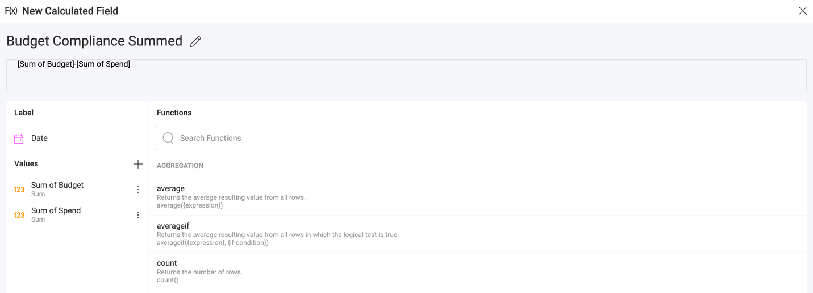
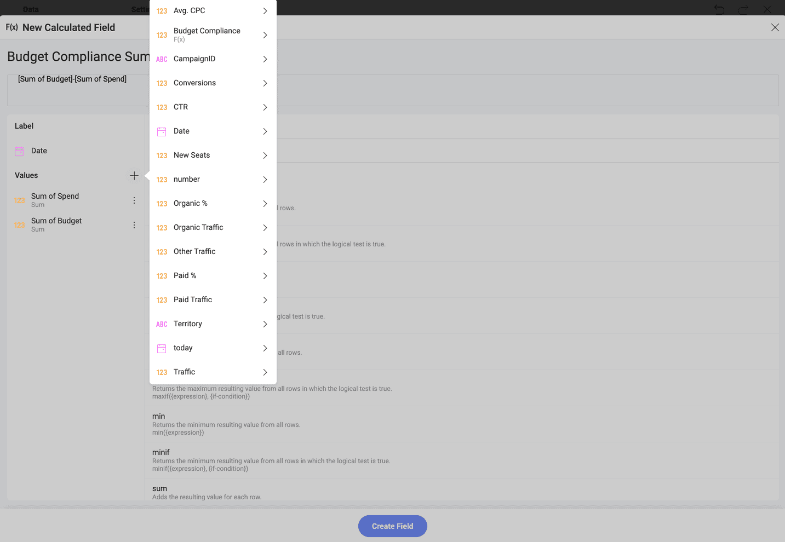

# 計算フィールド

Reveal では、計算フィールドというフィールドをデータセットに定義することができます。フィールドは、式 (数式) を使用して作成されます。式は、既存のフィールド、定数値、および以下の組み合わせにすることができます。

  - [定義済み関数](#reveal-定義済み関数の使用)

  - [単純な数学関数および定義されていない他の関数](#定義済み関数を使用せず計算フィールドを作成)。

以下の 2 種類の計算フィールドがあります。

  - [事前計算](#事前計算フィールド) (計算済み)

  - [事後計算](#事後計算フィールド)。

## 事前計算フィールド

事前計算フィールドは、データ エディターの集計を実行する前に評価されます。つまり、特定の数式を適用するために、Reveal はフィールドのデータセット内のすべてのレコードを 1 回または複数回調べます。そのため、大規模なデータセットを使用する場合、事前計算のパフォーマンスが低下する可能性があります。

新しい計算フィールドを追加するには、**[フィールド]** パネルの **[+]** ボタンをクリックまたはタップし、**[計算フィールド]** を選択します。

[計算フィールドの作成] 画面が開きます。

以下の手順を実行します。

1.  新しい計算フィールドに名前を割り当てます。

2.  数式 (式) を入力します。[フィールド] セクションで、すべての既存のフィールドのリストがら選択できます。1 つ以上のフィールドを使用して (選択したフィールドをクリックまたは角括弧で名前を入力) 数式を作成できます。[関数] セクションにリストされている定義済み関数のいずれかを選択して、または単純な数学計算を使用します (上記に表示)。

新しい計算フィールドは、フィールド リストの下部に表示されます。

上記の例では、集計がデータ フィールドに適用されていないグリッドの可視化で新しい計算フィールドが使用されます。事前計算フィールドは、**ピボット グリッド**でも使用できます。この場合、計算は事前計算フィールドで集計されたレコードに適用されます。

## 事後計算フィールド

**データ エディター**でデータ フィールドの集計を実行する**ピボット テーブル**やその他の表示形式を使用する場合、事後計算フィールドを作成できます。事後計算フィールドは、すでに集計された値に数式を適用することによって常に作成されます。

事後計算フィールドを作成する手順:

1.  **データ エディター**でデータ ソースからフィールドを追加して、表示形式 (または**ピボット テーブル**) を作成します。

  

2.  **[値]** の横にある **[F(x)]** ボタンをクリック/タップして、**[計算フィールドの作成]** 画面を開きます。

  

3.  計算フィールドに名前を付け、集計値に数式を適用します。注: **値**のリストには、集計後に表示形式で使用したデータ フィールドが含まれています (*Spend*、*Budget* ではなく、*Sum of Spend*、*Sum of Budget*)。

**データ エディター**に含まれていないデータ ソースの他のフィールドを使用する場合は、**[値]** の横の **[+]** ボタンをクリックまたはタップして追加できます。事後計算フィールドは集計値のみで作成されるため、最初にデータ フィールドで実行する集計をドロップダウン リストから選択する必要があります。

**手順 1** をスキップして、最初に事後計算フィールドを作成するか、表示形式で事後計算フィールドのみを使用することもできます。

大規模なデータセットを使用する場合、事後計算は事前計算よりパフォーマンスが向上します。

## Reveal 定義済み関数の使用

事前計算フィールドと事後計算フィールドの両方で、Reveal で使用可能な機能のいずれかを使用できます。

  - [**集計**](aggregation.md):
    [average](aggregation.md#aggregation-functions)、
    [averageif](aggregation.md#aggregation-functions)、
    [count](aggregation.md#aggregation-functions)、
    [countif](aggregation.md#aggregation-functions)、
    [max](aggregation.md#aggregation-functions)、
    [maxif](aggregation.md#aggregation-functions)、
    [min](aggregation.md#aggregation-functions)、
    [minif](aggregation.md#aggregation-functions)。

  - [**日付**](date.md):
    [date](date.md#date-functions)、
    [datevalue](date.md#date-functions)、
    [day](date.md#date-functions)、
    [formatdate](date.md#date-functions)、
    [fquarter](date.md#date-functions)、
    [semester](date.md#date-functions)、
    [fsemester](date.md#date-functions)、
    [fyear](date.md#date-functions)、
    [hour](date.md#date-functions)、
    [millisecond](date.md#date-functions)、
    [minute](date.md#date-functions)、
    [month](date.md#date-functions)、
    [monthname](date.md#date-functions)、
    [monthshortname](date.md#date-functions)、
    [applytimezone](date.md#date-functions)、
    [currenttimezone](date.md#date-functions)、
    [datetimefromunixts](date.md#date-functions)、
    [now](date.md#date-functions)、
    [quarter](date.md#date-functions)、
    [second](date.md#date-functions)、
    [time](date.md#date-functions)、
    [today](date.md#date-functions)、
    [weekday](date.md#date-functions)、
    [weeknum](date.md#date-functions)、
    [year](date.md#date-functions)。

  - [**情報**](information.md):
    [empty](information.md#information-functions)、
    [isempty](information.md#information-functions).

  - [**論理**](logic.md):
    [and](logic.md#logic-functions)、
    [false](logic.md#logic-functions)、
    [if](logic.md#logic-functions)、
    [not](logic.md#logic-functions)、
    [or](logic.md#logic-functions)、
    [true](logic.md#logic-functions)。

  - [**検索/行列**](lookup-reference.md):
    [previous](lookup-reference.md#lookup-and-reference-functions)、
    [row](lookup-reference.md#lookup-and-reference-functions).

  - [**数学**](math.md):
    [abs](math.md#math-functions)、
    [exp](math.md#math-functions)、
    [log](math.md#math-functions)、
    [log10](math.md#math-functions)、
    [mod](math.md#math-functions)、
    [rand](math.md#math-functions)、
    [randbetween](math.md#math-functions)、
    [sign](math.md#math-functions)、
    [sqrt](math.md#math-functions)、
    [trunc](math.md#math-functions)。

  - [**文字列**](string.md):
    [concatenate](string.md#string-functions)、
    [find](string.md#string-functions)、
    [len](string.md#string-functions)、
    [lower](string.md#string-functions)、
    [mid](string.md#string-functions)、
    [replace](string.md#string-functions)、
    [sortinterval](string.md#string-functions)、
    [trim](string.md#string-functions)、
    [upper](string.md#string-functions)。

:::note
**IF 条件の制限**。事前計算のフィールドの集計関数に含まれる場合、IF 条件には既知の制限があります。計算式内の IF 条件を確認するためにすべてのレコードを複数回調べる必要があり、パフォーマンスが低下する問題が発生するため、サポートされていません。:::

## 定義済み関数を使用せず計算フィールドを作成

定義済み関数を使用せずに計算フィールドを作成することもできます。たとえば、減算、除算、加算、乗算などの単純な数学計算用。[こちらの表](samples.md)には、定義済み関数を使用しない例があります。

## Reveal の関数を使用する際に注意すること

  - テキスト文字列は引用符で囲む必要があります。例えば、ロケール ("en") および日付書式 ("dd/mm/yyyy")。

  - 数式に含まれるフィールドは角括弧で囲む必要があります。たとえば、HR データセットの [Wage]、[BirthDate]、[EmployeeID] などです。
