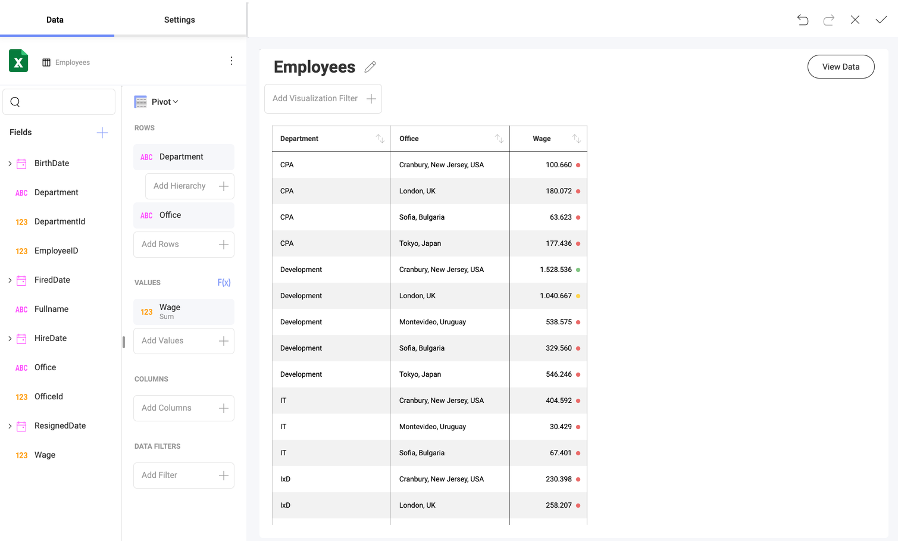
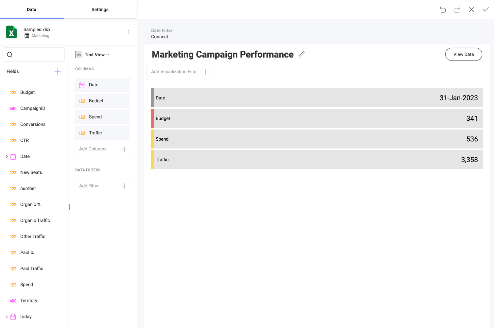
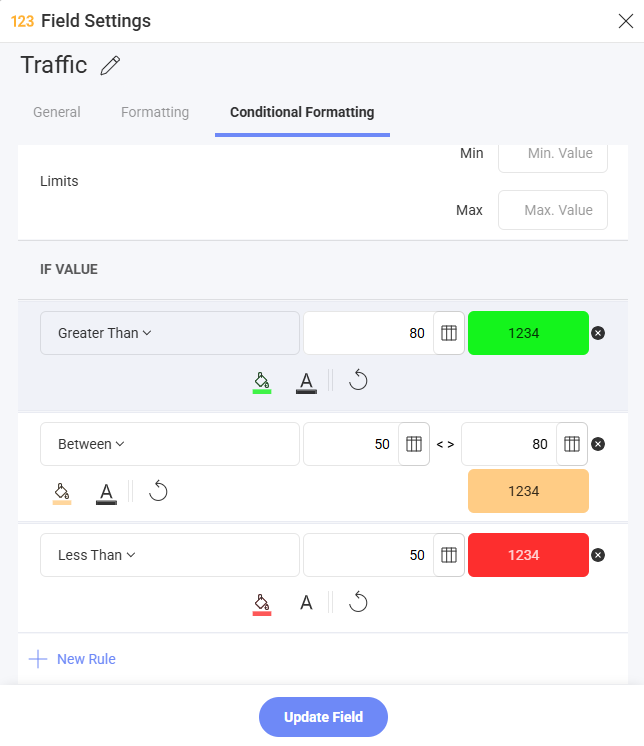

# 条件付き書式

条件付き書式を使用して数値列の値に応じて、セル (または[テキス トビュー](../chart-types/text-view.md)の行) に異なる書式を設定できます。たとえば、グリッドの下位 50% 範囲内の値は、非常に低い値を通知する赤色のアドナーで色を付けることができます。

条件付き書式の設定では、データの範囲ごと、または一般的な比較演算子に基づいて、スタイル規則を設定することができます。

## 条件付き書式設定の有効化

数値列で条件付き書式を有効にするには、**[フィールドの設定]** ダイアログボックスを表示するためにデータ エディターのフィールドを選択します。条件付き書式は、設定の最後のオプションであり、デフォルトでは無効になっています。

  - **制限**: これらの値は自動的に指定された値の列のデータセット内の最高値/最低値として設定されますが、一定の値を使用して手動でオーバーライドすることができます。

  - **データ範囲**: データのスタイル設定に使用する 3 つの範囲。すべての範囲にはドロップダウンで定義済みのインジケーターと色のいずれかを選択できます。

      - **値比較タイプ**: 範囲をパーセンテージまたは数値にします。

      - **値は ≥ の場合**: 入力した数値より大きい値の書式。

      - **値は ≥ の場合および \<**: 最初と 3 番目の範囲に入力する値に依存する固定範囲です。

      - **値は \< の場合**: 入力した数値より小さい値の書式設定。

## フィールドベースの比較

固定値と比較するだけでなく、条件付き書式ルールは同じ表示形式内の**別のフィールド**に対してフィールドの値を比較することをサポートします。書式は、そのロウの実際のデータに基づいて、各ロウで個別に評価されます。

**例:** *Revenue* が *Budget* を超えるすべてのロウをハイライト表示します。比較に *Budget* フィールドが使用されているため、各ロウは固定値ではなく、独自の Budget 値に対して評価されます。

### サポートされているルール タイプ

フィールドベースの比較は、3 種類すべてのルール タイプで使用可能です:

| ルール タイプ | 使用例 |
|---|---|
| **数値** | *予測売上* より大きい場合に *実際売上* をハイライト表示 |
| **文字列** | *請求先国* と一致する場合に *配送先国* をハイライト表示 |
| **日付** | *注文日* 以降の場合に *出荷日* をハイライト表示 |

:::note
日付フィールドと日時フィールドは、フィールドベースの比較においては互換性があるものとして扱われます。
:::

### フィールド参照の設定方法

1. フィールドの設定は、ビジュアライゼーション パネルでフィールドが選択されているときに使用できます。
2. 条件付き書式タブには、ルールとスタイルのオプションが含まれています。
3. ルールには、ユーザーが入力した値、または**フィールド チューザー**から選択した互換性のあるフィールドを使用できます。
4. 選択したフィールドは値の入力部分にチップとして表示され、削除して手動入力に戻すことができます。

**Between / Not Between** の数値ルールでは、「from」と「to」の両方の境界に対してフィールド参照を個別に設定できます。また、静的な値とフィールド参照を混在させることもできます (例: 「Between *Min Threshold* フィールドと 1000」)。

### 対象フィールド

フィールド チューザーには、以下の**すべて**の条件を満たすフィールドのみが表示されます:

- 現在の表示形式に存在する。
- 書式設定対象フィールドと同じデータ型である (日付と日時は互換性あり)。
- 書式設定対象フィールド自体でない。

### 孤立したフィールド参照

表示形式を変更し、条件付き書式ルールで比較参照として使用されていたフィールドを削除した場合、次にフィールドの設定を開いたときに参照が**自動的にクリア**されます。参照が削除されたことを通知するメッセージが表示されるため、ルールを再構成できます。

### 検証

- フィールド参照が設定されている場合、静的な値の入力は**不要**です。比較値は参照フィールドから取得されます。
- フィールド参照が設定されていない場合は、標準の検証ルールが適用されます (例: 数値ルールには値が必要、Between ルールには両方の境界が必要、「from」値は「to」値以下である必要があります)。
- null または非互換の値を含むフィールドを参照するルールは、そのロウに対して**スキップ**されます (書式は適用されません)。
- 数値の Between/Not Between ルールでは、両方の境界が静的な値の場合のみ from ≤ to の検証が実施されます。一方または両方の境界がフィールドを参照する場合、検証は事前に行われず、ロウごとに評価されます。

### ベスト プラクティス

- **2 色に絞る**: 赤とグレーなど、1 つのハイライト色と 1 つのニュートラル トーンで十分です。色を増やすとチャートが読みにくくなり、凡例が煩雑になります。
- **視覚的な参照を追加する**: 色で値にフラグを立てることはできますが、参照線、目標範囲、または支出に対する予算バーなどの比較列を使用すると、ルールをより解釈しやすくなります。
- **単一系列のチャートで条件付き書式を使用する**: 1 つのメジャーを持つ縦棒チャートと棒チャートは、通常最も明確な結果を生成します。複数の系列はチャートの色と競合し、凡例を解釈しにくくすることがあります。
- **行ごとの比較にはグリッドまたはテキスト ビューを使用する**: 注文ごとの実績と予算など、同じロウ内の列を比較するルールは、これらの表示形式で最も信頼性が高くなります。計算フィールドを使用する場合は**既知の制限**を参照してください。

### 既知の制限

#### 集計計算フィールドでの条件付き書式
**集計を使用する計算フィールド** (例: Average、Sum) に条件付き書式を適用する場合、比較値はチャートに表示されるラベルやカテゴリ グループごとではなく、シリーズ全体に対して計算されることに注意してください。

**これが重要な理由:** チャートの表示形式では、各棒またはデータ ポイントは特定のラベル/カテゴリ グループの集計を表します。ただし、条件付き書式のしきい値 (例: 「平均より大きい」) は、*すべての*グループにわたるシリーズ全体の集計に対して評価されます。つまり、チャートの平均線より視覚的に上に見えるいくつかの値がハイライト表示されないことがあります。これは、グループごとの集計が比較に使用されるシリーズ全体の集計と異なるためです。

## サポートされている表示形式

条件付き書式は、以下の表示形式に適用できます。

- [グリッド チャート](../chart-types/grid-chart.md)
- [ピボット チャート](../chart-types/pivot-table.md)
- [テキストおよびテキスト ビュー](../chart-types/text-view.md)
- [縦棒チャート](../chart-types/category-charts.md)
- [棒チャート](../chart-types/category-charts.md)

:::note
[KPI](../chart-types/kpi-gauge.md)、[リニア](../chart-types/gauge-charts.md#リニア-ゲージ)、[円形](../chart-types/gauge-charts.md#円形ゲージ)、[テキスト](../chart-types/gauge-charts.md#テキスト-ゲージ)、および[ブレット グラフ](../chart-types/gauge-charts.md#ブレット-グラフ) ゲージも、バンド構成の一部としてネイティブに条件付き書式をサポートします。

フィールドベースの比較は、表形式データ ソースを使用した**グリッド チャート**と**テキスト ビュー**の表示形式でのみ使用できます。
:::