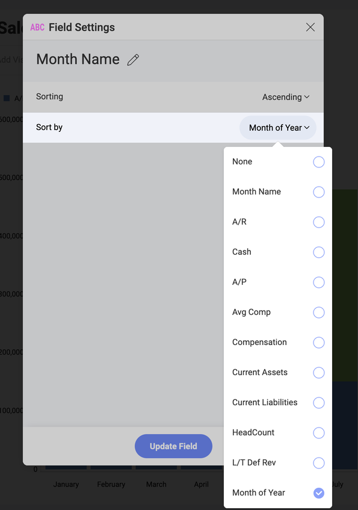

# 並べ替えフィールド

Reveal では、データを昇順または降順に並べ替えることで、表示形式のデータの表示方法を変更できます。さらに、元のデータ ソースで選択したフィールドで並べ替えることで、表示形式の外観をさらに制御することもできます。 

## 並べ替えフィールドを有効にする 

**[並べ替えフィールド]** オプションはフィールド設定の一部ですが、デフォルトでは非表示になっています。有効にする方法: 

1. **[ラベル]** プレースホルダーからフィールドを選択します。
2. **[フィールド設定]**で、**[並べ替え]** に **[昇順]** または **[降順]** を選択します。
3. **[並べ替え条件]** は、**[並べ替え]** 設定の下に表示されます。右側のドロップダウンからフィールドを選択できます (上記を参照)。
 
より実用的な情報については、この機能を示す次の例をご覧ください。

- [並べ替えフィールドを有効にする](#並べ替えフィールドを有効にする )
- [サポート ケースを優先順位で順序](#サポート-ケースを優先順位で順序)
- [文字列日付を時系列で並べ替え](#文字列日付を時系列で順序)

## サポート ケースを優先順位で順序

フィールドをアルファベット順に並べ替えるのではなく、ビジネス ロジックを使用して並べ替えたいシナリオがあります。たとえば、以下は、新しいサポート ケースを昇順で表示する表示形式です。

*Priority* フィールドはテキスト フィールドであるため、デフォルトでは A-Z の順序になっています。ただし、ビジネス ロジックを使用する場合、*Priority*値は次のように並べ替える必要があります: *Low* - *Normal* - *High*。これを実現するには、データセットに優先度ステータスの数値表現を示す *Priority Level* 列が必要です (以下を参照)。 

[並べ替え条件] フィールド オプションを使用して、*Priority Level* フィールドをデータ エディタに実際にドラッグアンドドロップせずに、チャート内の情報を優先度レベル別に整理します。

## 文字列日付を時系列で順序

次の表示形式を見てみましょう。ここでは、[積層型柱状チャート](../tutorials-stacked-charts.md#積層型チャートの作成)で企業の現金と売掛金の増加をプロットしています。

値は、**Month Name** (文字列フィールド) で並べ替えされています。ただし、月はデフォルトでアルファベット順に並べ替えされているため、結果の表示形式は分析には適しません。

ただし、書式を変更し、**Month of Year** の順に情報を並べ替えることで、**Month Name** の表示方法を変更できます。Y 軸 (**Month of Year**) に 1-12 の数値を表示する必要はないかもしれませんが、それでもその順序を優先する必要があります。データ エディターのラベル プレースホルダーで **Month Name** フィールドを選択し、目的の並べ替えを選択します。

この後、**[フィールドの更新]** を選択します。情報は時系列順に並べ替えられます。

