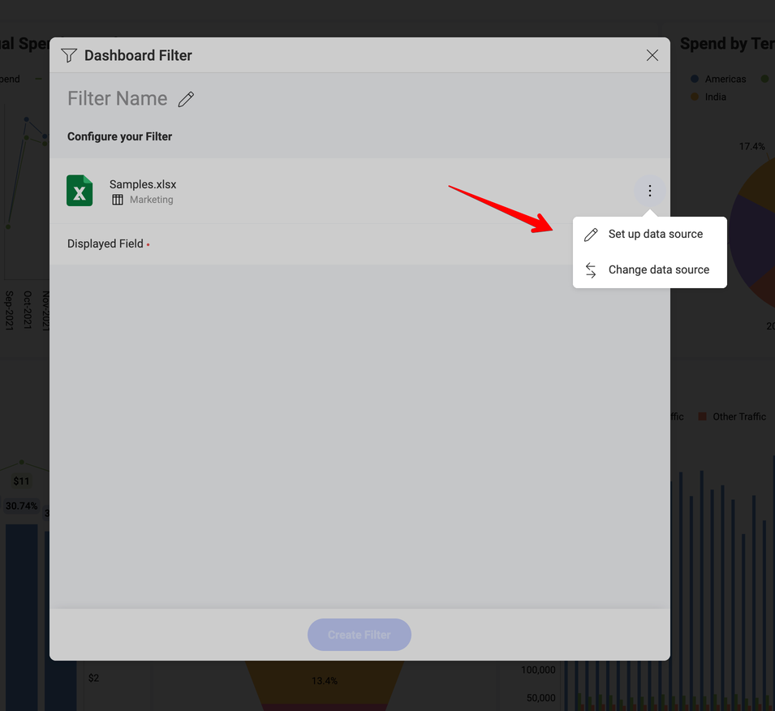
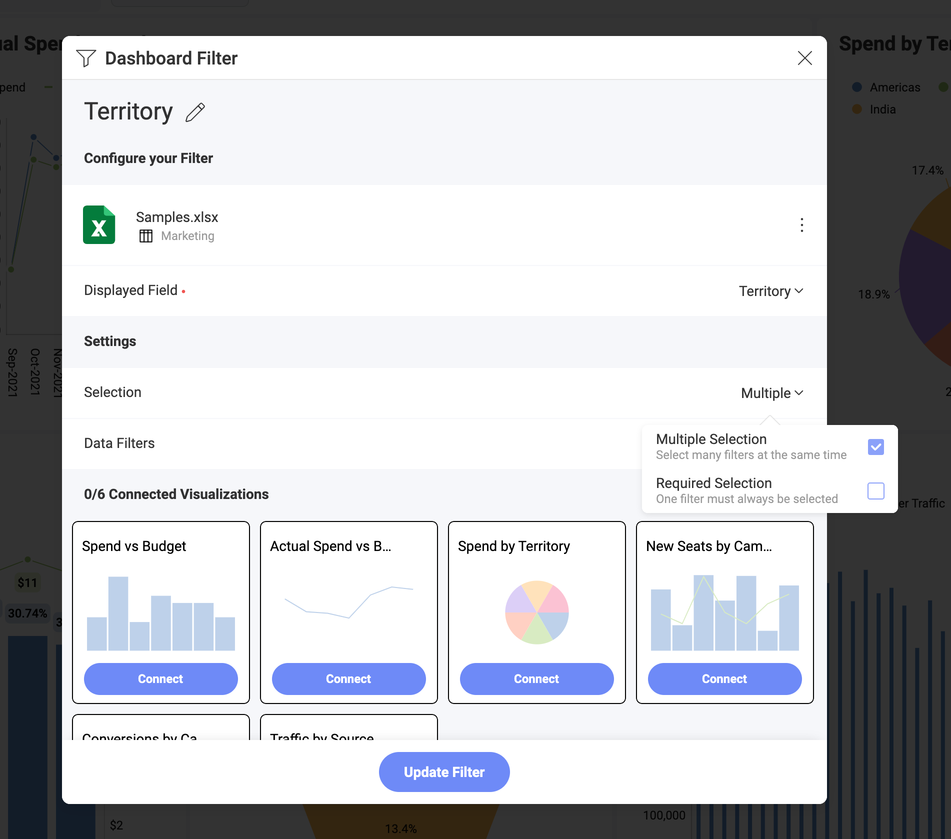
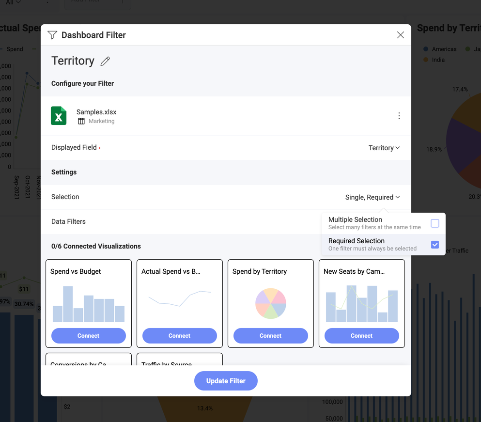

# ダッシュボード フィルターとそのプロパティ

## ダッシュボード フィルター プロパティにアクセスする

新しいダッシュボード フィルターを追加するには:

1.  ダッシュボード エディターに移動し、[フィルターの追加] ⇒ **[ダッシュボード フィルターの追加]** を選択します。

2.  ダッシュボード フィルター メニューが開きます。デフォルトで、選択されたデータ ソースは、はじめての表示形式で使用されるデータ ソースになります。変更するには、データ ソース名の横にあるオーバーフロー ボタンを選択します。

  

3.  ダッシュボード フィルターとして使用するデータセットを選択し、**[データの選択]** をクリック/タップします。

## フィルター設定の概要

フィルターの以下の設定を変更できます:

- **タイトル:** ダッシュボードのタイトルのすぐ下に表示される、ダッシュボード ィルターのタイトル。デフォルトで、これはフィルターとして使用されるフィールド名です。

- [**表示されるフィールド/要素:**](#表示フィールド) ダッシュボード フィルターとして使用されるデータセット内のフィールド。

- **選択:** この設定では、以下を構成できます。[複数選択](#複数選択) (一度に複数の値を選択できます) および/または[必須選択](#必須選択) (少なくとも 1 つの値を常に選択する必要があります)。

- [**データ フィルター:**](#データ-フィルター) この設定により、ダッシュボード フィルターに使用されるデータ ソースにフィールド フィルターとルールを適用できます。

- [**接続された表示形式:**](filters-connecting.md) ダッシュボードを表示形式に接続するかどうか。

## 表示フィールド

:::note
**Microsoft Analysis Services** および **Google アナリティクス**のデータを使用するダッシュボード フィルターの場合、この設定の名前は **[表示する要素]** です。
:::

**表示するフィールド/要素**設定は、ダッシュボード フィルターの値を表示するために使用されるデータセット フィールドを指定します。リスト値は、元のデータセットで複数回表示された場合も繰り返されません。

ダッシュボード フィルター名の隣りのオーバーフロー メニューで [編集] ボタンをクリックして、編集モードで表示列を変更できます。

## 複数選択

Reveal は、複数のダッシュボード フィルター値の同時選択をサポートしています。これにより、コレクション内で要素を並べて比較できます。たとえば、[HR ダッシュボード] で複数の選択を有効にすることで、さまざまなオフィスの雇用や欠勤を比較することができます。

**[複数選択] を有効する**には、ダッシュボードを編集モードに替える必要があります。⇒ ダッシュボード フィルターのオーバーフロー ニューから **[編集]** を選択 ⇒ **[選択]** ⇒ **[複数選択]** チェックボックスをオンにします。

## 必須選択

ダッシュボード フィルターで選択オプションを必須または無効にできます。デフォルトでは、選択は不要です。選択オプションで、ユーザーがすべてのダッシュボード フィルター値を解除することができ、実行したクエリからフィルターを削除します。クエリはデータ ソースのすべてのデータを取得し、ダッシュボード フィルター行に「選択なし」と表示されます。

**[必須選択] を有効する**には、ダッシュボードを編集モードに替える必要があります。⇒ ダッシュボード フィルターのオーバーフロー ニューから **[編集]** を選択 ⇒ **[選択]** ⇒ **[必須選択]** チェックボックスをオンにします。

## データ フィルター

ダッシュボード フィルターに表示されるデータセットのフィールドにフィルターを適用することもできます。これにより、特定のフィールドの null または空の値をフィルター アウトできます(空の値のフィルター)。特定の値を選択するか、フィールド タイプに応じてオプションを変更するためにフィールドにルールを追加することもできます。詳細は、**フィールド フィルターとルール**をご覧ください。

たとえば、**Fullname** フィールドを使用して **HR ダッシュボード**のデータをフィルタリングする場合、**ダッシュボード フィルター**は会社のすべてのオフィスの従業員リストを表示します。

フィルター リストに特定のオフィス (*London, UK* など) で働く従業員のみを含める場合は、以下に示すようにデータ フィルターを適用します。

### ダッシュボード フィルターにデータ フィルターを適用

ダッシュボード フィルターとして使用されるデータ ソースにフィールド フィルターとルールを適用し、ダッシュボード フィルターに (上記の例のように) *London, UK* オフィスの従業員のみを表示するには、次の手順に従います。

1.  ダッシュボード フィルター設定の**データ フィルター**に移動します。

2.  **表示フィールド**プロパティで **Employee name** を選択します。

3.  [フィールドを選択] をクリックまたはタップして、リストから [オフィス] を選択します。

  

4.  次のダイアログで、適用するフィルター タイプを選択します (この例では、**[値の選択]** を選択します)。

  

5.  リストから *London, UK* を選択し、[フィルターの作成] ボタンをクリックまたはタップします。

## 次の手順 

ダッシュボード フィルターを作成したので、フィルターを適用する**表示形式に接続する**必要があります。詳細は、[ダッシュボード フィルターを表示形式に接続](filters-connecting.md)をご覧ください。

