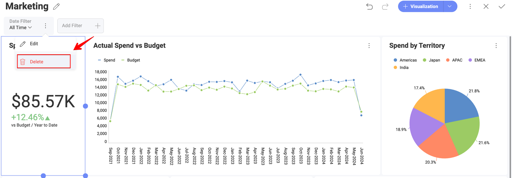
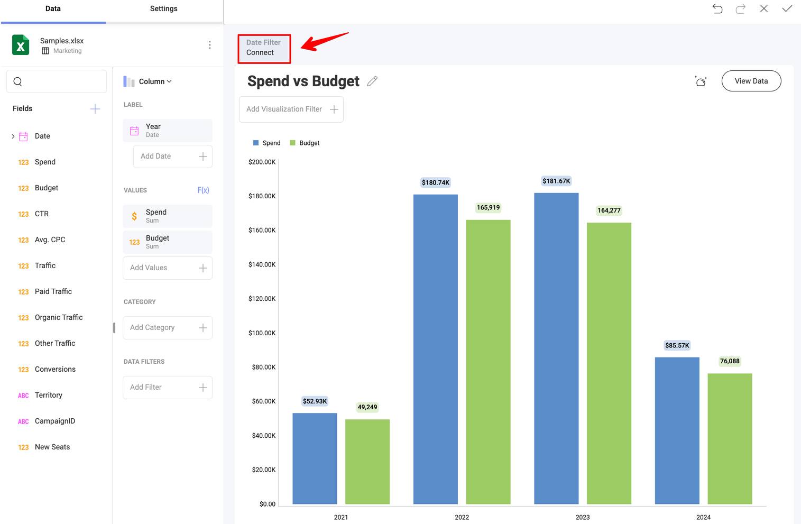

# ダッシュボード フィルター

ダッシュボード フィルター データセットは、**ダッシュボード編集**モードを開始することによって定義されます。新しいデータセットを追加するには、**[フィルターの追加]** のボタン を選択します。

これにより、適用される可能性のあるダッシュボード フィルターのリストが表示されます。以下から選択できます:

  - **ダッシュボード フィルターの追加**このオプションを使用すると、データ ソースから情報を選択できます。その後、ダッシュボードの各表示形式にフィルターをバインドできます。

  - **日付フィルターの追加**このオプションは、固定範囲の選択や指定した日付範囲のみ表示するようカスタマイズできます。

ダッシュボード フィルター リストからデータセットを削除するには、ダッシュボード フィルターの横にあるオーバーフロー ボタンを選択し、**[削除]** を選択します。

## ダッシュボード フィルターと表示形式エディター

ダッシュボード エディターに 1 つ以上のダッシュボード フィルターまたは日付フィルターが定義されている場合、フィルター名の下部にある **[接続]** をクリックするとダッシュボード フィルターまたは日付フィルターのデータを表示形式にバインドします。 

日付フィルター ダイアログまたはダッシュボード フィルター ダイアログでデータを接続することもできます。

バインド機能の詳細については、[「ダッシュボード フィルターを表示形式に接続」](filters-connecting.md)トピックを参照してください。

## フィルターのカスケード

ダッシュボード フィルターは*カスケード*できます。つまり、あるフィルターで値を選択すると、ダッシュボード フィルター リストでその後に続く別のフィルターに表示される値のリストが自動的に絞り込まれます。

たとえば、ダッシュボードに *Country* フィルターがあり、その後に *City* フィルターがある場合、*Country* で *Germany* を選択すると、*City* フィルターにはデータセット内のすべての都市ではなく、ドイツの都市のみが表示されます。

カスケードは自動的に行われます。カスケードを有効にしたり、2 つのフィルターをリンクしたりするための設定はありませんが、カスケードは次の両方の条件を満たす場合にのみ発生します:

  - 絞り込まれるフィルター (上記の例では *City*) が、ダッシュボード フィルター リストで変更されたフィルターの**後**にあること。順序は重要であり、カスケードはその方向にのみ適用されます。フィルターがその前にあるフィルターにカスケードすることはありません。

  - 両方のフィルターがまったく同じデータ項目から直接作成されていること。*Country* が *Countries* テーブルから作成され、*City* が別の *Orders* テーブルから作成されている場合、*Orders* に 2 つを論理的にリンクできる国の列があったとしても、またダッシュボード上の表示形式で両方のテーブルがブレンドされていたとしても、2 つのフィルターはカスケードしません。表示形式のデータのためのテーブルのブレンドは、ダッシュボード フィルターには適用されません。フィルターのカスケードでは、両方のフィルターが同じ基になるデータ項目を参照しているかどうかのみが考慮され、表示形式がデータをどのように組み合わせているかは考慮されません。

変更されたフィルターで何も選択されていない場合、依存するフィルターはフィルターされていない値の完全なリストの表示に戻ります。

:::note
この機能は、*表示形式のクイック フィルター*間のカスケードとは異なる機能です。表示形式のクイック フィルターは常に同じ表示形式のデータセットを共有するため、よりシンプルです。詳細については、表示形式のクイック フィルターの[「フィルターのカスケード」](filters-visualization.md#フィルターのカスケード)を参照してください。
:::
