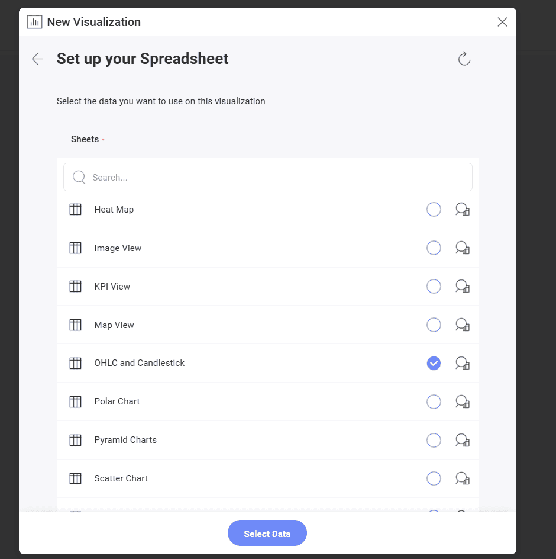
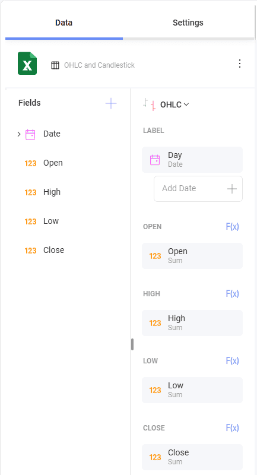
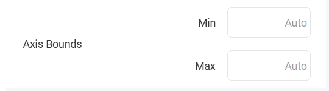

# OHLC チャートを作成する方法

このチュートリアルは、サンプル スプレッドシートを使用して OHLC チャートを作成する方法を説明します。

## 重要なコンセプト

OHLC チャートとローソク足チャートは各財務データの始値、高値、安値、終値を表します。財務シナリオと株の変動の分析のために役立ちます。このチャートは各垂直軸に**始値**および**終値**を表す 2 つの水平線で数値を垂直軸に表します。

そのため、OHLC チャートには以下の項目が必要になります。

  - 通常日付に関連する日付エディターの **[ラベル]** プレースホルダーにドロップする 1 つのフィールド。

  - データ エディターの [始値]、[高値]、[安値]、および [終値] カテゴリの **4 つの異なるフィールド**。

チャートに追加情報を表示するためのオプションが複数あります。

  - **軸の構成**: 軸の構成でチャートの最大値と最小値を構成できます。デフォルトで最小値は 0 に設定され、最大値は使用されるデータによって設定されます。

  - **対数軸構成**: [対数] ボックスをチェックする場合、値のスケールは通常のリニア スケールを使用する代わりに大きさを使用するリニア スケール以外で計算されます。

## サンプル データ ソース

このチュートリアルでは、<a href="/data/Reveal_Visualization_Tutorials.xlsx" download>Reveal Visualization Tutorials</a> の「OHLC and Candlestick」シートを使用します。

## OHLC チャートを作成する方法

1. オーバーフロー メニューで **[編集]** を選択します。
   
    

 2. 右上隅にある **[+ 表示形式]** ボタンを選択します。

     

 3. データ ソースのリストからデータ ソースを選択します。
   
                         

 4. データ ソースを設定したら、**OHLC and Candlestick** シートを選択します。

      

 5. **表示形式ピッカー**を開き、**OHLC** を選択します。デフォルトで、表示形式のタイプは**柱状**に設定されています。  

                                    

 6. *Day* フィールドを **[ラベル]** にドラッグアンドドロップし、*Open*、*High*、*Low* および *Close* フィールドを対応するプレースホルダーにドラッグアンドドロップします。

                                  

## 軸の構成の変更

[ゲージの範囲](tutorials-gauge.md#ゲージ表示形式に範囲を追加する方法)と同様に、チャート軸構成でチャート (範囲) の最小値と最大値を設定できます。この機能を使用して、特定のデータ含有や除外ができます。

以下は軸構成のメニューへアクセスするための手順です。

|                                             |                                                                                      |                                                             |
| ------------------------------------------- | ------------------------------------------------------------------------------------ | ----------------------------------------------------------- |
| 1\. **設定メニューにアクセスする**            |                | 表示形式エディターの **[設定]** セクションに移動します。 |
| 2\. **軸範囲セクションに移動する** |  | 変更する設定は**軸範囲**です。   |

最大値または最小値 (または両方) のどれを設定するかに基づいて、以下のオプションの 1 つへアクセスする必要があります。

### 最小境界値を変更します。

デフォルトの値は *0* です。境界値を変更する場合は、チャートの開始値を入力してください。

### 最大境界値を変更します。

最大境界値の場合、Reveal が元のデータを使用するためにデフォルトの値は **[自動]** に設定されます。別の値を設定するには、チャートの上限値を入力します。

## 軸を対数軸として設定

|                                        |                                                                                                       |                                                             |
| -------------------------------------- | ----------------------------------------------------------------------------------------------------- | ----------------------------------------------------------- |
| 1\. **設定メニューにアクセスする**       |                                 | 表示形式エディターの **[設定]** セクションに移動します。 |
| 2\. **軸を対数に変更する** |  | **[軸]** ドロップダウンを開き、**[対数]** を選択します。      |
